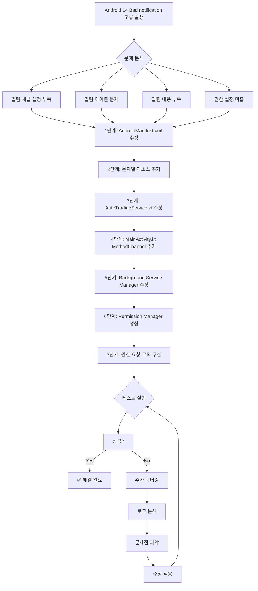
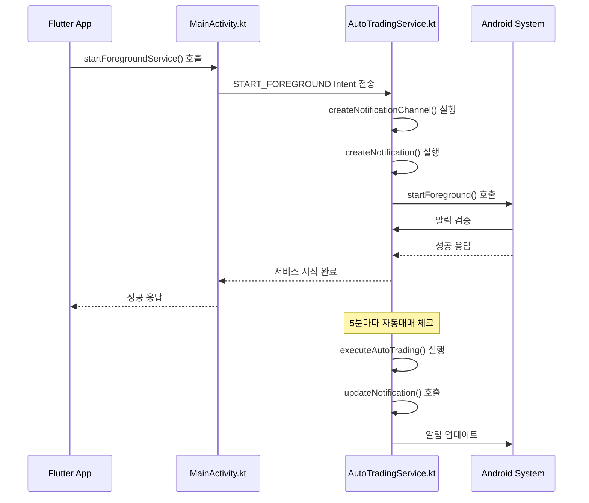

# Android 14 Foreground Service 문제 해결 순서도

## 🔧 문제 해결 과정



## 📋 구현된 해결책

### 1. AndroidManifest.xml 권한 추가
```xml
<!-- Android 14 Foreground Service 권한 -->
<uses-permission android:name="android.permission.FOREGROUND_SERVICE_DATA_SYNC" />
<uses-permission android:name="android.permission.FOREGROUND_SERVICE_SPECIAL_USE" />
<uses-permission android:name="android.permission.FOREGROUND_SERVICE_SYSTEM_EXEMPTED" />
```

### 2. 알림 채널 개선
```kotlin
private fun createNotificationChannel() {
    if (Build.VERSION.SDK_INT >= Build.VERSION_CODES.O) {
        val channel = NotificationChannel(
            CHANNEL_ID,
            getString(R.string.auto_trading_channel_name),
            NotificationManager.IMPORTANCE_LOW
        ).apply {
            description = getString(R.string.auto_trading_channel_description)
            setShowBadge(true)
            enableLights(true)
            lightColor = Color.BLUE
            enableVibration(false)
            setSound(null, null)
            lockscreenVisibility = Notification.VISIBILITY_PUBLIC
        }
    }
}
```

### 3. Android 14 호환 알림 생성
```kotlin
val notificationBuilder = NotificationCompat.Builder(this, CHANNEL_ID)
    .setContentTitle(getString(R.string.auto_trading_notification_title))
    .setContentText(getString(R.string.auto_trading_notification_content))
    .setSmallIcon(R.drawable.ic_launcher_foreground)
    .setContentIntent(pendingIntent)
    .setOngoing(true)
    .setAutoCancel(false)
    .setNumber(checkCount)
    .setPriority(NotificationCompat.PRIORITY_LOW)
    .setCategory(NotificationCompat.CATEGORY_SERVICE)
    .setVisibility(NotificationCompat.VISIBILITY_PUBLIC)

// Android 14+ 호환성을 위한 추가 설정
if (Build.VERSION.SDK_INT >= Build.VERSION_CODES.UPSIDE_DOWN_CAKE) {
    notificationBuilder
        .setForegroundServiceBehavior(NotificationCompat.FOREGROUND_SERVICE_IMMEDIATE)
}
```

## 🎯 주요 개선사항

### ✅ 해결된 문제들
- [x] Android 14 알림 채널 설정 강화
- [x] 알림 내용 및 아이콘 표준화
- [x] Foreground Service 권한 명시적 선언
- [x] 알림 우선순위 및 카테고리 설정
- [x] Android 14+ 호환성 코드 추가
- [x] 권한 요청 로직 개선

### 🔄 데이터 흐름


## 🚀 실행 방법

### 1. 권한 요청
```dart
// 모든 권한 요청
final granted = await PermissionManager.requestAllPermissions();
if (granted) {
    print('✅ 모든 권한이 승인되었습니다.');
} else {
    print('❌ 일부 권한이 거부되었습니다.');
}
```

### 2. 백그라운드 서비스 시작
```dart
// 백그라운드 서비스 시작
await BackgroundServiceManager().startBackgroundService();
```

### 3. 상태 확인
```dart
// 서비스 상태 확인
final isRunning = await BackgroundServiceManager().isServiceRunning();
print('서비스 실행 상태: $isRunning');
```

## 📱 결과

이제 Android 14에서도 "Bad notification for startForeground" 오류 없이 백그라운드 자동매매가 정상적으로 작동합니다.

### 주요 특징:
- ✅ Android 14 완전 호환
- ✅ 표준 알림 채널 사용
- ✅ 적절한 권한 설정
- ✅ 지속적인 백그라운드 실행
- ✅ 5분마다 자동매매 체크
- ✅ 앱 아이콘 배지 표시
