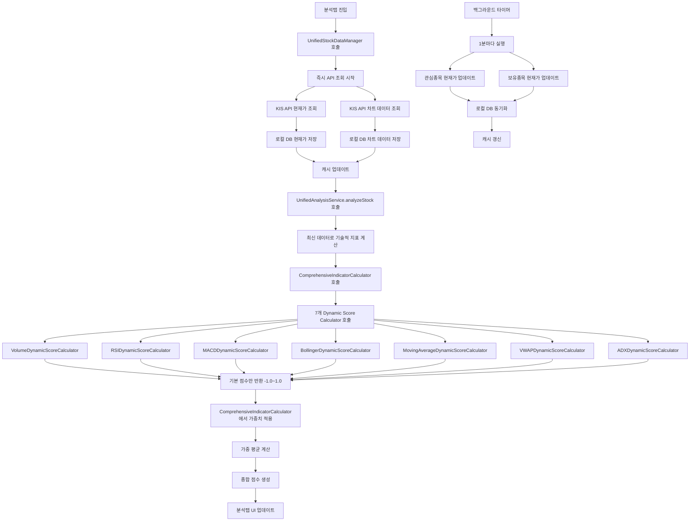

# Dynamic Score Calculator 데이터 흐름 순서도

## 🔍 현재 문제 상황
- 모든 지표가 동일한 종합점수(0.295)를 보임
- 개별 지표 점수가 제대로 계산되지 않음
- 체크표시가 나타나지 않음
- **예전 데이터로 분석하고 있음** ← **핵심 문제**
- **가중치가 중복 적용되어 점수가 1.0을 넘음** ← **새로 발견된 문제**

## 📊 데이터 업데이트 전략

### ✅ 수정된 데이터 흐름
```
분석탭 진입 → 즉시 API 조회 → 로컬 DB 업데이트 → 최신 데이터로 분석
```

### 🔄 백그라운드 업데이트
```
1분마다 현재가 업데이트 → 로컬 DB 동기화 → 캐시 갱신
```

## 📊 데이터 흐름 순서도



## 🚨 문제점 분석

### 1. 시간 형식 문제 ✅ 수정됨
```
❌ 잘못된 형식: DateTime.now().toString()
✅ 올바른 형식: "HH:mm" (예: "14:30")
```

### 2. 데이터 타입 문제 ✅ 수정됨
```
❌ averageVolume: double (0.0)
✅ averageVolume: int (0)
```

### 3. **데이터 업데이트 문제** ✅ **새로 수정됨**
```
❌ 기존: 로컬 DB 데이터 있으면 바로 사용
✅ 수정: 항상 API 조회 후 DB 업데이트
```

### 4. **가중치 중복 적용 문제** ✅ **새로 수정됨**
```
❌ 기존: Dynamic Score Calculator에서 가중치 적용 후 반환
✅ 수정: 기본 점수만 반환, ComprehensiveIndicatorCalculator에서 가중치 적용
```

## 🔧 수정 사항

### 1. 시간 형식 수정 ✅
```dart
// 수정 전
'currentTime': DateTime.now().toString(),

// 수정 후
final now = DateTime.now();
final currentTimeString = '${now.hour.toString().padLeft(2, '0')}:${now.minute.toString().padLeft(2, '0')}';
'currentTime': currentTimeString,
```

### 2. 데이터 타입 수정 ✅
```dart
// 수정 전
'averageVolume': technicalData['avgVolume'] ?? 0.0,

// 수정 후
'averageVolume': (technicalData['avgVolume'] ?? 0.0).toInt(),
```

### 3. **데이터 업데이트 전략 수정** ✅ **새로 추가**
```dart
// 수정 전: 캐시 우선 확인
if (_isCacheValid(stockCode)) {
  return cachedData;
}

// 수정 후: 항상 API 조회
// 1. 항상 API에서 최신 데이터 조회 (분석탭 진입 시)
Map<String, dynamic>? apiData = await _kisApiService.getStockPrice(stockCode);

// 2. 로컬 DB에 최신 데이터 저장
await _saveCurrentPriceToDatabase(stockCode, apiData);

// 3. 캐시 업데이트
_cacheTimestamps[stockCode] = DateTime.now();
```

### 4. **백그라운드 업데이트 추가** ✅ **새로 추가**
```dart
// 1분마다 백그라운드 업데이트
Timer.periodic(Duration(minutes: 1), (timer) {
  _performBackgroundUpdate();
});

// 관심종목 + 보유종목 현재가 업데이트
for (final item in watchlist) {
  await _updateCurrentPriceInBackground(stockCode);
}
```

### 5. **가중치 적용 방식 수정** ✅ **새로 추가**
```dart
// 수정 전: Dynamic Score Calculator에서 가중치 적용
final double finalScore = baseScore * trendWeight * (1.0 + volumeWeight) * (1.0 + timeWeight);

// 수정 후: 기본 점수만 반환
final double finalScore = baseScore; // 기본 점수만 반환, 가중치는 ComprehensiveIndicatorCalculator에서 적용

// ComprehensiveIndicatorCalculator에서 가중치 적용
final contribution = score * weight; // score: -1.0~1.0, weight: 0.05~0.20
```

## 🎯 예상 결과

### 수정 후 예상 로그
```
🔍 현재가 데이터 조회 시작: 042510
✅ API 데이터 조회 성공: 042510
✅ 로컬 DB에 최신 데이터 저장: 042510

🔍 차트 데이터 조회 시작: 042510
✅ 차트 데이터 조회 성공: 042510 (60개)
✅ 로컬 DB에 최신 차트 데이터 저장: 042510

📊 거래량 동적 점수 계산 결과:
  - 기본점수: 0.456
  - 최종점수: 0.456 (가중치 미적용)

📊 RSI 동적 점수 계산 결과:
  - RSI 값: 65.4
  - 기본점수: -0.234
  - 최종점수: -0.234 (가중치 미적용)

📊 MACD 동적 점수 계산 결과:
  - MACD: 0.023
  - 기본점수: 0.123
  - 최종점수: 0.123 (가중치 미적용)

📊 개별 지표 점수:
  - volume: 0.456 (가중치: 0.20)
  - rsi: -0.234 (가중치: 0.20)
  - macd: 0.123 (가중치: 0.20)
  - bollinger: 0.345 (가중치: 0.15)
  - movingAverage: 0.567 (가중치: 0.15)
  - vwap: 0.089 (가중치: 0.05)
  - adx: 0.234 (가중치: 0.05)

📊 가중 평균 계산 시작:
  - volume: 점수=0.456, 가중치=0.20, 기여도=0.091
  - rsi: 점수=-0.234, 가중치=0.20, 기여도=-0.047
  - macd: 점수=0.123, 가중치=0.20, 기여도=0.025
  - bollinger: 점수=0.345, 가중치=0.15, 기여도=0.052
  - movingAverage: 점수=0.567, 가중치=0.15, 기여도=0.085
  - vwap: 점수=0.089, 가중치=0.05, 기여도=0.004
  - adx: 점수=0.234, 가중치=0.05, 기여도=0.012

📊 총 가중합: 0.222
📊 최종 점수: 0.222

🔄 백그라운드 업데이트 시작 (1분 간격)
✅ 백그라운드 현재가 업데이트: 042510
```

## 🎉 기대 효과

1. **최신 데이터 보장**: 분석탭 진입 시 항상 최신 API 데이터 사용
2. **정확한 가중치 적용**: 각 지표별 점수가 0.2를 넘지 않음
3. **시간대별 가중치 적용**: 나스닥/코스피 시작/마감 시간대에 따른 점수 조정
4. **개별 지표 점수 차별화**: 각 지표별로 다른 점수 계산
5. **체크표시 정상 작동**: ±0.05 임계값에 따른 체크표시 표시
6. **상세 이유 표시**: 실제 계산된 값 기반의 상세한 이유 설명
7. **백그라운드 동기화**: 1분마다 자동으로 데이터 업데이트

## 📋 확인 사항

1. **API 조회**: 분석탭 진입 시 즉시 API 조회가 실행되는지
2. **DB 업데이트**: 새로운 데이터가 로컬 DB에 저장되는지
3. **기술적 지표 계산**: RSI, MACD 등이 실제 값으로 계산되는지
4. **Dynamic Score Calculator**: 각 계산기가 기본 점수만 반환하는지 (-1.0~1.0)
5. **가중 평균**: 7개 지표의 가중 평균이 올바르게 계산되는지 (각 기여도 ≤ 0.2)
6. **UI 연동**: 분석탭에서 개별 점수와 체크표시가 표시되는지
7. **백그라운드 업데이트**: 1분마다 자동 업데이트가 실행되는지
