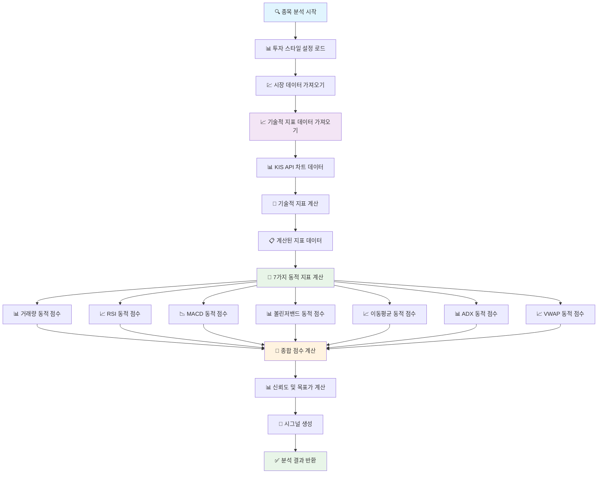

# 🔄 UnifiedAnalysisService 수정된 구조 순서도

## 📊 **수정 전 vs 수정 후 비교**

### ❌ **수정 전 (문제점)**
```
종목 분석 시작
    ↓
시장 데이터 가져오기 (KIS API)
    ↓
더미 데이터로 동적 지표 계산 ❌
    ↓
종합 점수 계산 (의미 없는 결과)
    ↓
분석 완료
```

### ✅ **수정 후 (개선점)**
```
종목 분석 시작
    ↓
시장 데이터 가져오기 (KIS API)
    ↓
기술적 지표 데이터 가져오기 (KIS API + 계산)
    ↓
실제 데이터로 동적 지표 계산 ✅
    ↓
종합 점수 계산 (의미 있는 결과)
    ↓
분석 완료
```

## 🔄 **상세 데이터 흐름 순서도**



## 📋 **기술적 지표 데이터 구성**

### 🔧 **계산되는 지표들**
```dart
{
  'rsi': 50.0,                    // RSI (14일 Wilder 공식)
  'macd': 0.0,                   // MACD 값
  'signal': 0.0,                 // MACD Signal 값
  'histogram': 0.0,              // MACD Histogram
  'bbUpper': 50000,              // 볼린저 상단
  'bbMiddle': 49000,             // 볼린저 중간
  'bbLower': 48000,              // 볼린저 하단
  'ma5': 49500,                  // 5일 이동평균
  'ma20': 49000,                 // 20일 이동평균
  'ma60': 48500,                 // 60일 이동평균
  'vwap': 49200,                 // 거래량가중평균가격
  'adx': 25.0,                   // ADX (추세 강도)
  'atr': 1.5,                    // ATR (14일)
  'avgAtr': 1.2,                 // 평균 ATR (20일)
  'avgVolume': 1000000,          // 평균 거래량 (20일)
  'currentVolume': 1200000,      // 현재 거래량
  'currentPrice': 49500,         // 현재가
  'previousPrice': 49000,        // 이전가
}
```

## 🎯 **동적 지표 계산기별 입력 데이터**

### 1️⃣ **거래량 동적 점수 계산기**
```dart
VolumeDynamicScoreCalculator.calculateVolumeScore(
  currentVolume: 1200000,        // 실제 현재 거래량
  averageVolume: 1000000,        // 실제 평균 거래량
  currentPrice: 49500,           // 실제 현재가
  previousPrice: 49000,          // 실제 이전가
  currentTime: "14:30",          // 실제 현재 시간
)
```

### 2️⃣ **RSI 동적 점수 계산기**
```dart
RSIDynamicScoreCalculator.calculateRSIScore(
  rsiValue: 65.5,                // 실제 RSI 값
  currentVolume: 1200000,        // 실제 현재 거래량
  averageVolume: 1000000,        // 실제 평균 거래량
  currentATR: 1.5,               // 실제 ATR 값
  averageATR: 1.2,               // 실제 평균 ATR 값
  currentTime: "14:30",          // 실제 현재 시간
)
```

### 3️⃣ **MACD 동적 점수 계산기**
```dart
MACDDynamicScoreCalculator.calculateMACDScore(
  macdValue: 0.5,                // 실제 MACD 값
  signalValue: 0.3,              // 실제 Signal 값
  adxValue: 28.0,                // 실제 ADX 값
  currentVolume: 1200000,        // 실제 현재 거래량
  averageVolume: 1000000,        // 실제 평균 거래량
  currentTime: "14:30",          // 실제 현재 시간
)
```

### 4️⃣ **볼린저밴드 동적 점수 계산기**
```dart
BollingerDynamicScoreCalculator.calculateBollingerScore(
  currentPrice: 49500,           // 실제 현재가
  upperBand: 50000,              // 실제 상단 밴드
  middleBand: 49000,             // 실제 중간 밴드
  lowerBand: 48000,              // 실제 하단 밴드
  currentATR: 1.5,               // 실제 ATR 값
  averageATR: 1.2,               // 실제 평균 ATR 값
  currentVolume: 1200000,        // 실제 현재 거래량
  averageVolume: 1000000,        // 실제 평균 거래량
  currentTime: "14:30",          // 실제 현재 시간
)
```

### 5️⃣ **이동평균 동적 점수 계산기**
```dart
MovingAverageDynamicScoreCalculator.calculateMovingAverageScore(
  ma5: 49500,                    // 실제 MA5
  ma20: 49000,                   // 실제 MA20
  ma60: 48500,                   // 실제 MA60
  adxValue: 28.0,                // 실제 ADX 값
  currentVolume: 1200000,        // 실제 현재 거래량
  averageVolume: 1000000,        // 실제 평균 거래량
  currentTime: "14:30",          // 실제 현재 시간
)
```

### 6️⃣ **ADX 동적 점수 계산기**
```dart
ADXDynamicScoreCalculator.calculateADXScore(
  adxValue: 28.0,                // 실제 ADX 값
  currentVolume: 1200000,        // 실제 현재 거래량
  averageVolume: 1000000,        // 실제 평균 거래량
  currentATR: 1.5,               // 실제 ATR 값
  averageATR: 1.2,               // 실제 평균 ATR 값
  currentTime: "14:30",          // 실제 현재 시간
)
```

### 7️⃣ **VWAP 동적 점수 계산기**
```dart
VWAPDynamicScoreCalculator.calculateVWAPScore(
  currentPrice: 49500,           // 실제 현재가
  vwapValue: 49200,              // 실제 VWAP 값
  currentVolume: 1200000,        // 실제 현재 거래량
  averageVolume: 1000000,        // 실제 평균 거래량
  currentATR: 1.5,               // 실제 ATR 값
  averageATR: 1.2,               // 실제 평균 ATR 값
  currentTime: "14:30",          // 실제 현재 시간
)
```

## 🎯 **종합 점수 계산 가중치**

```dart
{
  'volume': 0.20,        // 거래량 (20%) - 모든 지표의 신뢰도
  'rsi': 0.20,           // RSI (20%) - 과매수/과매도 판단
  'macd': 0.20,          // MACD (20%) - 추세 전환 포착
  'bollinger': 0.15,     // 볼린저밴드 (15%) - 변동성 기반 타이밍
  'movingAverage': 0.15, // 이동평균선 (15%) - 추세 방향 판단
  'vwap': 0.05,          // VWAP (5%) - 일일 기준가격
  'adx': 0.05,           // ADX (5%) - 추세 강도 판단
}
```

## ✅ **수정 효과**

### 🎯 **이전 문제점**
- ❌ 더미 데이터 사용으로 의미 없는 결과
- ❌ 실제 시장 상황과 무관한 분석
- ❌ 동적 점수 계산기의 고급 로직 활용 못함

### 🚀 **개선 효과**
- ✅ 실제 KIS API 데이터 활용
- ✅ 정확한 기술적 지표 계산
- ✅ 동적 점수 계산기의 완전한 기능 활용
- ✅ 시간대별, 거래량별, 변동성별 세밀한 분석
- ✅ 신뢰도 높은 매매 시그널 생성

## 📊 **실행 예시**

```dart
// 분석 실행
final result = await UnifiedAnalysisService.instance.analyzeStock('005930');

// 결과 예시
{
  'stockCode': '005930',
  'stockName': '삼성전자',
  'currentPrice': 49500,
  'comprehensiveScore': 0.65,        // 실제 계산된 종합 점수
  'individualScores': {
    'volume': 0.8,                   // 거래량 점수
    'rsi': 0.6,                      // RSI 점수
    'macd': 0.7,                     // MACD 점수
    'bollinger': 0.5,                // 볼린저 점수
    'movingAverage': 0.6,            // 이동평균 점수
    'vwap': 0.3,                     // VWAP 점수
    'adx': 0.4,                      // ADX 점수
  },
  'tradingDecision': '매수',
  'signal': '매수',
  'confidence': 0.75,
  'targetPrice': 51200,
  'isTradingTime': true,
  'analysisTime': '2024-01-15T14:30:00.000Z',
}
```

이제 **UnifiedAnalysisService**가 실제 시장 데이터를 활용하여 의미 있는 분석 결과를 제공합니다! 🎉
