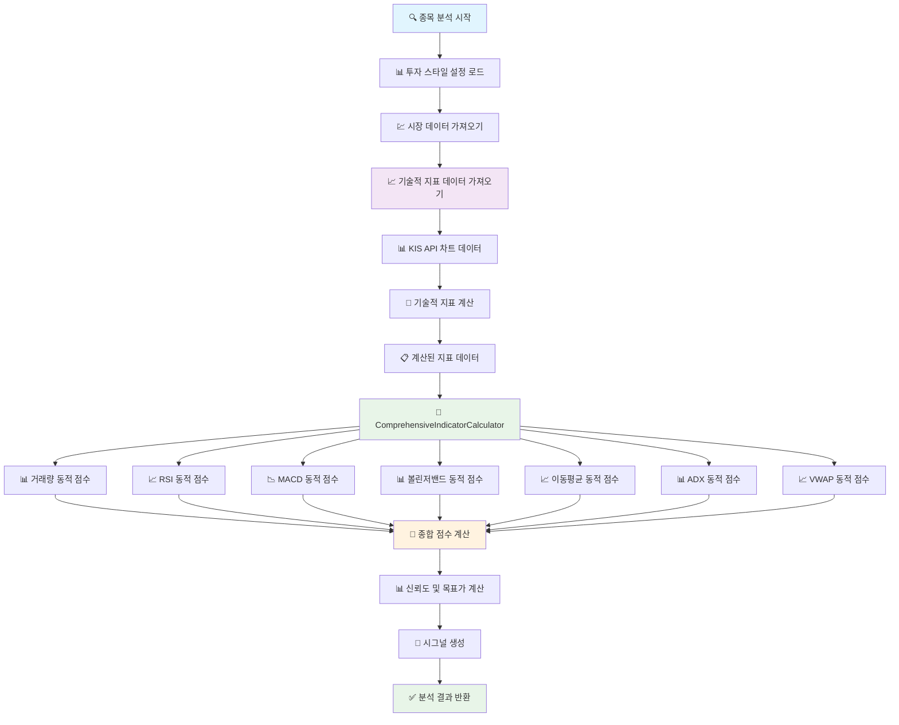

# 🔄 UnifiedAnalysisService 중복 제거 수정 순서도

## 📊 **수정 전 vs 수정 후 비교**

### ❌ **수정 전 (중복 문제)**
```
종목 분석 시작
    ↓
시장 데이터 가져오기 (KIS API)
    ↓
기술적 지표 데이터 가져오기 (KIS API + 계산)
    ↓
UnifiedAnalysisService._calculateIndicators() ❌
    ↓ (중복 계산)
ComprehensiveIndicatorCalculator.calculateComprehensiveScore() ❌
    ↓ (중복 계산)
종합 점수 계산 (중복된 결과)
    ↓
분석 완료
```

### ✅ **수정 후 (중복 제거)**
```
종목 분석 시작
    ↓
시장 데이터 가져오기 (KIS API)
    ↓
기술적 지표 데이터 가져오기 (KIS API + 계산)
    ↓
ComprehensiveIndicatorCalculator.calculateComprehensiveScore() ✅
    ↓ (단일 계산)
종합 점수 계산 (정확한 결과)
    ↓
분석 완료
```

## 🔄 **상세 데이터 흐름 순서도**



## 🗑️ **제거된 중복 코드**

### ❌ **제거된 메서드**
```dart
// UnifiedAnalysisService._calculateIndicators() - 완전 제거
Future<Map<String, dynamic>> _calculateIndicators(
  String stockCode,
  Map<String, dynamic> marketData,
  double currentPrice,
  Map<String, dynamic> technicalData,
) async {
  // 1. 거래량 동적 점수 계산 ❌ (중복)
  // 2. RSI 동적 점수 계산 ❌ (중복)
  // 3. MACD 동적 점수 계산 ❌ (중복)
  // 4. 볼린저밴드 동적 점수 계산 ❌ (중복)
  // 5. 이동평균 동적 점수 계산 ❌ (중복)
  // 6. ADX 동적 점수 계산 ❌ (중복)
  // 7. VWAP 동적 점수 계산 ❌ (중복)
}
```

### ❌ **제거된 Import**
```dart
// 더 이상 사용하지 않는 import들 제거
import 'volume_dynamic_score_calculator.dart';      // ❌ 제거
import 'rsi_dynamic_score_calculator.dart';         // ❌ 제거
import 'macd_dynamic_score_calculator.dart';        // ❌ 제거
import 'bollinger_dynamic_score_calculator.dart';   // ❌ 제거
import 'moving_average_dynamic_score_calculator.dart'; // ❌ 제거
import 'adx_dynamic_score_calculator.dart';         // ❌ 제거
import 'vwap_dynamic_score_calculator.dart';        // ❌ 제거
```

## ✅ **수정된 코드 구조**

### 🎯 **UnifiedAnalysisService의 역할**
```dart
class UnifiedAnalysisService {
  // 1. 시장 데이터 수집
  Future<Map<String, dynamic>?> _getMarketData(String stockCode)
  
  // 2. 기술적 지표 데이터 준비
  Future<Map<String, dynamic>> _getTechnicalIndicators(String stockCode, Map<String, dynamic> marketData)
  
  // 3. ComprehensiveIndicatorCalculator에 데이터 전달
  final comprehensiveResult = ComprehensiveIndicatorCalculator.calculateComprehensiveScore(
    indicatorData: {
      'currentPrice': price,
      'previousPrice': technicalData['previousPrice'],
      'currentVolume': technicalData['currentVolume'],
      'averageVolume': technicalData['avgVolume'],
      'rsiValue': technicalData['rsi'],
      'macdValue': technicalData['macd'],
      'signalValue': technicalData['signal'],
      'upperBand': technicalData['bbUpper'],
      'middleBand': technicalData['bbMiddle'],
      'lowerBand': technicalData['bbLower'],
      'ma5': technicalData['ma5'],
      'ma20': technicalData['ma20'],
      'ma60': technicalData['ma60'],
      'vwapValue': technicalData['vwap'],
      'adxValue': technicalData['adx'],
      'currentATR': technicalData['atr'],
      'averageATR': technicalData['avgAtr'],
      'currentTime': DateTime.now().toString(),
    },
    currentTime: DateTime.now().toString(),
    buyThreshold: buyThreshold,
    sellThreshold: sellThreshold,
  );
  
  // 4. 결과 처리 및 시그널 생성
  // 5. 신뢰도 및 목표가 계산
}
```

### 🎯 **ComprehensiveIndicatorCalculator의 역할**
```dart
class ComprehensiveIndicatorCalculator {
  // 모든 동적 지표 계산을 담당
  static Map<String, dynamic> calculateComprehensiveScore({
    required Map<String, dynamic> indicatorData,
    required String currentTime,
    double? buyThreshold,
    double? sellThreshold,
  }) {
    // 1. 각 지표별 점수 계산 (_calculateIndividualScores)
    // 2. 가중 평균으로 종합 점수 계산 (_calculateWeightedAverage)
    // 3. 매매 실행 기준 판단 (_determineTradingDecision)
    // 4. 신호 강도 분석 (_analyzeSignalStrength)
    // 5. 상세 분석 결과 생성 (_generateAnalysisResult)
  }
}
```

## 📊 **데이터 전달 구조**

### 🔄 **기술적 지표 데이터 변환**
```dart
// UnifiedAnalysisService에서 준비한 데이터
{
  'rsi': 65.5,                    // RSI 값
  'macd': 0.5,                   // MACD 값
  'signal': 0.3,                 // MACD Signal 값
  'bbUpper': 50000,              // 볼린저 상단
  'bbMiddle': 49000,             // 볼린저 중간
  'bbLower': 48000,              // 볼린저 하단
  'ma5': 49500,                  // 5일 이동평균
  'ma20': 49000,                 // 20일 이동평균
  'ma60': 48500,                 // 60일 이동평균
  'vwap': 49200,                 // VWAP 값
  'adx': 28.0,                   // ADX 값
  'atr': 1.5,                    // ATR 값
  'avgAtr': 1.2,                 // 평균 ATR 값
  'avgVolume': 1000000,          // 평균 거래량
  'currentVolume': 1200000,      // 현재 거래량
  'currentPrice': 49500,         // 현재가
  'previousPrice': 49000,        // 이전가
}

// ComprehensiveIndicatorCalculator가 기대하는 형태로 변환
{
  'currentPrice': 49500,
  'previousPrice': 49000,
  'currentVolume': 1200000,
  'averageVolume': 1000000.0,
  'rsiValue': 65.5,              // rsi → rsiValue
  'macdValue': 0.5,              // macd → macdValue
  'signalValue': 0.3,            // signal → signalValue
  'upperBand': 50000,            // bbUpper → upperBand
  'middleBand': 49000,           // bbMiddle → middleBand
  'lowerBand': 48000,            // bbLower → lowerBand
  'ma5': 49500,
  'ma20': 49000,
  'ma60': 48500,
  'vwapValue': 49200,            // vwap → vwapValue
  'adxValue': 28.0,              // adx → adxValue
  'currentATR': 1.5,             // atr → currentATR
  'averageATR': 1.2,             // avgAtr → averageATR
  'currentTime': "2024-01-15T14:30:00.000Z",
}
```

## ✅ **수정 효과**

### 🎯 **이전 문제점**
- ❌ **중복 계산**: 동일한 동적 지표를 두 번 계산
- ❌ **성능 저하**: 불필요한 계산으로 인한 처리 시간 증가
- ❌ **코드 복잡성**: 동일한 로직이 두 곳에 분산
- ❌ **유지보수 어려움**: 한 곳 수정 시 다른 곳도 수정 필요

### 🚀 **개선 효과**
- ✅ **단일 책임**: ComprehensiveIndicatorCalculator가 모든 계산 담당
- ✅ **성능 향상**: 중복 계산 제거로 처리 시간 단축
- ✅ **코드 단순화**: UnifiedAnalysisService는 데이터 준비와 결과 처리만 담당
- ✅ **유지보수 용이**: 계산 로직이 한 곳에 집중

## 📊 **실행 예시**

```dart
// 분석 실행
final result = await UnifiedAnalysisService.instance.analyzeStock('005930');

// 결과 예시 (중복 제거 후)
{
  'stockCode': '005930',
  'stockName': '삼성전자',
  'currentPrice': 49500,
  'comprehensiveScore': 0.65,        // ComprehensiveIndicatorCalculator에서 계산
  'individualScores': {              // ComprehensiveIndicatorCalculator에서 계산
    'volume': 0.8,
    'rsi': 0.6,
    'macd': 0.7,
    'bollinger': 0.5,
    'movingAverage': 0.6,
    'vwap': 0.3,
    'adx': 0.4,
  },
  'tradingDecision': '매수',         // ComprehensiveIndicatorCalculator에서 판단
  'signal': '매수',                  // UnifiedAnalysisService에서 생성
  'confidence': 0.75,                // UnifiedAnalysisService에서 계산
  'targetPrice': 51200,              // UnifiedAnalysisService에서 계산
  'isTradingTime': true,
  'technicalData': {...},            // 원본 기술적 지표 데이터
  'comprehensiveResult': {...},      // ComprehensiveIndicatorCalculator의 전체 결과
  'analysisTime': '2024-01-15T14:30:00.000Z',
}
```

이제 **UnifiedAnalysisService**가 중복 없이 깔끔하게 **ComprehensiveIndicatorCalculator**를 활용하여 효율적인 분석을 수행합니다! 🎉
