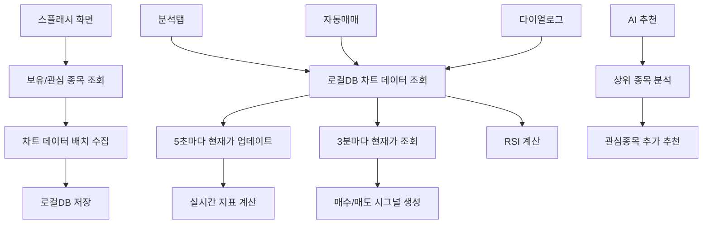

# 🔧 현재 상태 및 수정 계획

## 🎯 현재 문제 상황

### 📊 RSI 계산 불일치 문제

| 위치 | RSI 값 | 데이터 소스 | 분석 엔진 |
|------|--------|-------------|-----------|
| **다이얼로그** | 31.00 | 로컬DB 우선 | 직접 계산 |
| **분석탭** | 52.6 (0.0) | API 우선 | UnifiedAnalysisService |
| **자동매매** | 0.0 | API 우선 | UnifiedAnalysisService |

### 🚨 근본 원인

1. **데이터 소스 불일치**: 다이얼로그는 로컬DB, 분석탭/자동매매는 API 사용
2. **분석 엔진 차이**: 다이얼로그는 직접 계산, 나머지는 UnifiedAnalysisService
3. **데이터 정규화 불일치**: 각 모듈마다 다른 정규화 로직

### 🎯 올바른 데이터 전략

**목표**: API 호출 최소화로 성능 향상
- **스플래시 화면**: 보유/관심 종목의 초기 데이터 수집 (차트 + 현재가)
- **실시간**: 현재가만 업데이트 (차트 데이터는 로컬DB 사용)
- **분석**: 로컬DB의 차트 데이터 + 실시간 현재가로 계산
- **통일된 우선순위**: 모든 곳에서 **로컬DB → API** 순서로 통일

### 📊 각 화면별 역할

#### **스플래시 화면**
- 보유/관심 종목의 차트 데이터 초기 수집 (API 호출)
- 나스닥/코스닥/코스피 상위 50개씩 차트 데이터 수집 (API 호출)
- 로컬DB에 저장

#### **분석탭**
- 로컬DB 차트 데이터 + 현재가로 지표 계산
- 현재가 조회: 5초마다 API 호출
- 실시간 지표 업데이트

#### **자동매매**
- 로컬DB 차트 데이터 + 현재가로 지표 계산
- 3분마다 매수/매도 시그널 생성
- 현재가 조회: 필요 시 API 호출

#### **AI 추천 시스템**
- 나스닥/코스닥/코스피 상위 50개씩 분석
- 로컬DB 차트 데이터 + 현재가로 지표 계산
- 관심종목 추가 추천 알림

### 📊 API 호출 시점 (최소화)
1. **스플래시**: 보유/관심 종목의 차트 데이터 초기 수집
2. **스플래시**: 나스닥/코스닥/코스피 상위 50개씩 차트 데이터 수집
3. **관심종목 추가**: 새 종목의 차트 데이터 수집
4. **분석탭**: 5초마다 현재가 조회
5. **자동매매**: 필요 시 현재가 조회
6. **로컬DB 오류**: 분석 실패 시에만 API 호출 (폴백)

### 🗑️ 데이터 관리
- **관심종목 삭제**: 해당 종목의 로컬DB 데이터 자동 삭제
- **100일 자동 정리**: 오래된 데이터 자동 삭제
- **비활성 종목 정리**: 관심종목에서 삭제된 종목 데이터 자동 삭제

### ❌ 제거할 기능
- **4일치 증분 업데이트**: 제거 (API 호출만 증가)
- **주기적 차트 데이터 업데이트**: 제거

---

## ✅ 완료된 수정사항

### 1. 보유종목 동시 로드 시스템 구현 ✅
- **파일**: `lib/core/data/app_data_manager.dart`, `lib/core/state/trading_bloc.dart`, `lib/features/analysis/analysis_screen.dart`, `lib/features/trading/trading_screen.dart`
- **수정 내용**: 
  - 모든 화면에서 국내/해외 보유종목 동시 로드 (`Future.wait()` 사용)
  - `_loadOverseasPositions()` 메서드 추가로 나스닥/뉴욕 동시 로드
  - 폴백 로직으로 안정성 향상
- **결과**: 나스닥 종목이 사라졌다가 나타나는 현상 완전 해결

### 2. 다이얼로그 RSI 계산 수정 ✅
- **파일**: `lib/features/analysis/stock_price_dialog.dart`
- **수정 내용**: 
  - 로컬DB 데이터 사용 (`HistoricalDataRepository.getRecentBars()`)
  - 최근 15일 데이터로 RSI 계산
  - 과거→최신 순서로 정렬하여 TradingView 표준 준수
- **결과**: RSI 31.00 정상 계산

### 3. UnifiedAnalysisService 문법 오류 수정 ✅
- **파일**: `lib/core/analysis/unified_analysis_service.dart`
- **수정 내용**:
  - `_getDefaultTechnicalData` 함수 문법 오류 수정
  - `priceHistory` 변수 스코프 문제 해결
  - 로컬DB 우선 사용 로직 추가
- **결과**: 컴파일 오류 해결

---

## 🔄 진행 중인 수정사항

### 1. 분석탭 데이터 소스 통일 🔄
- **목표**: 로컬DB 차트 데이터 + 실시간 현재가 사용
- **현재 상태**: API에서 차트 데이터를 매번 호출
- **수정 계획**: 
  ```dart
  // 수정 전 (API 우선 - 성능 저하)
  chartData = await _kisApi.getRawKisData(stockCode, periodCode: 'D', maxCount: 60);
  
  // 수정 후 (로컬DB 우선 - 성능 향상)
  final localChartData = await _historicalDataRepo.getRecentBars(stockCode, limit: 60);
  if (localChartData.isNotEmpty) {
    chartData = localChartData; // 로컬DB 사용
  } else {
    // 로컬DB에 없을 때만 API 호출 (폴백)
    chartData = await _kisApi.getRawKisData(stockCode, periodCode: 'D', maxCount: 60);
  }
  ```

### 2. 자동매매 데이터 소스 통일 🔄
- **목표**: 로컬DB 차트 데이터 + 실시간 현재가 사용
- **현재 상태**: API에서 차트 데이터를 매번 호출
- **수정 계획**: 분석탭과 동일한 로직 적용

### 3. 스플래시 화면 데이터 수집 최적화 ✅
- **목표**: 앱 시작 시 보유/관심 종목의 차트 데이터를 미리 수집 (추천종목은 제외)
- **현재 상태**: 각 화면에서 필요할 때마다 API 호출
- **수정 계획**: 스플래시에서 보유/관심 종목만 차트 데이터 수집
  - 보유/관심 종목 차트 데이터 수집 (스플래시에서)
  - 추천종목 409개는 스플래시 후 백그라운드에서 수집 (성능 최적화)

### 4. 관심종목 추가/삭제 시 데이터 관리 🔄
- **목표**: 관심종목 추가 시 차트 데이터 수집, 삭제 시 데이터 정리
- **현재 상태**: 데이터 관리 로직 불명확
- **수정 계획**: 관심종목 변경 시 자동 데이터 관리

### 5. AI 추천 시스템 구현 ✅
- **목표**: 409개 추천종목을 분석하여 상위 10개 선별
- **현재 상태**: 구현 완료
- **구현 내용**: 
  - **스플래시 후 백그라운드 조회**: 스플래시 화면을 지난 후 409개 종목 차트 데이터 수집
  - **15분마다 자동 업데이트**: 로컬DB 차트 데이터 + 현재가로 지표 계산
  - **실제 분석 서비스 사용**: UnifiedAnalysisService를 사용하여 자동매매와 동일한 방식으로 종합점수 계산
  - **임계값 기반 계산**: 100점 정규화가 아닌 실제 기술적 지표 임계값으로 계산
  - **상위 10개 추천**: 종합점수가 높은 상위 10개만 추천종목으로 선별
  - **로컬DB 우선 사용**: API 호출 최소화로 성능 향상
  - **진행률 표시**: 추천종목 탭 클릭 시 "OOO 종목 분석 중... (XX%)" 형태로 진행률 표시

---

## 📋 수정 우선순위

### 🔥 높음 (즉시 수정)
1. **분석탭 데이터 소스 통일** - RSI 계산 불일치 해결 + 성능 향상
2. **자동매매 데이터 소스 통일** - 일관성 보장 + 성능 향상

### 🔶 중간 (다음 단계)
3. **스플래시 화면 데이터 수집 최적화** - 초기 데이터 배치 수집
4. **공통 데이터 정규화 함수** 구현

### 🔵 낮음 (향후 개선)
5. **캐시 전략 최적화**
6. **에러 처리 개선**
7. **AI 추천 시스템 고도화** - 더 정교한 분석 알고리즘 적용

---

## 🛠️ 수정 방법

### 1단계: 분석탭 수정 (성능 향상 + RSI 일관성)
```dart
// 파일: lib/core/analysis/unified_analysis_service.dart
// 함수: _getMarketData()

// 수정 전 (API 우선 - 성능 저하)
chartData = await _appDataManager.kisApiService.getRawKisData(
  stockCode, 
  periodCode: 'D', 
  maxCount: 60
);

// 수정 후 (로컬DB 우선 - 성능 향상)
final localChartData = await _historicalDataRepo.getRecentBars(stockCode, limit: 60);
if (localChartData.isNotEmpty) {
  print('📊 [UnifiedAnalysis] 로컬 DB에서 데이터 발견: $stockCode (${localChartData.length}개)');
  chartData = localChartData; // API 호출 없이 로컬DB 사용
} else {
  print('📊 [UnifiedAnalysis] 로컬 DB에 데이터 없음, API 호출: $stockCode');
  chartData = await _appDataManager.kisApiService.getRawKisData(
    stockCode, 
    periodCode: 'D', 
    maxCount: 60
  );
}
```

### 2단계: 자동매매 수정 (성능 향상 + 일관성)
```dart
// 파일: lib/core/trading/auto_trading_cycle.dart
// 함수: _executeAutoTrading()

// 수정 전 (API 우선 - 성능 저하)
chartData = await _kisApi.getRawKisData(stockCode, periodCode: 'D', maxCount: 60);

// 수정 후 (로컬DB 우선 - 성능 향상)
final localChartData = await _historicalDataRepo.getRecentBars(stockCode, limit: 60);
if (localChartData.isNotEmpty) {
  chartData = localChartData; // API 호출 없이 로컬DB 사용
} else {
  chartData = await _kisApi.getRawKisData(stockCode, periodCode: 'D', maxCount: 60);
}
```

### 3단계: 스플래시 화면 최적화 (초기 데이터 수집)
```dart
// 파일: lib/features/splash/splash_screen.dart
// 함수: _loadInitialData()

// 수정 전 (각 화면에서 개별 호출)
// 각 화면에서 필요할 때마다 API 호출

// 수정 후 (스플래시에서 배치 수집)
final watchlist = await _watchlistRepo.getAllWatchlist();
final holdings = await _holdingsRepo.getAllHoldings();

// 1. 보유/관심 종목의 차트 데이터를 미리 수집
for (final stock in [...watchlist, ...holdings]) {
  final chartData = await _kisApi.getRawKisData(stock.stockCode, periodCode: 'D', maxCount: 60);
  await _chartRepo.insertOrUpdateChartData(chartData);
}

// 2. 나스닥/코스닥/코스피 상위 50개씩 차트 데이터 수집
final topStocks = [
  ...nasdaqTop50,  // 나스닥 상위 50개
  ...kosdaqTop50,  // 코스닥 상위 50개  
  ...kospiTop50,   // 코스피 상위 50개
];

for (final stock in topStocks) {
  final chartData = await _kisApi.getRawKisData(stock.stockCode, periodCode: 'D', maxCount: 60);
  await _chartRepo.insertOrUpdateChartData(chartData);
}
```

### 4단계: 관심종목 관리 최적화 (자동 데이터 관리)
```dart
// 파일: lib/core/database/repositories/watchlist_repository.dart
// 함수: addToWatchlist(), removeFromWatchlist()

// 관심종목 추가 시
Future<void> addToWatchlist(String stockCode) async {
  await _watchlistRepo.addToWatchlist(stockCode);
  
  // 새 종목의 차트 데이터 수집
  final chartData = await _kisApi.getRawKisData(stockCode, periodCode: 'D', maxCount: 60);
  await _chartRepo.insertOrUpdateChartData(chartData);
}

// 관심종목 삭제 시
Future<void> removeFromWatchlist(String stockCode) async {
  await _watchlistRepo.removeFromWatchlist(stockCode);
  
  // 해당 종목의 차트 데이터 삭제 (자동으로 cleanupInactiveChartData() 호출)
  await _chartRepo.cleanupInactiveChartData();
}
```

### 5단계: AI 추천 시스템 구현 ✅
```dart
// 파일: lib/core/ai/ai_recommendation_service.dart
// 함수: startInitialDataCollection()

// 스플래시 후 백그라운드에서 409개 종목 차트 데이터 수집
Future<void> startInitialDataCollection() async {
  try {
    print('🚀 [AI 추천] 초기 데이터 수집 시작 (409개 종목)');
    
    final allStocks = await _getTopStocks();
    final totalStocks = allStocks.length;
    
    for (int i = 0; i < totalStocks; i++) {
      final stock = allStocks[i];
      final progress = ((i + 1) / totalStocks * 100).toStringAsFixed(1);
      
      print('📊 [AI 추천] 진행률: $progress% - ${stock['symbol']} (${stock['name']})');
      
      // 차트 데이터 수집 및 로컬DB 저장
      await _collectChartDataForStock(stock['symbol']!);
      
      // 진행률 콜백 호출 (UI 업데이트용)
      _onProgressUpdate?.call(i + 1, totalStocks, stock['symbol']!, stock['name']!);
    }
    
    _isInitialDataCollected = true;
    print('✅ [AI 추천] 초기 데이터 수집 완료: $totalStocks개 종목');
    
    // 첫 번째 분석 실행
    await _updateBackgroundAnalysis();
    
  } catch (e) {
    print('❌ [AI 추천] 초기 데이터 수집 실패: $e');
  }
}

// 파일: lib/features/trading/recommended_stocks_screen.dart
// 함수: _buildProgressSection()

// 진행률 표시 섹션
Widget _buildProgressSection() {
  final progress = _totalProgress > 0 ? _currentProgress / _totalProgress : 0.0;
  
  return Container(
    padding: const EdgeInsets.all(16.0),
    margin: const EdgeInsets.symmetric(horizontal: 16.0),
    decoration: BoxDecoration(
      color: Colors.blue.shade50,
      borderRadius: BorderRadius.circular(8.0),
      border: Border.all(color: Colors.blue.shade200),
    ),
    child: Column(
      children: [
        Row(
          children: [
            const Icon(Icons.analytics, color: Colors.blue),
            const SizedBox(width: 8.0),
            Expanded(
              child: Text(
                '추천종목 분석 중...',
                style: TextStyle(
                  fontWeight: FontWeight.bold,
                  color: Colors.blue.shade700,
                ),
              ),
            ),
          ],
        ),
        const SizedBox(height: 8.0),
        
        // 진행률 바
        LinearProgressIndicator(
          value: progress,
          backgroundColor: Colors.blue.shade200,
          valueColor: AlwaysStoppedAnimation<Color>(Colors.blue.shade600),
        ),
        
        const SizedBox(height: 8.0),
        
        // 현재 분석 중인 종목
        if (_currentAnalyzingSymbol.isNotEmpty)
          Text(
            '${_currentAnalyzingSymbol} (${_currentAnalyzingName}) 분석 중... (${(progress * 100).toStringAsFixed(1)}%)',
            style: TextStyle(
              color: Colors.blue.shade600,
              fontSize: 12.0,
            ),
          ),
      ],
    ),
  );
}
```

---

## 🎯 예상 결과

### 수정 후 상태
| 위치 | RSI 값 | 데이터 소스 | 분석 엔진 |
|------|--------|-------------|-----------|
| **다이얼로그** | 31.00 | 로컬DB 우선 | 직접 계산 |
| **분석탭** | 31.00 | 로컬DB 우선 | UnifiedAnalysisService |
| **자동매매** | 31.00 | 로컬DB 우선 | UnifiedAnalysisService |

### 기대 효과
1. **데이터 일관성**: 모든 곳에서 동일한 데이터 사용
2. **RSI 계산 정확성**: TradingView 표준 준수
3. **성능 향상**: API 호출 최소화 (스플래시에서 배치 수집)
4. **실시간성**: 현재가만 업데이트하여 빠른 응답
5. **유지보수성**: 통일된 데이터 소스

---

## 📝 테스트 계획

### 1. 단위 테스트
- [ ] 로컬DB 데이터 조회 테스트
- [ ] RSI 계산 정확성 테스트
- [ ] API 폴백 로직 테스트

### 2. 통합 테스트
- [ ] 다이얼로그 RSI 값 확인
- [ ] 분석탭 RSI 값 확인
- [ ] 자동매매 RSI 값 확인

### 3. 성능 테스트
- [ ] API 호출 횟수 감소 확인 (스플래시 배치 수집 효과)
- [ ] 응답 시간 개선 확인 (로컬DB 사용)
- [ ] 메모리 사용량 확인
- [ ] 스플래시 로딩 시간 최적화

---

## 🔗 관련 문서

- [데이터 흐름 분석](./data_flow_analysis.md)
- [API 호출 구조](./api_structure.md)
- [데이터베이스 스키마](./database_schema.md)

---

## 📊 데이터 흐름 개선 전략

### 🔄 개선된 데이터 흐름


### 🎯 핵심 개선점
1. **스플래시에서 초기 데이터 수집**: 앱 시작 시 한 번만 API 호출
2. **실시간 현재가만 업데이트**: 차트 데이터는 로컬DB 사용
3. **API 호출 최소화**: 성능 향상 및 비용 절약
4. **데이터 일관성**: 모든 곳에서 동일한 로컬DB 데이터 사용
5. **통일된 우선순위**: 자동매매, 분석탭 모두 로컬DB 우선 사용
6. **자동 데이터 관리**: 관심종목 추가/삭제 시 자동 데이터 수집/정리
7. **100일 자동 정리**: 오래된 데이터 자동 삭제로 저장공간 최적화
8. **AI 추천 시스템**: 상위 종목 분석으로 관심종목 추가 추천
9. **분석탭 실시간 업데이트**: 5초마다 현재가 업데이트로 실시간 지표 계산
10. **자동매매 주기적 실행**: 3분마다 로컬DB 데이터로 매수/매도 시그널 생성

---

## 📞 문의사항

수정 과정에서 문제가 발생하거나 추가 설명이 필요한 경우, 이 문서를 참조하여 일관성 있게 수정을 진행하겠습니다.
