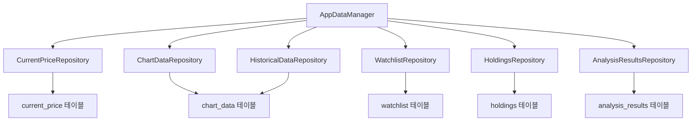
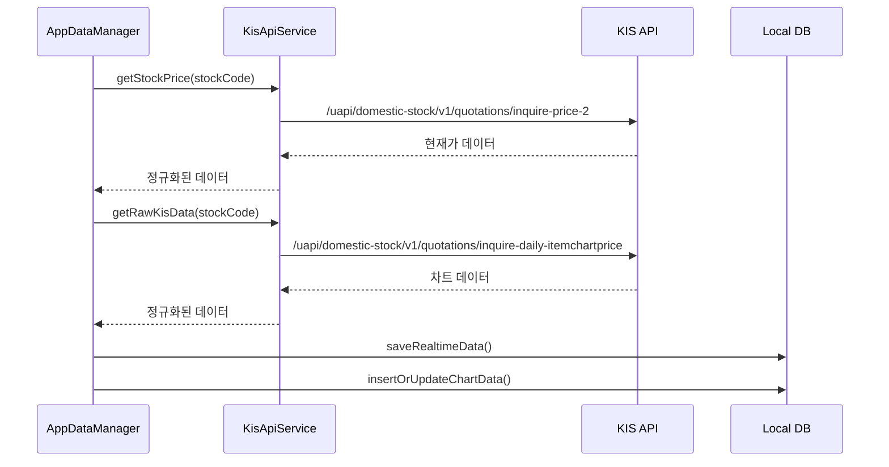
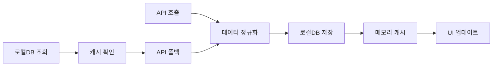
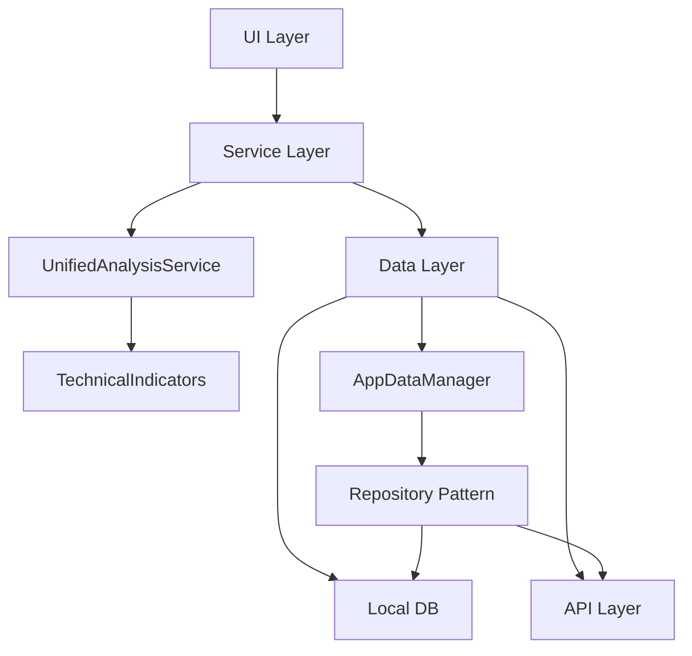

# 📊 자동매매 & 분석탭 데이터 흐름 분석

## 🎯 개요

자동매매와 분석탭의 로컬DB CRUD, API 호출, 데이터 흐름을 상세히 분석한 문서입니다.

---

## 📋 목차

1. [데이터베이스 구조](#데이터베이스-구조)
2. [API 호출 구조](#api-호출-구조)
3. [자동매매 데이터 흐름](#자동매매-데이터-흐름)
4. [분석탭 데이터 흐름](#분석탭-데이터-흐름)
5. [API vs 로컬DB 관계](#api-vs-로컬db-관계)
6. [문제점 및 개선방안](#문제점-및-개선방안)

---

## 🗄️ 데이터베이스 구조

### 📊 주요 테이블

| 테이블명 | 용도 | 주요 컬럼 |
|---------|------|-----------|
| `current_price` | 실시간 현재가 | stock_code, current_price, prev_close, volume, timestamp |
| `chart_data` | 일봉 차트 데이터 | stock_code, date, open, high, low, close, volume |
| `watchlist` | 관심종목 | stock_code, stock_name, market, added_at |
| `holdings` | 보유종목 | stock_code, stock_name, quantity, avg_price, current_price |
| `analysis_results` | 분석 결과 | stock_code, comprehensive_score, signal, confidence |
| `investment_styles` | 투자 스타일 | style_name, buy_threshold, sell_threshold |

### 🔧 Repository 구조



---

## 🌐 API 호출 구조

### 📡 주요 API 엔드포인트

| API | 용도 | 호출 위치 |
|-----|------|-----------|
| `getStockPrice()` | 국내주식 현재가 | 자동매매, 분석탭 |
| `getOverseasStockPrice()` | 해외주식 현재가 | 자동매매, 분석탭 |
| `getRawKisData()` | 국내주식 차트 | 자동매매, 분석탭 |
| `getOverseasDailyChartData()` | 해외주식 차트 | 자동매매, 분석탭 |

### 🔄 API 호출 흐름



---

## 🤖 자동매매 데이터 흐름

### 🔄 AutoTradingCycle 흐름도

```mermaid
graph TD
    A[자동매매 시작] --> B[관심종목 + 보유종목 조회]
    B --> C[각 종목별 분석]
    
    C --> D{시장 구분}
    D -->|국내주식| E[getStockPrice()]
    D -->|해외주식| F[getOverseasStockPrice()]
    
    E --> G[getRawKisData()]
    F --> H[getOverseasDailyChartData()]
    
    G --> I[UnifiedAnalysisService.analyzeStock()]
    H --> I
    
    I --> J[시그널 생성]
    J --> K[매매 실행]
    K --> L[결과 저장]
```

### 📝 자동매매 CRUD 작업

#### **Create (생성)**
```dart
// 현재가 데이터 저장
await _currentPriceRepo.insertOrUpdateCurrentPrice(
  stockCode: stockCode,
  currentPrice: currentPrice,
  // ...
);

// 분석 결과 저장
await _analysisRepo.insertAnalysisResult(analysisData);
```

#### **Read (조회)**
```dart
// 현재가 조회
final currentPriceData = await _currentPriceRepo.getCurrentPrice(stockCode);

// 보유종목 조회
final holdings = await _holdingsRepo.getAllHoldings();
```

#### **Update (업데이트)**
```dart
// 현재가 업데이트 (REPLACE 사용)
await _currentPriceRepo.insertOrUpdateCurrentPrice(...);

// 차트 데이터 업데이트
await _chartRepo.insertOrUpdateChartData(...);
```

#### **Delete (삭제)**
```dart
// 오래된 데이터 정리 (자동)
await _cleanupOldData();
```

---

## 📊 분석탭 데이터 흐름

### 🔄 AnalysisScreen 흐름도

```mermaid
graph TD
    A[분석탭 진입] --> B[캐시된 데이터 로드]
    B --> C[실시간 분석 시작]
    
    C --> D[빠른 업데이트 타이머]
    C --> E[실시간 분석 타이머]
    
    D --> F[5초마다 현재가만 업데이트]
    E --> G[3분마다 전체 분석]
    
    F --> H{캐시 확인}
    H -->|5초 이내| I[캐시 사용]
    H -->|5초 초과| J[API 호출]
    
    J --> K[getStockPrice()]
    K --> L[로컬DB 저장]
    L --> I
    
    G --> M[UnifiedAnalysisService]
    M --> N[분석 결과 저장]
```

### 🔄 분석탭 CRUD 작업

#### **Create (생성)**
```dart
// 실시간 데이터 저장
await _realtimeDataRepository.saveRealtimeData(
  stockCode: stockCode,
  currentPrice: currentPrice,
  // ...
);

// 분석 결과 저장
_analysisResults[stockCode] = analysisResult;
```

#### **Read (조회)**
```dart
// 캐시된 데이터 확인
final cachedData = _watchlistDataCache[stockCode];

// 로컬DB 데이터 조회
final realtimeData = await _realtimeDataRepository.getLatestRealtimeData(stockCode);
```

#### **Update (업데이트)**
```dart
// 캐시 업데이트
_watchlistDataCache[stockCode] = Map<String, dynamic>.from(mappedData);

// AppDataManager 캐시 업데이트
AppDataManager.instance.updateCurrentPrice(stockCode, mappedData);
```

---

## 🔗 API vs 로컬DB 관계

### 📊 데이터 우선순위

| 상황 | 우선순위 | 설명 |
|------|----------|------|
| **자동매매** | 로컬DB → API | 성능 + 일관성 중시 |
| **분석탭** | 로컬DB → API | 성능 + 일관성 중시 |
| **다이얼로그** | 로컬DB → API | 일관성 중시 |

### 🔄 데이터 동기화 흐름



### ⚡ 캐시 전략

#### **메모리 캐시 (AppDataManager)**
```dart
// 현재가 캐시
Map<String, Map<String, dynamic>> _stockDataCache = {};

// 캐시 업데이트
void updateCurrentPrice(String stockCode, Map<String, dynamic> data) {
  _stockDataCache[stockCode] = {
    'currentPriceData': data,
    'lastUpdate': DateTime.now(),
  };
}
```

#### **로컬DB 캐시**
```dart
// 현재가 테이블 (REPLACE 전략)
await db.insert('current_price', data, conflictAlgorithm: ConflictAlgorithm.replace);

// 차트 데이터 테이블 (100일 보관)
await _chartRepo.insertOrUpdateChartData(data);
```

---

## ⚠️ 문제점 및 개선방안

### 🚨 발견된 문제점

#### **1. 데이터 소스 불일치**
- **자동매매**: API 우선 사용 (수정 필요)
- **분석탭**: 캐시 → API → 로컬DB (수정 필요)
- **다이얼로그**: 로컬DB 우선 사용 (✅ 완료)

#### **2. 분석 엔진 차이**
- **자동매매 & 분석탭**: UnifiedAnalysisService 사용
- **다이얼로그**: 직접 계산

#### **3. 데이터 정규화 불일치**
- 각 모듈마다 다른 정규화 로직 사용

### 🛠️ 개선방안

#### **1. 데이터 소스 통일**
```dart
// 모든 곳에서 로컬DB 우선 사용
final localChartData = await _historicalDataRepo.getRecentBars(stockCode, limit: 60);
if (localChartData.isNotEmpty) {
  chartData = localChartData;
} else {
  chartData = await _kisApi.getRawKisData(...);
}
```

#### **2. 분석 엔진 통일**
```dart
// 모든 곳에서 UnifiedAnalysisService 사용
final analysis = await _unifiedAnalysis.analyzeStock(stockCode, ...);
```

#### **3. 데이터 정규화 통일**
```dart
// 공통 정규화 함수 사용
final normalizedData = _normalizeChartData(chartData);
```

### 📊 권장 아키텍처



---

## 🎯 결론

현재 시스템은 **API 우선**과 **로컬DB 우선**이 혼재되어 있어 데이터 일관성 문제가 발생하고 있습니다. 

**권장 해결책:**
1. **로컬DB 우선 전략**으로 통일 (자동매매, 분석탭 모두)
2. **UnifiedAnalysisService** 사용 통일
3. **공통 데이터 정규화** 함수 구현
4. **캐시 전략** 최적화

이를 통해 **동일한 데이터로 동일한 분석**을 보장하고 **API 호출 최소화로 성능 향상**을 달성할 수 있습니다.

---

## 📝 수정 히스토리

| 날짜 | 수정 내용 | 담당자 |
|------|-----------|--------|
| 2025-08-30 | 초기 문서 작성 | AI Assistant |
| 2025-08-30 | 데이터 흐름 분석 추가 | AI Assistant |
| 2025-08-30 | 문제점 및 개선방안 추가 | AI Assistant |

---

## 🔗 관련 파일

- `lib/core/trading/auto_trading_cycle.dart` - 자동매매 로직
- `lib/features/analysis/analysis_screen.dart` - 분석탭 UI
- `lib/core/analysis/unified_analysis_service.dart` - 통합 분석 서비스
- `lib/core/api/kis_api_service.dart` - KIS API 서비스
- `lib/core/database/repositories/` - 데이터베이스 Repository들
