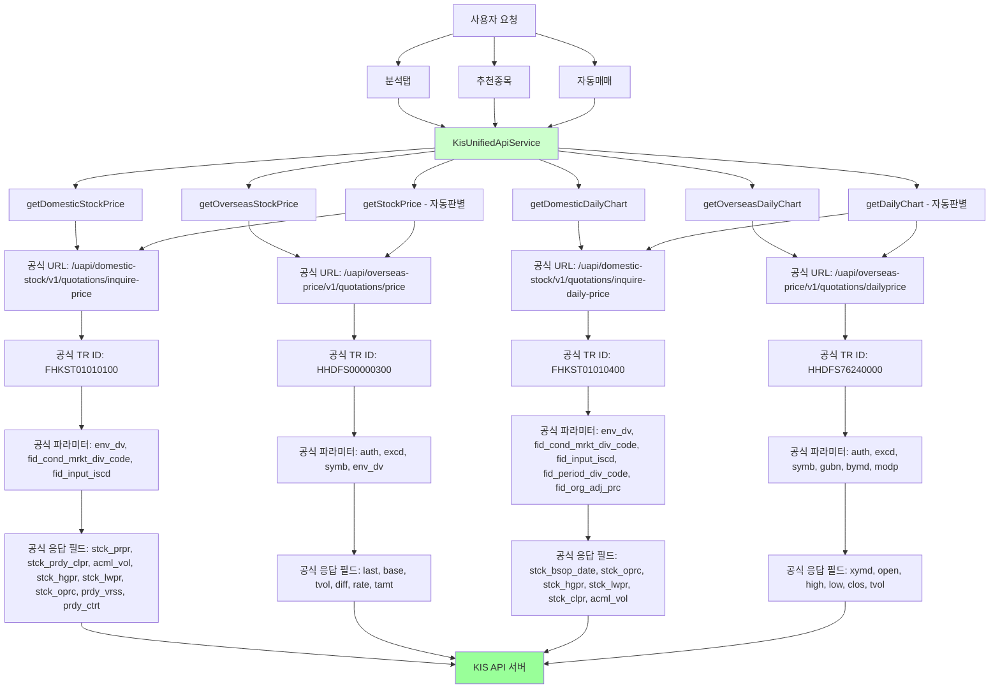

# KIS API 통일화 수정 전후 비교 순서도

## 📊 수정 전 상황 (문제점)

```mermaid
graph TD
    A[사용자 요청] --> B[분석탭]
    A --> C[추천종목]
    A --> D[자동매매]
    
    B --> B1[_kisApiService.getStockPrice]
    B --> B2[_kisApiService.getOverseasStockPrice]
    B --> B3[_kisApiService.getDailyChartData]
    B --> B4[_kisApiService.getOverseasDailyChartData]
    
    C --> C1[_kisApi.getStockPrice]
    C --> C2[_kisApi.getOverseasStockPrice]
    C --> C3[_kisApi.getDailyChartData]
    C --> C4[_kisApi.getOverseasDailyChartData]
    
    D --> D1[_kisApi.getStockPrice]
    D --> D2[_kisApi.getOverseasStockPrice]
    D --> D3[_kisApi.getRawKisData]
    D --> D4[_kisApi.getOverseasDailyChartData]
    
    B1 --> E1[다른 URL/TR ID]
    B2 --> E2[다른 URL/TR ID]
    B3 --> E3[다른 URL/TR ID]
    B4 --> E4[다른 URL/TR ID]
    
    C1 --> F1[다른 URL/TR ID]
    C2 --> F2[다른 URL/TR ID]
    C3 --> F3[다른 URL/TR ID]
    C4 --> F4[다른 URL/TR ID]
    
    D1 --> G1[다른 URL/TR ID]
    D2 --> G2[다른 URL/TR ID]
    D3 --> G3[다른 URL/TR ID]
    D4 --> G4[다른 URL/TR ID]
    
    E1 --> H[KIS API 서버]
    E2 --> H
    E3 --> H
    E4 --> H
    F1 --> H
    F2 --> H
    F3 --> H
    F4 --> H
    G1 --> H
    G2 --> H
    G3 --> H
    G4 --> H
    
    style B fill:#ffcccc
    style C fill:#ffcccc
    style D fill:#ffcccc
    style H fill:#ff9999
```



### ❌ 문제점
1. **API URL 불일치**: 각 모듈이 다른 URL 사용
2. **TR ID 불일치**: 각 모듈이 다른 TR ID 사용
3. **파라미터명 불일치**: 각 모듈이 다른 파라미터명 사용
4. **응답 필드 불일치**: 각 모듈이 다른 필드명 사용
5. **에러 처리 불일치**: 각 모듈이 다른 에러 처리 방식 사용

## ✅ 수정 후 상황 (해결)



### ✅ 해결된 점
1. **통일된 API 서비스**: 모든 모듈이 `KisUnifiedApiService` 사용
2. **공식 가이드라인 준수**: 고정된 URL, TR ID, 파라미터명, 응답 필드 사용
3. **자동 판별 기능**: 종목 코드로 국내/해외 자동 구분
4. **통일된 에러 처리**: 일관된 에러 처리 방식
5. **유지보수성 향상**: API 변경 시 한 곳만 수정하면 됨

## 🔄 API 호출 흐름 비교

### 수정 전 (분산된 API 호출)
```
분석탭 → _kisApiService.getStockPrice() → 다양한 URL/TR ID
추천종목 → _kisApi.getStockPrice() → 다양한 URL/TR ID  
자동매매 → _kisApi.getStockPrice() → 다양한 URL/TR ID
```

### 수정 후 (통일된 API 호출)
```
분석탭 → _unifiedApiService.getStockPrice() → 공식 가이드라인
추천종목 → _unifiedApiService.getStockPrice() → 공식 가이드라인
자동매매 → _unifiedApiService.getStockPrice() → 공식 가이드라인
```

## 📋 공식 가이드라인 준수 사항

### 1. 국내주식 현재가 API
- **URL**: `/uapi/domestic-stock/v1/quotations/inquire-price`
- **TR ID**: `FHKST01010100`
- **파라미터**: `env_dv`, `fid_cond_mrkt_div_code`, `fid_input_iscd`
- **응답 필드**: `stck_prpr`, `stck_prdy_clpr`, `acml_vol`, `stck_hgpr`, `stck_lwpr`, `stck_oprc`, `prdy_vrss`, `prdy_ctrt`

### 2. 해외주식 현재가 API
- **URL**: `/uapi/overseas-price/v1/quotations/price`
- **TR ID**: `HHDFS00000300`
- **파라미터**: `auth`, `excd`, `symb`, `env_dv`
- **응답 필드**: `last`, `base`, `tvol`, `diff`, `rate`, `tamt`

### 3. 국내주식 일별 차트 API
- **URL**: `/uapi/domestic-stock/v1/quotations/inquire-daily-price`
- **TR ID**: `FHKST01010400`
- **파라미터**: `env_dv`, `fid_cond_mrkt_div_code`, `fid_input_iscd`, `fid_period_div_code`, `fid_org_adj_prc`
- **응답 필드**: `stck_bsop_date`, `stck_oprc`, `stck_hgpr`, `stck_lwpr`, `stck_clpr`, `acml_vol`

### 4. 해외주식 일별 차트 API
- **URL**: `/uapi/overseas-price/v1/quotations/dailyprice`
- **TR ID**: `HHDFS76240000`
- **파라미터**: `auth`, `excd`, `symb`, `gubn`, `bymd`, `modp`
- **응답 필드**: `xymd`, `open`, `high`, `low`, `clos`, `tvol`

## 🎯 개선 효과

1. **안정성 향상**: 공식 가이드라인 준수로 API 호환성 보장
2. **유지보수성 향상**: API 변경 시 한 곳만 수정
3. **일관성 보장**: 모든 모듈이 동일한 API 호출 방식 사용
4. **에러 처리 통일**: 일관된 에러 처리 및 재시도 로직
5. **코드 품질 향상**: 중복 코드 제거 및 단일 책임 원칙 준수

## 🚀 다음 단계

1. **테스트**: 수정된 API 호출 방식 테스트
2. **모니터링**: API 호출 성공률 및 응답 시간 모니터링
3. **최적화**: 필요시 추가 최적화 작업
4. **문서화**: API 사용 가이드 문서 업데이트
