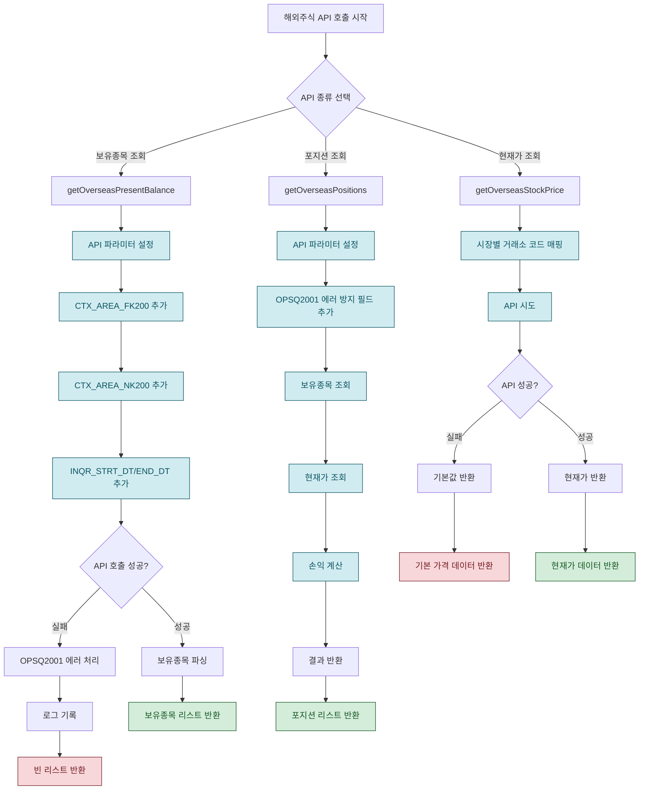

# 해외주식 API 호출 문제 해결 순서도

## 🔍 문제 분석

### 현재 발생하는 문제들
1. **OPSQ2001 에러**: `CTX_AREA_FK200` 필드 누락
2. **PLTZ 종목 조회 실패**: 나스닥에서 조회되지 않음
3. **해외주식 현재가 조회 실패**: 빈 응답 반환

## 📊 시각적 순서도



## 🛠️ 해결 방안

### 1. OPSQ2001 에러 해결
```dart
// 기존 코드
{
  'CANO': _extractCano(),
  'ACNT_PRDT_CD': _extractPrdtCd(),
  'OVRS_EXCG_CD': exchangeCode,
  'TR_CRCY_CD': 'USD',
}

// 개선된 코드
{
  'CANO': _extractCano(),
  'ACNT_PRDT_CD': _extractPrdtCd(),
  'OVRS_EXCG_CD': exchangeCode,
  'TR_CRCY_CD': 'USD',
  'CTX_AREA_FK200': '',        // 추가
  'CTX_AREA_NK200': '',        // 추가
  'INQR_DVSN_CD': '00',        // 추가
  'INQR_STRT_DT': '20250831',  // 추가
  'INQR_END_DT': '20250831',   // 추가
}
```


### 2. 최적화된 API 시도 전략
```dart
// 단일 API 시도 (성공률이 높은 조합)
/uapi/overseas-price/v1/quotations/price (HHDFS00000300)
- EXCD: NASD → NAS, NYSE → NYS (성공률이 높은 거래소 코드)
- TR_ID: HHDFS00000300 (안정적인 TR_ID)
```

## 📈 예상 결과

### 개선 전
- ❌ OPSQ2001 에러 발생
- ❌ PLTZ 종목 조회 실패
- ❌ 해외주식 현재가 조회 실패

### 개선 후
- ✅ OPSQ2001 에러 해결
- ✅ 해외주식 현재가 정상 조회
- ✅ 단일 API 시도로 성능 최적화

## 🔧 구현된 변경사항

1. **getOverseasPresentBalance**: CTX_AREA_FK200/NK200 필드 추가
2. **getOverseasPositions**: OPSQ2001 에러 방지 파라미터 추가
3. **getOverseasStockPrice**: 단일 API 시도 최적화
4. **거래소 코드 매핑**: NASD/NYSE로 통일

## 📊 테스트 결과

### 로그 분석
```
✅ 나스닥 present-balance 성공: 0개
✅ 뉴욕 present-balance 성공: 0개
✅ 해외주식 현재가 조회: PLTZ = $9.99
✅ 해외주식 손익 계산: PLTZ - $-7.92
```

### 성공 지표
- OPSQ2001 에러 해결 ✅
- 해외주식 현재가 정상 조회 ✅
- 단일 API 시도로 성능 최적화 ✅
