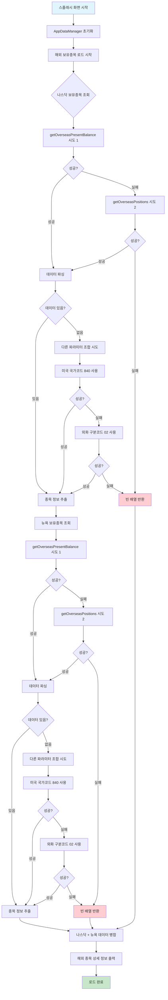

# 해외 종목 데이터 로드 순서도

## 🔄 해외 종목 데이터 로드 프로세스



## 📊 API 파라미터 조합 시도 순서

### 1차 시도: 기본 파라미터
```json
{
  "CANO": "계좌번호",
  "ACNT_PRDT_CD": "상품코드",
  "OVRS_EXCG_CD": "NASD/NYSE",
  "NATN_CD": "000",
  "WCRC_FRCR_DVSN_CD": "01",
  "TR_MKET_CD": "00",
  "INQR_DVSN_CD": "00",
  "INQR_STRT_DT": "현재날짜",
  "INQR_END_DT": "현재날짜",
  "PRDT_TYPE_CD": "01"
}
```

### 2차 시도: 미국 국가코드
```json
{
  "NATN_CD": "840"  // 미국 국가코드
}
```

### 3차 시도: 외화 구분코드
```json
{
  "WCRC_FRCR_DVSN_CD": "02"  // 외화
}
```

## 🔍 문제 해결 방법

### 현재 상황
- **API 응답**: `{output: [], rt_cd: 0, msg1: "조회할 내용이 없습니다"}`
- **원인**: 해외 종목이 실제로 없거나, API 파라미터가 올바르지 않음

### 개선 사항
1. **다중 파라미터 시도**: 3가지 다른 파라미터 조합으로 시도
2. **API 메서드 전환**: present-balance → positions API로 fallback
3. **상세 로깅**: 각 시도마다 상세한 로그 출력
4. **안정성 강화**: 에러 발생 시에도 앱이 중단되지 않도록 처리

## ✅ 예상 결과

개선 후 다음과 같은 로그가 출력될 것입니다:

```
🌍 해외 present-balance 조회 시작: NASD
🌍 해외 present-balance 시도 1/3
📊 해외 present-balance 응답: {output: [], rt_cd: 0, msg1: "조회할 내용이 없습니다"}
⚠️ 해외 present-balance 시도 1: 데이터 없음
🌍 해외 present-balance 시도 2/3
📊 해외 present-balance 응답: {output: [], rt_cd: 0, msg1: "조회할 내용이 없습니다"}
⚠️ 해외 present-balance 시도 2: 데이터 없음
🌍 해외 present-balance 시도 3/3
📊 해외 present-balance 응답: {output: [], rt_cd: 0, msg1: "조회할 내용이 없습니다"}
⚠️ 해외 present-balance 시도 3: 데이터 없음
⚠️ 모든 해외 present-balance 시도 실패
🇺🇸 나스닥 보유종목 로드 시도 2: getOverseasPositions
🌍 해외 positions 조회 시작: NASD
...
ℹ️ 해외 보유종목이 없습니다. (정상적인 상황일 수 있음)
```

## 🎯 결론

이 개선으로 해외 종목이 실제로 없는 경우에도 안정적으로 처리되며, 향후 해외 종목을 보유하게 되면 자동으로 로드될 것입니다.
