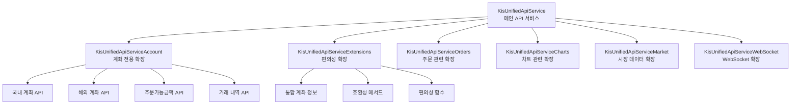
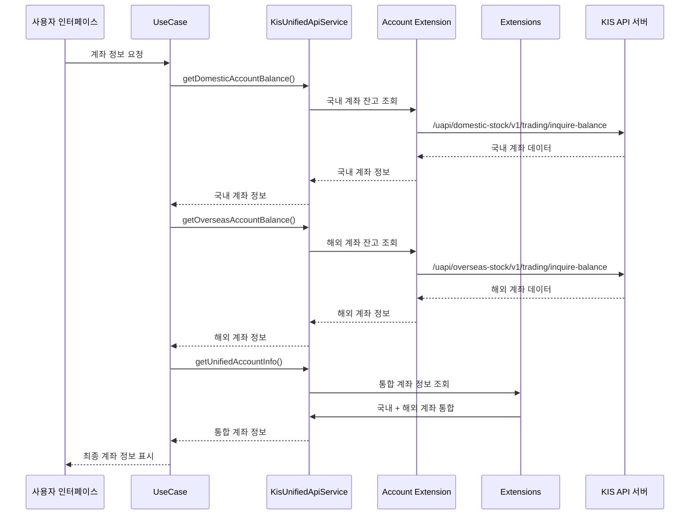
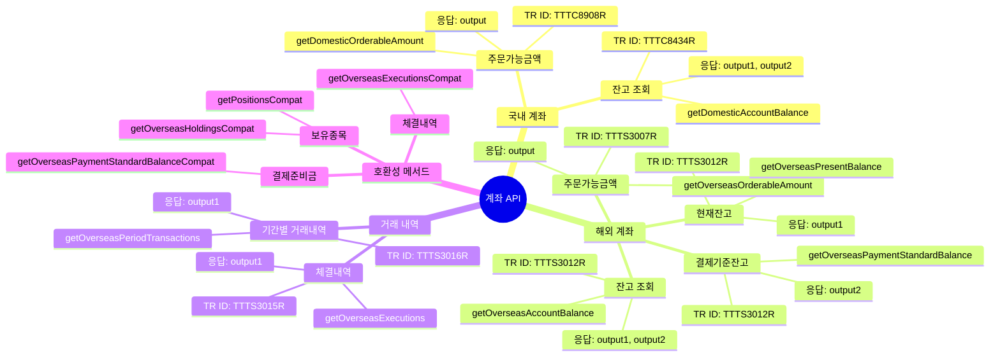
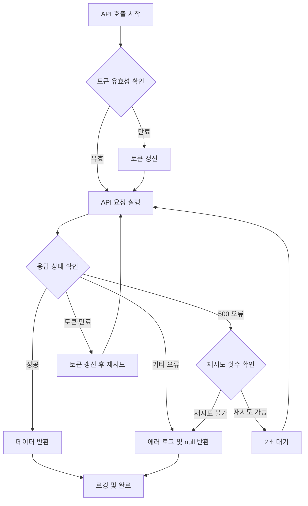
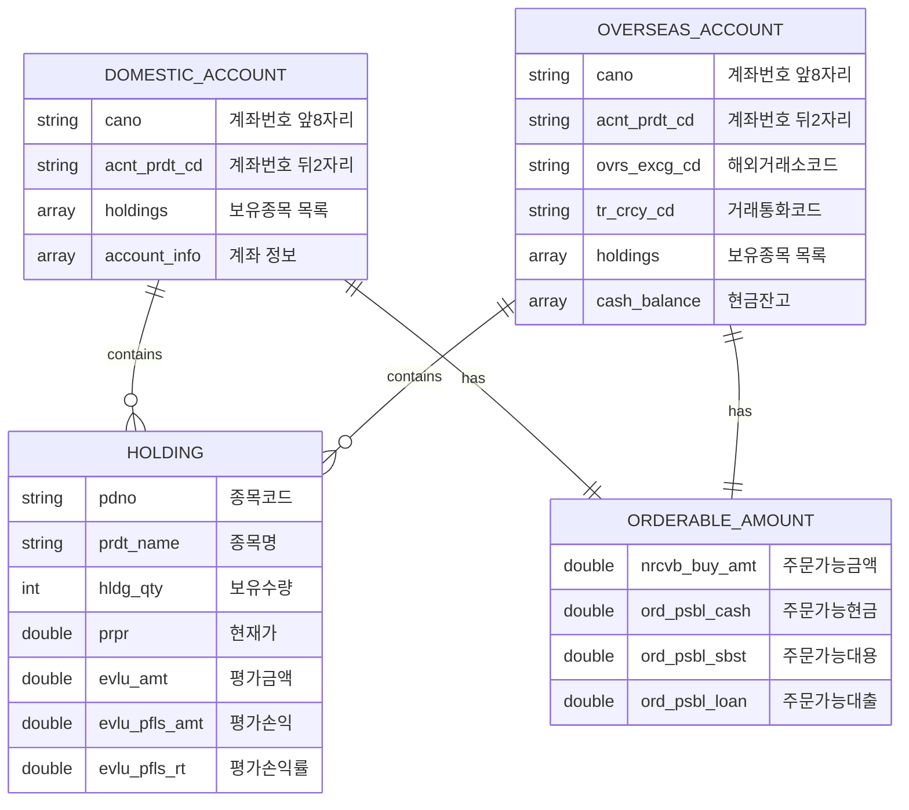
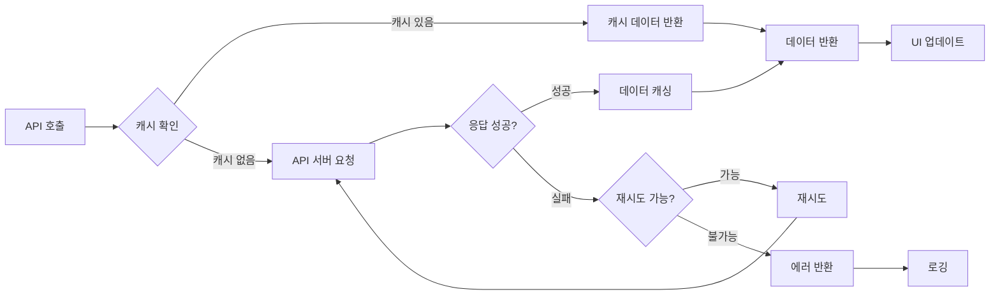
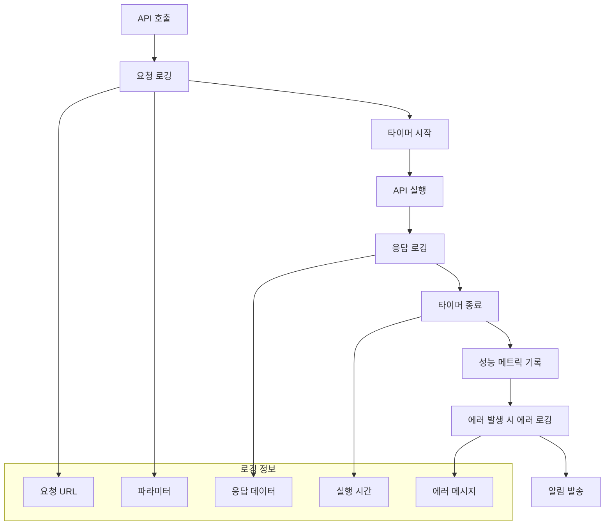

# 계좌 API 데이터 흐름도

## 📊 계좌 API 구조 시각화

### 🏗️ 전체 API 구조도

### 🔄 계좌 데이터 흐름도

### 📋 계좌 API 분류도

### 🔧 에러 처리 및 재시도 로직

### 📊 데이터 구조도

### 🚀 성능 최적화 전략

### 📈 모니터링 및 로깅

## 📝 주요 특징

### 1. 모듈화된 구조
- **계좌 전용 확장**: 계좌 관련 API만 별도 파일로 분리
- **편의성 확장**: 호환성 메서드 및 편의 함수 제공
- **명확한 책임 분리**: 각 확장 파일의 역할이 명확

### 2. 공식 가이드라인 준수
- **TR ID 정확성**: KIS 공식 TR ID 사용
- **파라미터 표준화**: 공식 파라미터명 사용
- **응답 필드 정확성**: 공식 응답 필드 구조 준수

### 3. 강화된 에러 처리
- **재시도 로직**: 500 오류 시 자동 재시도
- **토큰 관리**: 토큰 만료 시 자동 갱신
- **상세한 로깅**: 디버깅을 위한 상세 로그

### 4. 호환성 보장
- **기존 코드 지원**: 호환성 메서드로 기존 코드 지원
- **점진적 마이그레이션**: 단계적 전환 가능
- **안정성**: 기존 기능에 영향 없음

---

**작성일**: 2025년 1월 6일  
**작성자**: AI Assistant  
**버전**: 1.0
