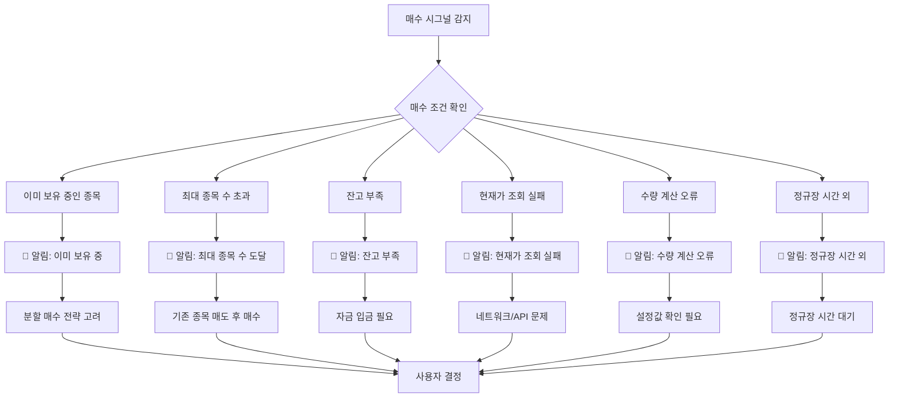

# 매수 조건 미충족 알림 시스템 순서도

## 🔍 문제 상황

### 현재 발생하는 문제
```
매수 시그널 발생 → 매수 조건 미충족 → 알림 없이 조용히 건너뜀
```

### 사용자 경험 문제
- **매수 시그널은 나오는데 실제 매수가 안됨**
- **왜 매수가 안되는지 알 수 없음**
- **혼란스러운 상황**

## 📊 매수 조건 미충족 알림 시스템



## 🔧 구현된 알림 시스템

### 1. 이미 보유 중인 종목 ✅
```dart
// 이미 보유 중인 종목에 대한 알림 발송
await _notificationManager.showNotification(
  title: '📈 매수 시그널: $stockCode',
  body: '이미 ${existingHolding['quantity']}주 보유 중 - 분할 매수 고려',
);
```

### 2. 최대 종목 수 도달 ✅
```dart
// 최대 종목 수 도달 시 알림 발송
await _notificationManager.showNotification(
  title: '📈 매수 시그널: $stockCode',
  body: '최대 종목 수 도달 (${holdings.length}/$maxStocks) - 매수 제한',
);
```

### 3. 매수 조건 미충족 ✅
```dart
// 매수 조건 미충족 알림 발송
String reason = '';
if (currentPrice <= 0) {
  reason = '현재가 조회 실패';
} else if (availableBalance <= 0) {
  reason = '가용자금 부족';
} else if (orderAmount <= 0) {
  reason = '주문금액 계산 오류';
} else {
  reason = '수량 계산 오류';
}

await _notificationManager.showNotification(
  title: '❌ 매수 조건 미충족: $stockName',
  body: '$reason - 자동매수 건너뜀',
);
```

### 4. 잔고 부족 알림 ✅
```dart
// 잔고 부족 시 알림 발송
await LocalNotificationManager().showBuyFailureNotification(
  stockCode: stockCode,
  stockName: stockName,
  reason: '원화 잔고 부족 (${Formatters.formatPrice(requiredAmount)} 필요)',
  price: currentPrice,
);
```

## 🎯 기대 효과

### 1. 투명성 확보
- **매수 시그널 발생 시 항상 알림**
- **매수가 안되는 이유 명확히 표시**
- **사용자가 상황을 정확히 파악 가능**

### 2. 사용자 경험 개선
- **혼란 제거**: 왜 매수가 안되는지 명확
- **대응 방안 제시**: 각 상황별 해결책 안내
- **신뢰성 향상**: 시스템이 정상 작동 중임을 확인

### 3. 분할 매수 전략 지원
- **이미 보유 중인 종목도 시그널 생성**
- **사용자가 분할 매수 여부 결정**
- **투자 전략의 유연성 확보**

## 📱 알림 예시

### 이미 보유 중인 종목
```
📈 매수 시그널: 338220
이미 30주 보유 중 - 분할 매수 고려
```

### 최대 종목 수 도달
```
📈 매수 시그널: 338220
최대 종목 수 도달 (5/5) - 매수 제한
```

### 잔고 부족
```
❌ 매수 조건 미충족: 뷰노
가용자금 부족 - 자동매수 건너뜀
```

### 현재가 조회 실패
```
❌ 매수 조건 미충족: 뷰노
현재가 조회 실패 - 자동매수 건너뜀
```

## 🔄 다음 단계

1. **알림 테스트**: 실제 상황에서 알림이 제대로 발송되는지 확인
2. **사용자 피드백**: 알림 내용이 명확한지 사용자 의견 수집
3. **추가 개선**: 필요시 알림 내용이나 타이밍 조정
