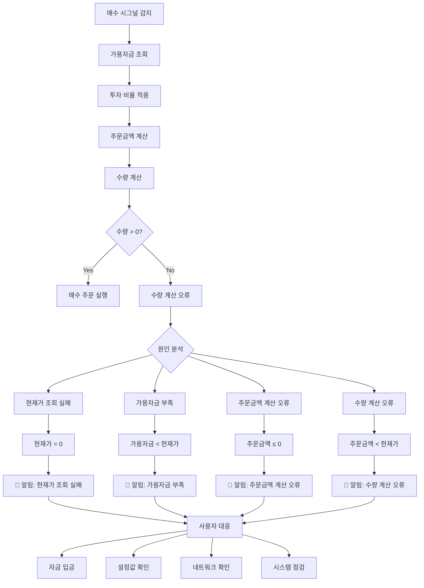

# 수량 계산 오류 해결 순서도

## 🔍 문제 상황

### 현재 발생하는 문제
```
매수 시그널 발생 → 수량 계산 오류 → "수량 계산 오류 - 자동매수 건너뜀"
```

### 사용자 혼란
- **매수 시그널은 나오는데 왜 매수가 안되는지 모름**
- **"수량 계산 오류"라는 메시지만으로는 원인 파악 불가**
- **가용자금이 부족한지, 다른 문제인지 불명확**

## 📊 수량 계산 오류 원인 분석



## 🔧 수량 계산 로직

### 1. 기본 수량 계산 공식
```dart
// 매수 수량 계산 (가용 자금의 positionSize% 사용)
final orderAmount = availableBalance * positionSize;
int quantity = 0;
if (currentPrice > 0 && orderAmount.isFinite) {
  quantity = (orderAmount / currentPrice).floor();
}
```

### 2. 수량이 0이 되는 경우들

#### Case 1: 현재가 조회 실패
```dart
currentPrice = 0; // API 오류 또는 네트워크 문제
quantity = (orderAmount / 0).floor(); // 무한대 또는 NaN
```

#### Case 2: 가용자금 부족
```dart
availableBalance = 10,000원; // 가용자금
positionSize = 0.1; // 10% 투자
orderAmount = 10,000 * 0.1 = 1,000원; // 주문금액
currentPrice = 20,050원; // 뷰노 현재가
quantity = (1,000 / 20,050).floor() = 0주; // 1주 미만
```

#### Case 3: 주문금액 계산 오류
```dart
orderAmount = 0; // 계산 오류
quantity = (0 / currentPrice).floor() = 0주;
```

#### Case 4: 수량 계산 오류
```dart
orderAmount = 15,000원; // 주문금액
currentPrice = 20,050원; // 현재가
quantity = (15,000 / 20,050).floor() = 0주; // 1주 미만
```

## 🎯 개선된 알림 시스템

### 1. 정확한 원인 분석 ✅
```dart
String reason = '';
if (currentPrice <= 0) {
  reason = '현재가 조회 실패';
} else if (availableBalance <= 0) {
  reason = '가용자금 부족';
} else if (orderAmount <= 0) {
  reason = '주문금액 계산 오류';
} else if (orderAmount < currentPrice) {
  reason = '가용자금 부족 (${availableBalance}원으로 ${currentPrice}원 주식 구매 불가)';
} else {
  reason = '수량 계산 오류 (주문금액: ${orderAmount}원, 현재가: ${currentPrice}원)';
}
```

### 2. 상세한 알림 메시지 ✅
```dart
await _notificationManager.showNotification(
  title: '❌ 매수 조건 미충족: $stockName',
  body: '$reason - 자동매수 건너뜀\n가용자금: ${availableBalance}원',
);
```

## 📱 개선된 알림 예시

### 가용자금 부족
```
❌ 매수 조건 미충족: 뷰노
가용자금 부족 (10,000원으로 20,050원 주식 구매 불가) - 자동매수 건너뜀
가용자금: 10,000원
```

### 현재가 조회 실패
```
❌ 매수 조건 미충족: 뷰노
현재가 조회 실패 - 자동매수 건너뜀
가용자금: 50,000원
```

### 주문금액 계산 오류
```
❌ 매수 조건 미충족: 뷰노
주문금액 계산 오류 - 자동매수 건너뜀
가용자금: 50,000원
```

### 수량 계산 오류
```
❌ 매수 조건 미충족: 뷰노
수량 계산 오류 (주문금액: 15,000원, 현재가: 20,050원) - 자동매수 건너뜀
가용자금: 50,000원
```

## 🎯 기대 효과

### 1. 투명성 확보
- **정확한 원인 파악**: 왜 매수가 안되는지 명확
- **구체적인 수치**: 가용자금, 주문금액, 현재가 표시
- **대응 방안 제시**: 각 상황별 해결책 안내

### 2. 사용자 경험 개선
- **혼란 제거**: "수량 계산 오류"만으로는 모호했던 문제 해결
- **자금 관리**: 가용자금 부족 시 입금 필요성 명확히 인지
- **설정 확인**: 투자 비율이나 다른 설정값 점검 유도

### 3. 시스템 안정성 향상
- **오류 추적**: 정확한 원인 분석으로 시스템 개선
- **사용자 피드백**: 구체적인 문제 상황 파악 가능
- **유지보수**: 각 오류 유형별 대응 방안 수립

## 🔄 다음 단계

1. **알림 테스트**: 실제 상황에서 개선된 알림이 제대로 발송되는지 확인
2. **사용자 피드백**: 알림 내용이 명확한지 사용자 의견 수집
3. **추가 개선**: 필요시 알림 내용이나 타이밍 조정
4. **자동화**: 가용자금 부족 시 자동 입금 알림 등 추가 기능 고려
