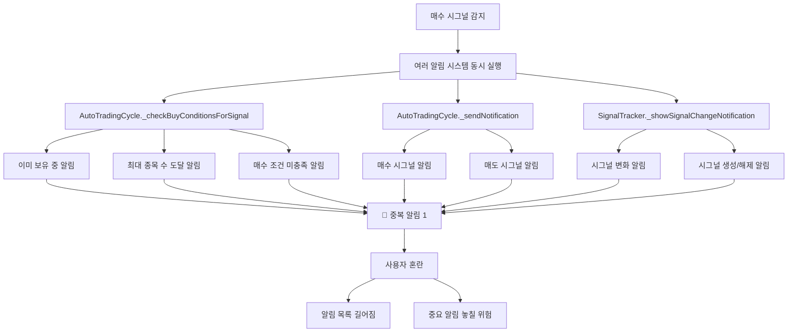
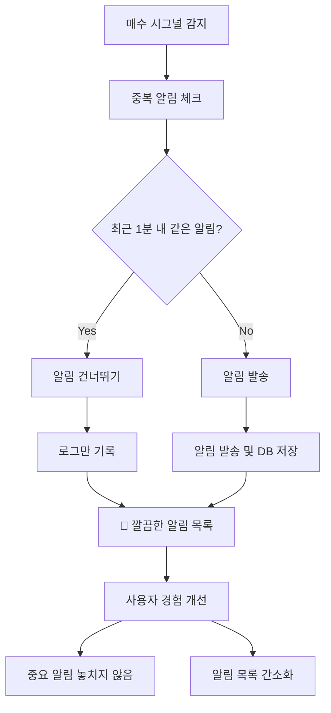

# 중복 알림 해결 순서도

## 🔍 문제 상황

### 현재 발생하는 문제
```
매수 시그널 발생 → 여러 곳에서 동시 알림 발송 → 같은 알림이 2번씩 표시
```

### 사용자 혼란
- **같은 알림이 2번씩 나와서 혼란스러움**
- **알림 목록이 불필요하게 길어짐**
- **중요한 알림을 놓칠 위험**

## 📊 중복 알림 발생 원인 분석



## 🔧 중복 알림 해결 방안

### 1. 중복 알림 방지 로직 추가 ✅

```dart
// 중복 알림 방지: 최근 1분 내에 같은 알림이 있었는지 확인
final now = DateTime.now();
final oneMinuteAgo = now.subtract(const Duration(minutes: 1));
final recentNotifications = await _notificationRepo.getNotificationsByDateRange(oneMinuteAgo, now);
final hasRecentNotification = recentNotifications.any((notification) =>
    notification['type'] == '📈 매수 시그널: $stockCode' && 
    notification['message'].contains('이미 ${existingHolding['quantity']}주 보유 중'));

if (!hasRecentNotification) {
  // 알림 발송
  await _notificationManager.showNotification(
    title: '📈 매수 시그널: $stockCode',
    body: '이미 ${existingHolding['quantity']}주 보유 중 - 분할 매수 고려',
  );
} else {
  print('⚠️ 최근 1분 내에 이미 보유 중 알림이 있었습니다: $stockCode');
}
```

### 2. 적용된 중복 방지 위치

#### A. 이미 보유 중인 종목 알림 ✅
```dart
// _checkBuyConditionsForSignal 메서드
if (existingHolding.isNotEmpty) {
  // 중복 알림 방지 로직 추가
  if (!hasRecentNotification) {
    await _notificationManager.showNotification(...);
  }
}
```

#### B. 최대 종목 수 도달 알림 ✅
```dart
// _checkBuyConditionsForSignal 메서드
if (holdings.length >= maxStocks) {
  // 중복 알림 방지 로직 추가
  if (!hasRecentNotification) {
    await _notificationManager.showNotification(...);
  }
}
```

#### C. 매수 조건 미충족 알림 ✅
```dart
// _executeBuyOrder 메서드
if (quantity <= 0) {
  // 중복 알림 방지 로직 추가
  if (!hasRecentNotification) {
    await _notificationManager.showNotification(...);
  }
}
```

#### D. 시그널 알림 ✅
```dart
// _processSignals 메서드
// 중복 알림 방지 로직 추가
if (!hasRecentNotification) {
  await _sendNotification(signal);
}
```

## 📊 개선된 알림 흐름



## 🎯 중복 방지 기준

### 1. 시간 기준
- **1분 내**: 같은 종목의 같은 타입 알림은 1분 내에 중복 발송 방지
- **타임스탬프**: 정확한 시간 비교로 중복 판단

### 2. 내용 기준
- **알림 타입**: 제목(title)으로 알림 종류 구분
- **알림 내용**: 메시지(body)로 구체적인 상황 구분
- **종목코드**: 같은 종목의 알림만 중복 체크

### 3. 조건별 구분
- **이미 보유 중**: "이미 X주 보유 중" 메시지 포함
- **최대 종목 수**: "최대 종목 수 도달" 메시지 포함
- **가용자금 부족**: "가용자금 부족" 메시지 포함
- **시그널**: "종합점수 X.XXX" 메시지 포함

## 📱 개선된 알림 예시

### Before (중복)
```
📈 매수 시그널: 뷰노
이미 30주 보유 중 - 분할 매수 고려

📈 매수 시그널: 뷰노  
이미 30주 보유 중 - 분할 매수 고려

❌ 매수 조건 미충족: 뷰노
가용자금 부족 (10,360원으로 20,050원 주식 구매 불가) - 자동매수 건너뜀
가용자금: 10,360원

❌ 매수 조건 미충족: 뷰노
가용자금 부족 (10,360원으로 20,050원 주식 구매 불가) - 자동매수 건너뜀
가용자금: 10,360원
```

### After (중복 제거)
```
📈 매수 시그널: 뷰노
이미 30주 보유 중 - 분할 매수 고려

❌ 매수 조건 미충족: 뷰노
가용자금 부족 (10,360원으로 20,050원 주식 구매 불가) - 자동매수 건너뜀
가용자금: 10,360원
```

## 🎯 기대 효과

### 1. 사용자 경험 개선
- **혼란 제거**: 같은 알림이 반복되지 않음
- **알림 목록 간소화**: 불필요한 중복 알림 제거
- **중요 알림 강조**: 중요한 알림을 놓치지 않음

### 2. 시스템 효율성 향상
- **알림 발송 최적화**: 불필요한 알림 발송 방지
- **DB 저장 최적화**: 중복 데이터 저장 방지
- **성능 향상**: 중복 체크로 인한 오버헤드 최소화

### 3. 유지보수성 개선
- **명확한 로직**: 중복 방지 기준이 명확
- **확장 가능**: 새로운 알림 타입에도 쉽게 적용
- **디버깅 용이**: 중복 방지 로그로 문제 추적 가능

## 🔄 다음 단계

1. **테스트**: 실제 상황에서 중복 알림이 제대로 방지되는지 확인
2. **사용자 피드백**: 알림이 너무 적어지지 않는지 확인
3. **시간 조정**: 1분 기준이 적절한지 사용자 의견 수집
4. **추가 개선**: 필요시 중복 방지 기준 조정
