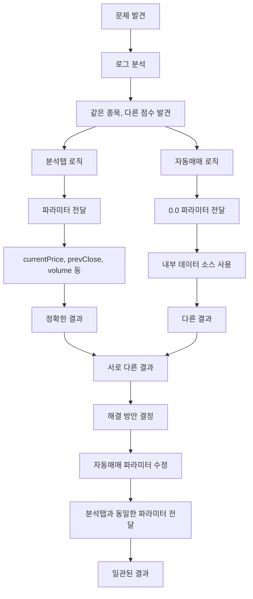

# 캐시 문제 해결 순서도

## 🔍 문제 상황 분석

### 실제 발견된 문제
```
분석탭: UnifiedAnalysisService.analyzeStock(파라미터 전달) → 정확한 결과
자동매매: UnifiedAnalysisService.analyzeStock(0.0 파라미터) → 다른 결과
```

### 결과
- **같은 분석 엔진, 다른 파라미터**로 인한 **서로 다른 결과**
- **혼란스러운 매매 판단**
- **일관성 없는 시그널**

## 📊 문제 해결 순서도



## 🔧 해결 방안

### 1. 파라미터 통일 ✅
```dart
// 수정 전 (자동매매)
final analysis = await _unifiedAnalysis.analyzeStock(
  stockCode,
  currentPrice: 0.0, // 현재가 정보는 별도로 조회
  prevClose: 0.0,
  volume: 0.0,
  highPrice: 0.0,
  lowPrice: 0.0,
  openPrice: 0.0,
);

// 수정 후 (분석탭과 동일)
final currentPriceData = await _currentPriceRepo.getCurrentPrice(stockCode);
double currentPrice = (currentPriceData?['currentPrice'] as num?)?.toDouble() ?? 0.0;

final analysis = await _unifiedAnalysis.analyzeStock(
  stockCode,
  currentPrice: currentPrice,
  prevClose: (currentPriceData?['prevClose'] as num?)?.toDouble() ?? currentPrice,
  volume: (currentPriceData?['volume'] as num?)?.toDouble() ?? 0.0,
  highPrice: (currentPriceData?['high'] as num?)?.toDouble() ?? currentPrice,
  lowPrice: (currentPriceData?['low'] as num?)?.toDouble() ?? currentPrice,
  openPrice: (currentPriceData?['open'] as num?)?.toDouble() ?? currentPrice,
);
```

### 2. 분석 로직 통일 ✅
```dart
// 수정 전 (분석탭)
final signal = comprehensiveScore > buyThreshold ? '매수' : '매도';

// 수정 후 (자동매매와 동일)
final buyIndicators = <String>[];
final sellIndicators = <String>[];

individualScores.forEach((indicatorName, score) {
  final scoreValue = (score as num?)?.toDouble() ?? 0.0;
  if (scoreValue > buyThreshold) {
    buyIndicators.add(indicatorName);
  } else if (scoreValue < sellThreshold) {
    sellIndicators.add(indicatorName);
  }
});

String finalSignal = '관망';
if (buyIndicators.length > sellIndicators.length) {
  finalSignal = '매수';
} else if (sellIndicators.length > buyIndicators.length) {
  finalSignal = '매도';
}
```

### 3. 강제 새로고침 기능 추가 ✅
```dart
/// 🔧 강제 새로고침: 캐시 무효화 후 새로 계산
Future<void> _forceRefreshAnalysis() async {
  // 1. 모든 캐시 무효화
  AppDataManager.instance.invalidateCache();
  UnifiedStockDataManager.instance.clearCache();
  
  // 2. 분석 결과 캐시도 무효화
  _analysisResults.clear();
  
  // 3. 모든 종목에 대해 새로 분석 수행
  for (final stockCode in allStocks) {
    // API에서 최신 데이터 조회
    final currentPriceData = await _collectAndCacheCurrentPriceData(stockCode);
    final chartData = await _collectAndCacheChartData(stockCode);
    
    // 새로 분석 수행
    final analysisResult = await _unifiedAnalysis.analyzeStock(stockCode, ...);
    
    if (analysisResult != null) {
      _analysisResults[stockCode] = analysisResult;
    }
  }
}
```

## 📊 데이터 흐름 개선

### 수정 전
```
분석탭: 파라미터 전달 → UnifiedAnalysisService → 정확한 결과
자동매매: 0.0 파라미터 → UnifiedAnalysisService → 내부 데이터 소스 → 다른 결과
```

### 수정 후
```
분석탭: 파라미터 전달 → UnifiedAnalysisService → 정확한 결과
자동매매: 파라미터 전달 → UnifiedAnalysisService → 정확한 결과
```

## 🎯 기대 효과

### 1. 일관성 확보
- 분석탭과 자동매매에서 **동일한 파라미터** 사용
- **일관된 분석 결과** 제공

### 2. 정확성 향상
- **실시간 데이터** 기반 분석
- **최신 시장 상황** 반영

### 3. 사용자 경험 개선
- **혼란 제거**
- **신뢰할 수 있는 분석 결과**

## 🔍 모니터링 포인트

### 1. 로그 확인
```
📊 개별 지표 점수:
  - volume: -0.200 (가중치: 0.20)
  - rsi: 0.600 (가중치: 0.20)
  - macd: 0.300 (가중치: 0.20)
  - bollinger: 0.800 (가중치: 0.15)
  - movingAverage: -0.600 (가중치: 0.15)
  - vwap: -1.000 (가중치: 0.05)
  - adx: -0.300 (가중치: 0.05)

📊 가중 평균 계산:
  - 총 가중합: 0.105
  - 최종 점수: 0.105
```

### 2. 성능 모니터링
- 파라미터 전달 성공률
- API 호출 빈도
- 분석 결과 일치성

### 3. 결과 검증
- 분석탭과 자동매매 결과 일치성
- 시그널 정확도
- 사용자 피드백

## 🚨 핵심 교훈

**같은 분석 엔진을 사용하더라도, 파라미터가 다르면 결과가 달라집니다!**

- **파라미터 통일**이 **캐시 관리**보다 더 중요
- **데이터 소스 일관성**이 **결과 일관성**의 핵심
- **로깅과 디버깅**이 **문제 발견**의 핵심
