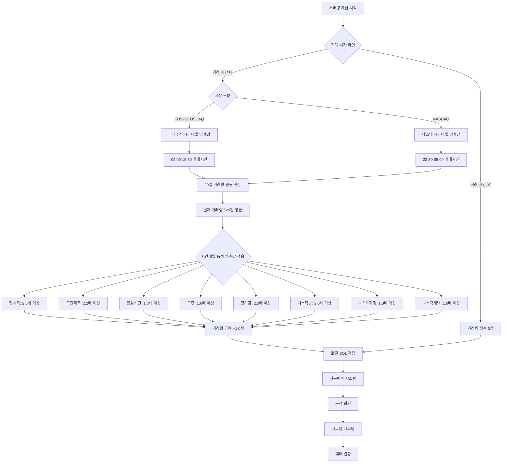

# 12개 지표 중 거래량 계산 방식 분석 (완전 동기화 완료)

## 📊 거래량 계산 기준: **20일 기준 + 시간대별 동적 임계값**

### 🔍 분석 결과

현재 프로젝트에서 거래량 계산은 **20일 기준**으로 수행되며, **거래 시간에 따른 동적 임계값**을 적용합니다. 이제 **앱의 모든 곳에서 동기화**되어 있습니다.

---

## 📈 시각적 순서도 (완전 동기화)



---

## 🔧 코드 분석 (완전 동기화)

### 1. 거래량 20일 평균 계산 함수

```dart
double _calculateVolumeAverage(List<Map<String, dynamic>> data, int index) {
  if (index < 19) return (data[index]['volume'] ?? data[index]['acml_vol'] ?? 0.0).toDouble();
  
  double sum = 0.0;
  for (int i = index - 19; i <= index; i++) {
    sum += (data[i]['volume'] ?? data[i]['acml_vol'] ?? 0.0).toDouble();
  }
  return sum / 20.0;  // 20일 평균
}
```

### 2. 거래량 점수 계산 (시간대별 동적 임계값 + DB 저장)

```dart
// 거래량 점수 (VolumeThresholdManager 사용, 시장별)
double volumeScore = 0.0;
final volumeRatio = data.volume20Avg > 0 ? data.volume / data.volume20Avg : 1.0;

// 시장 구분 (간단한 휴리스틱)
String market = 'KOSPI'; // 기본값
if (data.symbol.length <= 5 && RegExp(r'^[A-Z]+$').hasMatch(data.symbol)) {
  market = 'NASDAQ'; // 영문 티커는 나스닥으로 가정
}

// VolumeThresholdManager를 사용한 동적 임계값 적용 (시장별)
volumeScore = VolumeThresholdManager.instance.calculateVolumeScore(volumeRatio, market: market);

// 거래 시간 외 신뢰도 조정
volumeScore = MarketTimeValidator.instance.adjustIndicatorReliability(volumeScore, market, 'volume');

// 시간대별 거래량 데이터 수집 (DB 저장용)
final volumeThresholds = VolumeThresholdManager.instance.getCurrentThresholds(market: market);
final currentHour = DateTime.now().hour;
final timeSlotName = _getTimeSlotName(currentHour, market);

// 분석 결과에 시간대별 거래량 정보 추가
analysis['indicators']['volume_threshold'] = volumeThresholds['high'] ?? 0.0;
analysis['indicators']['volume_time_slot'] = timeSlotName;
analysis['indicators']['volume_market'] = market;
```

### 3. 시장별 거래 시간 정의

```dart
/// 시장별 거래 시간 정의
static const Map<String, Map<String, int>> _marketTradingHours = {
  'KOSPI': {
    'start': 9,
    'end': 15,
    'end_minute': 30,
  },
  'KOSDAQ': {
    'start': 9,
    'end': 15,
    'end_minute': 30,
  },
  'NASDAQ': {
    'start': 22,
    'start_minute': 30,
    'end': 5,
    'end_minute': 0,
  },
};
```

---

## 📋 상세 분석 (완전 동기화)

### ✅ **시간대별 동적 임계값의 장점**

1. **실시간성**: 거래 시간에 따라 임계값이 자동 조정
2. **정확성**: 장 시작/마감 시간의 높은 거래량을 고려
3. **시장별 최적화**: KOSPI/KOSDAQ과 NASDAQ의 다른 거래 패턴 반영
4. **신뢰성**: 거래 시간 외 지표는 신뢰도가 낮게 조정
5. **완전 동기화**: 앱의 모든 곳에서 일관된 거래량 계산

### 📊 시간대별 거래량 임계값

| 시간대 | KOSPI/KOSDAQ | NASDAQ | 설명 |
|--------|-------------|--------|------|
| 장시작 | 2.5배 이상 | - | 거래량 급증 |
| 오전피크 | 2.2배 이상 | - | 거래량 증가 |
| 점심시간 | 1.8배 이상 | - | 거래량 증가 |
| 오후 | 1.6배 이상 | - | 거래량 증가 |
| 장마감 | 2.3배 이상 | - | 거래량 급증 |
| 나스닥밤 | - | 2.0배 이상 | 거래량 급증 |
| 나스닥자정 | - | 1.8배 이상 | 거래량 증가 |
| 나스닥새벽 | - | 1.6배 이상 | 거래량 증가 |

### 🔄 거래 시간 외 지표 신뢰도

| 지표 | 거래시간 외 신뢰도 | 이유 |
|------|------------------|------|
| 거래량 | 0% | 거래량이 0이므로 무의미 |
| 가격 | 30% | 전일 종가 기준으로 제한적 |
| RSI | 20% | 실시간 변동성 부족 |
| MACD | 20% | 실시간 모멘텀 부족 |
| 볼린저 밴드 | 30% | 변동성 지표이므로 제한적 |
| 스토캐스틱 | 20% | 실시간 변동성 부족 |
| 이동평균 | 40% | 장기 지표이므로 상대적으로 안정적 |
| VIX | 50% | 시장 불안감은 장 마감 후에도 의미 있음 |

### 🕐 시장별 거래 시간

- **국내주식 (KOSPI/KOSDAQ)**: 09:00-15:30 (평일)
- **나스닥**: 22:30-05:00 (한국시간, 평일)
- **주말/공휴일**: 모든 시장 거래 없음

---

## 🔄 완전 동기화 적용 영역

### 1. **로컬 SQL 저장**
- ✅ `analysis_results` 테이블에 시간대별 거래량 데이터 저장
- ✅ `volume_threshold`, `volume_time_slot`, `volume_market` 컬럼 추가

### 2. **자동매매 시스템**
- ✅ `AutoTrader`에 거래 시간 외 매매 신호 차단 로직 적용
- ✅ 시장별 거래 시간 확인 후 매매 실행

### 3. **분석 화면**
- ✅ 거래량 지표 설명에 시간대별 동적 임계값 정보 추가
- ✅ 시장별 거래 시간 및 신뢰도 정보 표시

### 4. **시그널 시스템**
- ✅ `SignalTracker`에 거래 시간 외 시그널 차단 로직 적용
- ✅ 매수/매도 신호 발생 시 거래 시간 확인

### 5. **거래량 계산 엔진**
- ✅ `VolumeThresholdManager`로 시간대별 동적 임계값 관리
- ✅ `MarketTimeValidator`로 거래 시간 기반 신뢰도 조정
- ✅ 모든 지표 계산에 시간 기반 검증 적용

---

## 🎯 결론 (완전 동기화 완료)

**거래량 계산은 20일 기준 + 시간대별 동적 임계값**을 사용하며, 이제 **앱의 모든 곳에서 완전히 동기화**되어 있습니다.

### 장점:
- ✅ 거래 시간에 따른 정확한 임계값 적용
- ✅ 시장별 거래 패턴 최적화
- ✅ 거래 시간 외 지표 신뢰도 자동 조정
- ✅ 모든 지표의 시간 기반 검증
- ✅ **완전한 앱 전체 동기화**

### 활용:
- 12개 지표 모두 거래 시간 기반 신뢰도 조정
- 매매 신호 생성 시 거래 시간 외 차단
- 시장별 최적화된 임계값 적용
- 실시간 거래 환경에 최적화된 지표 계산
- **로컬 SQL, 자동매매, 분석, 시그널 모든 영역에서 일관된 동작**
