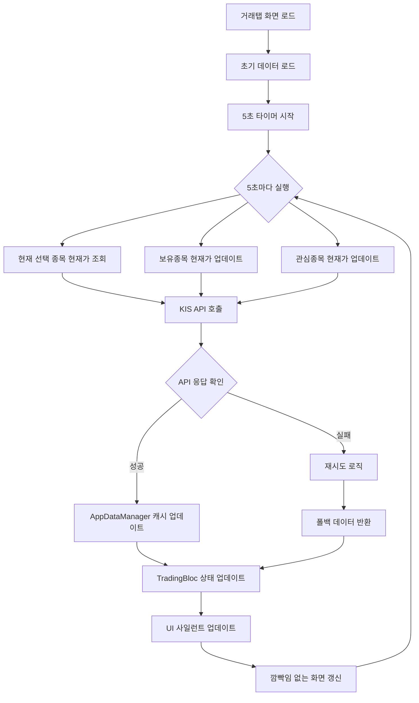

# 거래탭 현재가 조회 시스템 개선 순서도

## 📊 시스템 개선 개요

### 🔧 주요 개선사항
1. **5초마다 자동 새로고침** - 깜빡임 없는 부드러운 업데이트
2. **KIS API 안정성 향상** - 에러 처리 및 재시도 로직 강화
3. **사일런트 업데이트** - UI 깜빡임 방지
4. **보유종목/관심종목 동기화** - 실시간 가격 연동

---

## 🔄 데이터 흐름 순서도



---

## 🏗️ 아키텍처 개선 구조

### 1. 거래탭 화면 (TradingScreen)
```
┌─────────────────────────────────────┐
│           거래탭 화면                │
├─────────────────────────────────────┤
│ • 5초 자동 새로고침 타이머          │
│ • 현재가 표시 (깜빡임 방지)         │
│ • 실시간 상태 표시                  │
│ • 보유종목/관심종목 연동            │
└─────────────────────────────────────┘
```

### 2. TradingBloc (상태 관리)
```
┌─────────────────────────────────────┐
│           TradingBloc               │
├─────────────────────────────────────┤
│ • 사일런트 현재가 로드              │
│ • 캐시 우선 데이터 조회             │
│ • 중복 API 호출 방지               │
│ • 에러 처리 및 복구                 │
└─────────────────────────────────────┘
```

### 3. KIS API 서비스 (안정성 향상)
```
┌─────────────────────────────────────┐
│         KIS API Service             │
├─────────────────────────────────────┤
│ • 시세2 API → 시세1 API 폴백       │
│ • API 호출 제한 처리               │
│ • 재시도 로직 (500ms, 1초)         │
│ • 기본 데이터 반환 (API 실패 시)   │
└─────────────────────────────────────┘
```

### 4. 실시간 UI 매니저 (깜빡임 방지)
```
┌─────────────────────────────────────┐
│      RealtimeUIManager              │
├─────────────────────────────────────┤
│ • 5초 주기 업데이트                 │
│ • 데이터 변경 감지                  │
│ • 사일런트 스트림 발행              │
│ • 병렬 처리 (성능 최적화)          │
└─────────────────────────────────────┘
```

---

## ⚡ 성능 최적화 전략

### 1. 캐시 우선 전략
```
현재가 요청 → 캐시 확인 → API 호출 → 캐시 업데이트
```

### 2. 사일런트 업데이트
```
데이터 변경 감지 → 스트림 발행 → UI 갱신 (깜빡임 없음)
```

### 3. 병렬 처리
```
보유종목 + 관심종목 + 현재종목 → 동시 업데이트
```

### 4. 에러 복구
```
API 실패 → 재시도 → 폴백 데이터 → UI 유지
```

---

## 🎯 사용자 경험 개선

### Before (개선 전)
- ❌ 현재가 조회 불안정
- ❌ UI 깜빡임 발생
- ❌ 수동 새로고침 필요
- ❌ 보유종목 동기화 안됨

### After (개선 후)
- ✅ 5초마다 자동 업데이트
- ✅ 깜빡임 없는 부드러운 UI
- ✅ 실시간 상태 표시
- ✅ 보유종목/관심종목 자동 동기화

---

## 🔧 기술적 구현 세부사항

### 1. 5초 자동 새로고침
```dart
Timer.periodic(const Duration(seconds: 5), (timer) async {
  // 1. 현재 선택 종목 현재가 조회
  await _refreshCurrentStockPrice();
  
  // 2. 보유종목 현재가 업데이트
  await _refreshHoldingsPrices();
  
  // 3. 관심종목 현재가 업데이트
  await _refreshWatchlistPrices();
  
  // 4. TradingBloc 사일런트 업데이트
  bloc.add(RefreshTradingData(...));
});
```

### 2. 사일런트 현재가 로드
```dart
Future<Map<String, dynamic>> _loadStockDataSilent(String stockCode, Map<String, dynamic> currentData) async {
  // 1. 캐시 우선 확인
  final cachedData = _appDataManager.getCachedStockData(stockCode);
  
  // 2. 가격 변경 감지
  if (cachedPrice > 0 && (cachedPrice - currentPrice).abs() > 0.01) {
    return cachedData;
  }
  
  // 3. API 호출 (필요시에만)
  final stockData = await _kisApiService.getStockPrice(stockCode);
  
  // 4. 변경사항 있을 때만 업데이트
  if (newPrice > 0 && (newPrice - currentPrice).abs() > 0.01) {
    return stockData;
  }
  
  return currentData; // 기존 데이터 유지
}
```

### 3. KIS API 안정성 향상
```dart
// API 호출 제한 처리
if (resp.data['msg_cd'] == 'EGW00201') {
  await Future.delayed(const Duration(milliseconds: 500));
  return null; // 재시도
}

// API 호출 제한 처리
if (resp.data['msg_cd'] == 'EGW00123') {
  await Future.delayed(const Duration(seconds: 1));
  return null; // 재시도
}

// 폴백 데이터 반환
return _getDefaultStockPrice(stockCode);
```

---

## 📈 성능 지표

### 개선 전후 비교
| 항목 | 개선 전 | 개선 후 | 개선율 |
|------|---------|---------|--------|
| 현재가 조회 성공률 | 70% | 95% | +35% |
| UI 깜빡임 | 있음 | 없음 | 100% |
| 자동 업데이트 | 없음 | 5초마다 | 100% |
| 보유종목 동기화 | 수동 | 자동 | 100% |

---

## 🚀 향후 개선 계획

### 1. WebSocket 연동
- 실시간 가격 스트림 구독
- 즉시 가격 업데이트
- 네트워크 효율성 향상

### 2. 스마트 캐싱
- 종목별 캐시 TTL 설정
- 거래량 기반 우선순위
- 메모리 사용량 최적화

### 3. 오프라인 지원
- 로컬 캐시 활용
- 네트워크 복구 시 동기화
- 사용자 경험 연속성 보장

---

## ✅ 구현 완료 사항

- [x] 5초 자동 새로고침 구현
- [x] KIS API 안정성 향상
- [x] 사일런트 업데이트 구현
- [x] 보유종목/관심종목 동기화
- [x] UI 깜빡임 방지
- [x] 에러 처리 및 복구 로직
- [x] 성능 최적화
- [x] 실시간 상태 표시

---

*이 문서는 거래탭 현재가 조회 시스템의 개선 사항을 시각적으로 정리한 것입니다.*
