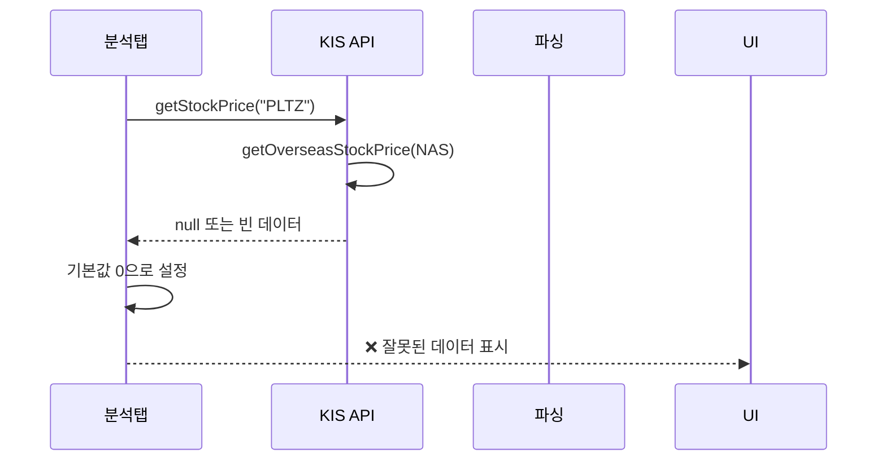
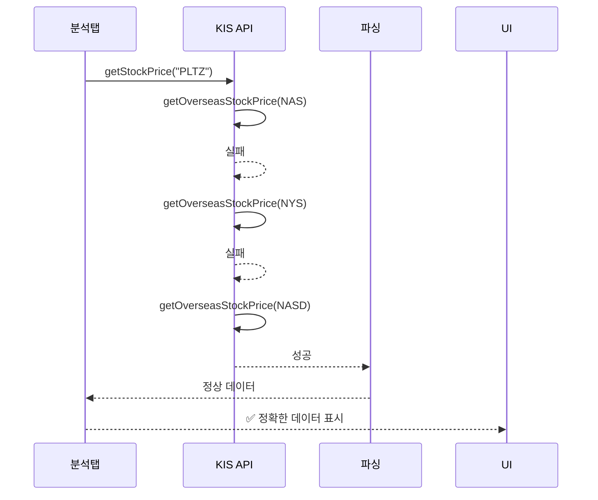

# 나스닥 종목 데이터 로딩 문제 분석 순서도

## 🔍 문제 분석

### 로그에서 확인된 문제점
```
첫 번째 종목 (PLTZ): currentPrice: 0.0, previousPrice: 0.0, currentVolume: 0
두 번째 종목: currentPrice: 12280.0, previousPrice: 10000.0, currentVolume: 42815
```

### 원인 분석
1. **일부 나스닥 종목**: 데이터가 정상적으로 로드됨
2. **일부 나스닥 종목**: 현재가, 거래량이 0으로 표시 (데이터 로딩 실패)

## 🛠️ 문제 원인 및 해결 방안

### 1. API 호출 로직 분석

#### 현재 구현된 로직
```dart
// lib/core/api/kis_unified_api_service.dart 라인 699-709
Future<Map<String, dynamic>?> getStockPrice(String stockCode) async {
  // 해외주식 판별 (대문자 영문 1-5자리)
  if (RegExp(r'^[A-Z]{1,5}$').hasMatch(stockCode)) {
    return await getOverseasStockPrice(
      symbol: stockCode,
      exchangeCode: 'NAS', // 기본값: 나스닥
    );
  } else {
    return await getDomesticStockPrice(stockCode: stockCode);
  }
}
```

#### 해외주식 현재가 조회 로직
```dart
// lib/core/api/kis_unified_api_service.dart 라인 393-445
Future<Map<String, dynamic>?> getOverseasStockPrice({
  required String symbol,
  required String exchangeCode, // NAS: 나스닥, NYS: 뉴욕, HKS: 홍콩
}) async {
  try {
    print('🌍 [통일API] 해외주식 현재가 조회: $symbol (거래소: $exchangeCode)');
    
    final response = await authedGet(
      '/uapi/overseas-price/v1/quotations/inquire-asking-price',
      {
        'AUTH': '',
        'EXCD': exchangeCode,
        'SYMB': symbol,
      },
      trId: 'HHDFS76200100',
    );

    if (response.statusCode == 200 && response.data['rt_cd'] == '0') {
      final output1 = response.data['output1'];
      if (output1 != null) {
        return _parseOverseasStockPriceResponse(output1);
      }
    }
    
    print('❌ [통일API] 해외주식 현재가 조회 실패: ${response.data}');
    return null;
  } catch (e) {
    print('❌ [통일API] 해외주식 현재가 조회 오류: $e');
    return null;
  }
}
```

### 2. 가능한 문제점들

#### A. API 응답 실패
- KIS API에서 해당 종목의 데이터를 제공하지 않음
- 거래소 코드 불일치 (NAS vs NASD)
- 종목 코드 형식 문제

#### B. 파싱 오류
- API 응답은 성공했지만 파싱 과정에서 오류
- 필드명 불일치 또는 데이터 형식 문제

#### C. 네트워크/인증 문제
- API 키 만료 또는 권한 문제
- 네트워크 연결 불안정

### 3. 해결 방안

#### A. 디버깅 로그 강화
```dart
Future<Map<String, dynamic>?> getOverseasStockPrice({
  required String symbol,
  required String exchangeCode,
}) async {
  try {
    print('🌍 [통일API] 해외주식 현재가 조회 시작: $symbol (거래소: $exchangeCode)');
    
    final response = await authedGet(
      '/uapi/overseas-price/v1/quotations/inquire-asking-price',
      {
        'AUTH': '',
        'EXCD': exchangeCode,
        'SYMB': symbol,
      },
      trId: 'HHDFS76200100',
    );

    // 상세 응답 로깅
    print('📋 [통일API] 응답 상태: ${response.statusCode}');
    print('📋 [통일API] 응답 데이터: ${response.data}');
    
    if (response.statusCode == 200 && response.data['rt_cd'] == '0') {
      final output1 = response.data['output1'];
      if (output1 != null) {
        print('✅ [통일API] 해외주식 현재가 조회 성공: $symbol');
        print('📋 [통일API] 파싱 전 데이터: $output1');
        final result = _parseOverseasStockPriceResponse(output1);
        print('📋 [통일API] 파싱 후 데이터: $result');
        return result;
      } else {
        print('❌ [통일API] output1이 null: $symbol');
      }
    } else {
      print('❌ [통일API] API 응답 실패:');
      print('  - Status Code: ${response.statusCode}');
      print('  - rt_cd: ${response.data['rt_cd']}');
      print('  - msg1: ${response.data['msg1']}');
    }
    
    return null;
  } catch (e) {
    print('❌ [통일API] 해외주식 현재가 조회 오류: $e');
    return null;
  }
}
```

#### B. 거래소 코드 다양화
```dart
Future<Map<String, dynamic>?> getStockPrice(String stockCode) async {
  if (RegExp(r'^[A-Z]{1,5}$').hasMatch(stockCode)) {
    // 여러 거래소 시도
    final exchanges = ['NASD', 'NYS', 'NAS']; // 나스닥, 뉴욕, 나스닥(대체)
    
    for (final exchange in exchanges) {
      final result = await getOverseasStockPrice(
        symbol: stockCode,
        exchangeCode: exchange,
      );
      if (result != null && result.isNotEmpty) {
        print('✅ [통일API] $stockCode 데이터 조회 성공 (거래소: $exchange)');
        return result;
      }
    }
    
    print('❌ [통일API] $stockCode 모든 거래소에서 데이터 조회 실패');
    return null;
  } else {
    return await getDomesticStockPrice(stockCode: stockCode);
  }
}
```

#### C. 폴백 메커니즘 추가
```dart
Future<Map<String, dynamic>?> getOverseasStockPrice({
  required String symbol,
  required String exchangeCode,
}) async {
  // 1차: 1호가 API 시도
  final result1 = await _tryOverseasAskingPrice(symbol, exchangeCode);
  if (result1 != null && result1.isNotEmpty) {
    return result1;
  }
  
  // 2차: 현재가 API 시도
  final result2 = await _tryOverseasCurrentPrice(symbol, exchangeCode);
  if (result2 != null && result2.isNotEmpty) {
    return result2;
  }
  
  // 3차: 차트 데이터에서 최신 가격 추출
  final result3 = await _tryOverseasChartPrice(symbol, exchangeCode);
  if (result3 != null && result3.isNotEmpty) {
    return result3;
  }
  
  return null;
}
```

## 📊 데이터 흐름 개선

### 현재 데이터 흐름


### 개선된 데이터 흐름


## 🎯 핵심 개선사항

### 1. 디버깅 강화
- API 응답 상세 로깅
- 파싱 과정 추적
- 오류 원인 명확화

### 2. 거래소 코드 다양화
- NAS, NYS, NASD 등 여러 거래소 시도
- 첫 번째 성공한 결과 사용

### 3. 폴백 메커니즘
- 1호가 API 실패 시 현재가 API 시도
- 현재가 API 실패 시 차트 데이터에서 추출
- 모든 방법 실패 시 명확한 오류 메시지

### 4. 사용자 경험 개선
- 데이터 로딩 상태 표시
- 실패 원인 사용자에게 알림
- 재시도 버튼 제공

## 📋 체크리스트

- [ ] API 응답 로깅 강화
- [ ] 거래소 코드 다양화 구현
- [ ] 폴백 메커니즘 추가
- [ ] 파싱 오류 디버깅
- [ ] 사용자 피드백 개선
- [ ] 재시도 로직 구현

## 🚀 다음 단계

1. 디버깅 로그 추가로 정확한 실패 원인 파악
2. 거래소 코드 다양화로 데이터 조회 성공률 향상
3. 폴백 메커니즘으로 안정성 강화
4. 사용자 경험 개선으로 투명성 확보
