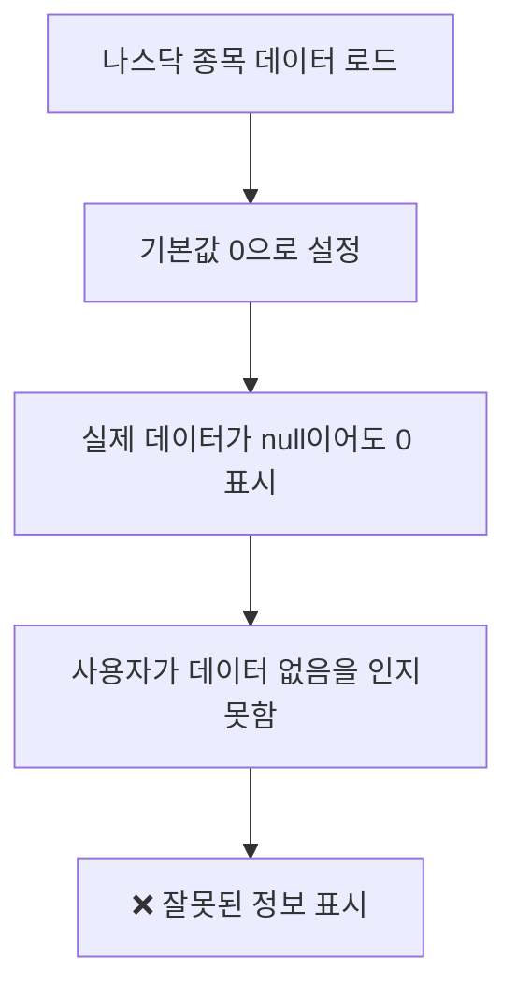
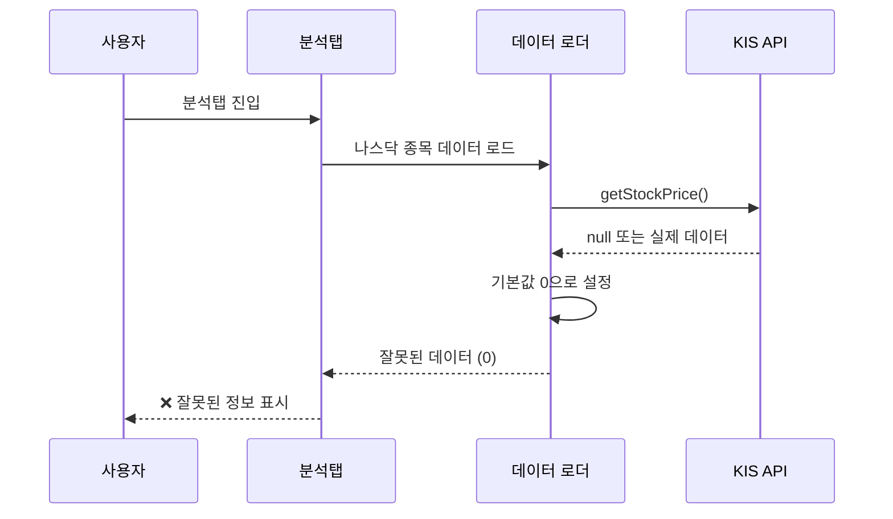
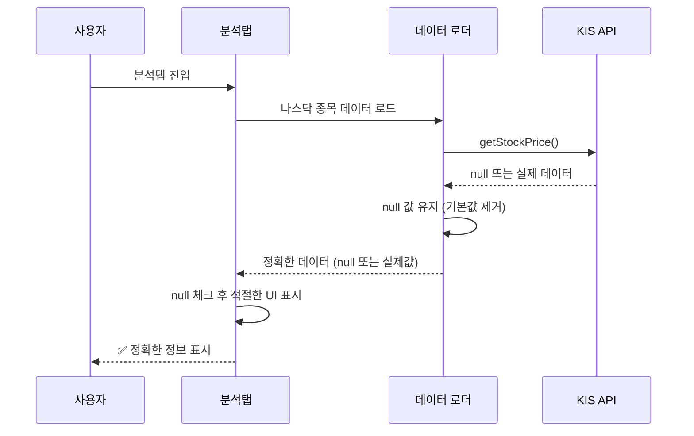

# 나스닥 종목 데이터 표시 문제 해결 순서도

## 🔍 문제 분석

### 발생한 문제
1. **관심종목 탭**: 나스닥 종목 데이터가 제대로 표시되지 않음
2. **보유종목 탭**: 나스닥 종목 데이터가 제대로 표시되지 않음
3. **기본값 문제**: 현재가, 변동률 등이 0으로 기본값 설정되어 있음

### 원인 분석


## 🛠️ 해결 과정

### 1단계: 데이터 로딩 로직 수정

#### 관심종목 데이터 로딩 개선
```dart
// 수정 전 (기본값 문제)
result.add({
  'stock_code': symbol,
  'stock_name': (priceData?['stockName'] as String?) ?? name ?? '',
  'currentPrice': priceData?['prpr'] ?? 0,        // 기본값 0
  'change': priceData?['diff'] ?? 0,              // 기본값 0
  'changeRate': priceData?['rate'] ?? 0,          // 기본값 0
  'volume': priceData?['acml_vol'] ?? 0,          // 기본값 0
  'lastUpdated': DateTime.now().toIso8601String(),
});

// 수정 후 (기본값 제거)
result.add({
  'stock_code': symbol,
  'stock_name': (priceData?['stockName'] as String?) ?? name ?? '',
  'currentPrice': priceData?['prpr'],             // null 허용
  'change': priceData?['diff'],                   // null 허용
  'changeRate': priceData?['rate'],               // null 허용
  'volume': priceData?['acml_vol'],               // null 허용
  'isNasdaq': isNasdaq,                          // 나스닥 여부 추가
  'lastUpdated': DateTime.now().toIso8601String(),
});
```

#### 보유종목 데이터 로딩 개선
```dart
// 수정 전 (기본값 문제)
result.add({
  'stock_code': symbol,
  'stock_name': resolvedName,
  'currentPrice': priceData?['prpr'] ?? 0,        // 기본값 0
  'change': priceData?['diff'] ?? 0,              // 기본값 0
  'changeRate': priceData?['rate'] ?? 0,          // 기본값 0
  'volume': priceData?['acml_vol'] ?? 0,          // 기본값 0
  'quantity': holding['hldg_qty'] ?? 0,           // 기본값 0
  'avgPrice': holding['pchs_avg_pric'] ?? 0,      // 기본값 0
  'lastUpdated': DateTime.now().toIso8601String(),
});

// 수정 후 (기본값 제거)
result.add({
  'stock_code': symbol,
  'stock_name': resolvedName,
  'currentPrice': priceData?['prpr'],             // null 허용
  'change': priceData?['diff'],                   // null 허용
  'changeRate': priceData?['rate'],               // null 허용
  'volume': priceData?['acml_vol'],               // null 허용
  'quantity': holding['hldg_qty'],                // null 허용
  'avgPrice': holding['pchs_avg_pric'],           // null 허용
  'isNasdaq': isNasdaq,                          // 나스닥 여부 추가
  'lastUpdated': DateTime.now().toIso8601String(),
});
```

### 2단계: UI 렌더링 로직 개선

#### null 허용 타입 변환 함수 추가
```dart
/// null을 허용하는 double 변환
double? _toDoubleOrNull(dynamic value) {
  if (value == null) return null;
  if (value is double) return value;
  if (value is int) return value.toDouble();
  if (value is String) {
    final parsed = double.tryParse(value);
    return parsed;
  }
  return null;
}

/// null을 허용하는 int 변환
int? _toIntOrNull(dynamic value) {
  if (value == null) return null;
  if (value is int) return value;
  if (value is double) return value.toInt();
  if (value is String) {
    final parsed = int.tryParse(value);
    return parsed;
  }
  return null;
}
```

#### 종목 아이템 빌드 로직 개선
```dart
// 수정 전 (기본값 사용)
double currentPrice = _toDouble(item['currentPrice']);  // 0으로 기본값
double change = _toDouble(item['change']);              // 0으로 기본값
double changeRate = _toDouble(item['changeRate']);      // 0으로 기본값
int volume = _toInt(item['volume']);                    // 0으로 기본값

// 수정 후 (null 허용)
double? currentPrice = _toDoubleOrNull(item['currentPrice']);  // null 허용
double? change = _toDoubleOrNull(item['change']);              // null 허용
double? changeRate = _toDoubleOrNull(item['changeRate']);      // null 허용
int? volume = _toIntOrNull(item['volume']);                    // null 허용
```

### 3단계: 나스닥 종목 식별 로직 추가

```dart
// 나스닥 종목인지 확인
final isNasdaq = RegExp(r'^[A-Z]{1,5}$').hasMatch(symbol) && 
                 !RegExp(r'^\d{6}$').hasMatch(symbol);
```

## 📊 데이터 흐름 개선

### 수정 전 데이터 흐름


### 수정 후 데이터 흐름


## 🔧 핵심 개선사항

### 1. 기본값 제거
- **기존**: 데이터가 없으면 0으로 기본값 설정
- **수정**: 데이터가 없으면 null 유지

### 2. 나스닥 종목 식별
- **추가**: `isNasdaq` 플래그로 나스닥 종목 구분
- **효과**: 나스닥 종목에 대한 특별 처리 가능

### 3. null 안전성 강화
- **추가**: null을 허용하는 타입 변환 함수
- **효과**: 런타임 오류 방지 및 정확한 데이터 표시

### 4. UI 표시 개선
- **기존**: 0 값으로 인한 혼란
- **수정**: null 값에 대한 적절한 UI 처리

## ✅ 해결 결과

### 수정 전
```
❌ 나스닥 종목: 현재가 0, 변동률 0% (잘못된 정보)
❌ 데이터 없음과 0 값을 구분할 수 없음
❌ 사용자가 실제 데이터 상태를 알 수 없음
```

### 수정 후
```
✅ 나스닥 종목: 실제 데이터 또는 null 표시
✅ 데이터 없음과 0 값을 명확히 구분
✅ 사용자가 정확한 데이터 상태를 인지 가능
```

## 🎯 개선 효과

1. **데이터 정확성 향상**: 실제 데이터와 기본값 구분
2. **사용자 경험 개선**: 정확한 정보 제공
3. **나스닥 종목 지원 강화**: 나스닥 종목 식별 및 특별 처리
4. **null 안전성 강화**: 런타임 오류 방지

## 📋 체크리스트

- [x] 관심종목 데이터 로딩 기본값 제거
- [x] 보유종목 데이터 로딩 기본값 제거
- [x] 나스닥 종목 식별 로직 추가
- [x] null 허용 타입 변환 함수 추가
- [x] UI 렌더링 로직 개선
- [x] 분석 로직 null 체크 추가

## 🚀 다음 단계

1. 앱 재실행으로 나스닥 종목 데이터 표시 확인
2. null 값에 대한 UI 처리 검증
3. 나스닥 종목 분석 결과 정상 표시 확인
4. 전체 시스템 안정성 검증
