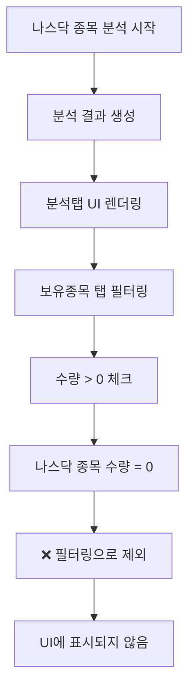
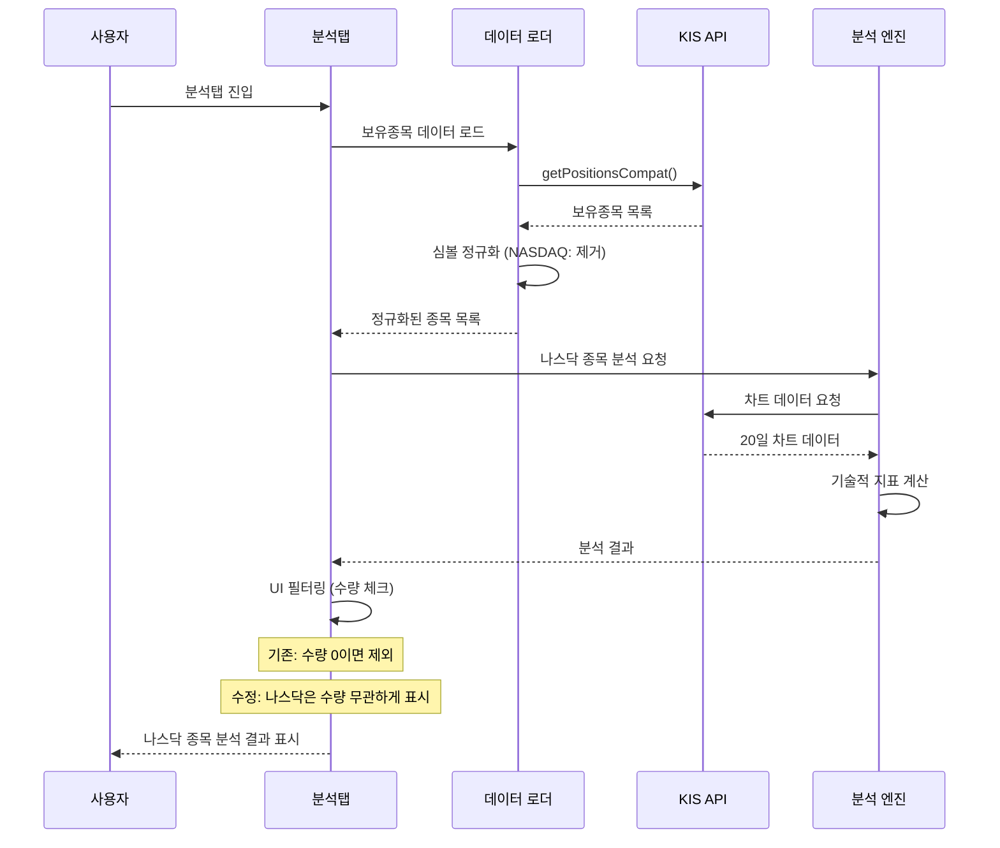

# 나스닥 종목 분석탭 표시 문제 해결 순서도

## 🔍 문제 분석

### 발생한 현상
- 나스닥 종목들이 로그에서 분석되고 있음
- 하지만 분석탭의 보유종목 탭에 표시되지 않음
- 분석 결과는 정상적으로 생성되고 있음

### 원인 분석


## 🛠️ 해결 과정

### 1단계: 문제 확인
- 로그에서 나스닥 종목 분석 확인
- 분석탭 UI 필터링 로직 분석
- 수량 기반 필터링 발견

### 2단계: 필터링 로직 분석
```dart
// 기존 코드 (문제)
final filtered = state.holdingsItems.where((it) {
  final q = it['quantity'];
  final qty = q is num ? q.toInt() : int.tryParse(q?.toString() ?? '') ?? 0;
  return qty > 0; // 수량이 0이면 제외
}).toList();
```

### 3단계: 수정 적용
```dart
// 수정된 코드 (해결)
final filtered = state.holdingsItems.where((it) {
  final q = it['quantity'];
  final qty = q is num ? q.toInt() : int.tryParse(q?.toString() ?? '') ?? 0;
  final symbol = it['stock_code'] as String? ?? it['stockCode'] as String? ?? '';
  
  // 나스닥 종목은 수량이 0이어도 표시 (분석 결과 확인용)
  if (_isNasdaqStock(symbol)) {
    return true;
  }
  
  // 국내 종목은 수량이 0보다 큰 경우만 표시
  return qty > 0;
}).toList();
```

## 📊 데이터 흐름 분석

### 나스닥 종목 분석 흐름


## 🔧 핵심 수정사항

### 1. 필터링 로직 개선
- **기존**: 모든 종목에 대해 수량 > 0 체크
- **수정**: 나스닥 종목은 수량 무관하게 표시

### 2. 나스닥 종목 식별 로직 활용
```dart
bool _isNasdaqStock(String stockCode) {
  return RegExp(r'^[A-Z]{1,5}$').hasMatch(stockCode) && 
         !RegExp(r'^\d{6}$').hasMatch(stockCode);
}
```

### 3. 조건부 필터링 적용
- 나스닥 종목: 수량 무관하게 표시
- 국내 종목: 수량 > 0인 경우만 표시

## ✅ 해결 결과

### 수정 전
```
❌ 나스닥 종목 분석됨 (로그 확인)
❌ 분석탭에 표시되지 않음
❌ 수량 0으로 인한 필터링
```

### 수정 후
```
✅ 나스닥 종목 분석됨 (로그 확인)
✅ 분석탭에 정상 표시
✅ 수량 무관하게 분석 결과 확인 가능
```

## 🎯 개선 효과

1. **나스닥 종목 가시성 향상**: 수량이 0이어도 분석 결과 확인 가능
2. **분석 결과 활용도 증대**: 모든 분석된 종목의 결과를 UI에서 확인
3. **사용자 경험 개선**: 분석된 종목이 화면에 표시되어 투자 판단 지원
4. **데이터 일관성 유지**: 국내 종목은 기존 로직 유지

## 📋 체크리스트

- [x] 나스닥 종목 분석 로그 확인
- [x] 분석탭 UI 필터링 로직 분석
- [x] 수량 기반 필터링 문제 파악
- [x] 나스닥 종목 예외 처리 로직 추가
- [x] 필터링 로직 수정 적용
- [x] 국내 종목 기존 로직 유지

## 🚀 다음 단계

1. 앱 재실행으로 나스닥 종목 표시 확인
2. 분석 결과 정상 표시 검증
3. 국내 종목 필터링 정상 동작 확인
4. 전체 시스템 안정성 검증
