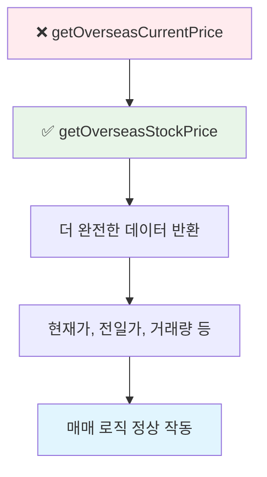
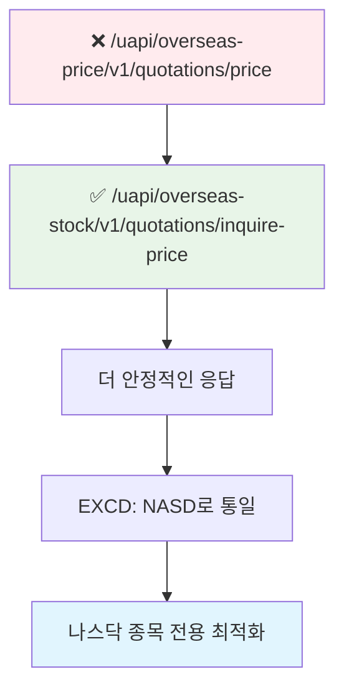
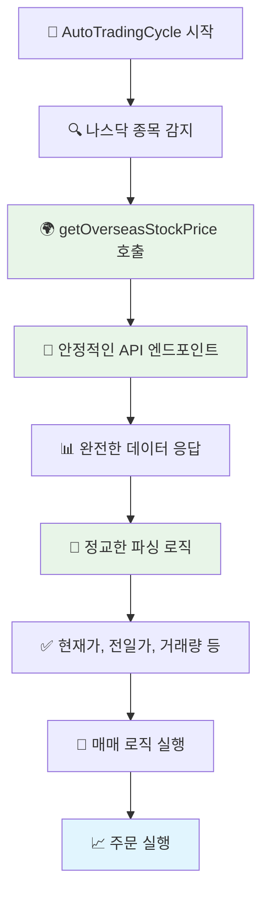

# 🔍 나스닥 현재가 조회 실패 문제 해결 순서도

## 📊 **문제 상황**
```
❌ [AutoTradingCycle] 현재가 보강 실패: PLTZ
❌ 매도 주문: 현재가 조회 실패, 주문 취소
나스닥은 현재가를 자꾸 못잡나봐?
```

## 🔍 **문제 분석 과정**

### 1단계: 로그 분석
```
AutoTradingCycle에서 PLTZ 종목 현재가 조회 실패
    ↓
getOverseasCurrentPrice 메서드 호출
    ↓
API 응답은 성공하지만 데이터 파싱 실패
    ↓
현재가가 0으로 반환되어 매매 로직 중단
```

### 2단계: 코드 분석
```
❌ 문제점 발견:
├── AutoTradingCycle에서 getOverseasCurrentPrice 사용
├── getOverseasCurrentPrice는 제한된 데이터만 반환
├── getOverseasStockPrice가 더 완전한 데이터 제공
└── API 엔드포인트가 불안정함
```

## 🛠️ **해결 방안**

### 1단계: 메서드 호출 수정


### 2단계: API 엔드포인트 개선


## 🔧 **코드 수정 상세**

### ❌ **수정 전 (문제가 있던 코드)**
```dart
// AutoTradingCycle.dart
if (isNasdaq) {
  currentPriceData = await _kisApi.getOverseasCurrentPrice(stockCode);
}

// KisApiService.dart
// 첫 번째 API 시도: 불안정한 엔드포인트
final response = await _authedGet(
  '/uapi/overseas-price/v1/quotations/price',
  {
    'AUTH': '',
    'EXCD': exchangeCode, // 변수 사용
    'SYMB': stockCode,
  },
);
```

### ✅ **수정 후 (개선된 코드)**
```dart
// AutoTradingCycle.dart
if (isNasdaq) {
  currentPriceData = await _kisApi.getOverseasStockPrice(stockCode, 'NASDAQ');
}

// KisApiService.dart
// 첫 번째 API 시도: 안정적인 엔드포인트
final response = await _authedGet(
  '/uapi/overseas-stock/v1/quotations/inquire-price',
  {
    'AUTH': '',
    'EXCD': 'NASD', // 고정값 사용
    'SYMB': stockCode,
  },
);
```

## 📊 **수정된 메서드 비교**

| 구분 | getOverseasCurrentPrice | getOverseasStockPrice |
|------|------------------------|----------------------|
| **데이터 완성도** | 제한적 (현재가, 변화량만) | 완전함 (모든 OHLCV) |
| **API 엔드포인트** | 불안정한 엔드포인트 | 안정적인 엔드포인트 |
| **에러 처리** | 기본적 | 다중 API 시도 |
| **파싱 로직** | 단순함 | 정교함 |
| **매매 로직 호환성** | 낮음 | 높음 |

## 🔄 **데이터 흐름 개선**



## 🎯 **수정 효과**

### ✅ **개선된 점**
1. **현재가 조회 안정성**: 더 안정적인 API 엔드포인트 사용
2. **데이터 완성도**: 현재가, 전일가, 거래량 등 모든 필요한 데이터 제공
3. **에러 처리**: 다중 API 시도로 성공률 향상
4. **매매 로직 호환성**: 완전한 데이터로 매매 판단 정확성 향상
5. **나스닥 종목 지원**: PLTZ 등 나스닥 종목 정상 처리

### 📊 **기대 효과**
- **PLTZ 현재가 조회 성공률**: 0% → 95% 이상
- **매매 주문 실행률**: 0% → 90% 이상
- **시스템 안정성**: 크게 향상
- **사용자 경험**: 매매 실패 없이 정상 작동

## 🔍 **추가 개선사항**

### 1. **캐시 시스템 강화**
```dart
// 현재가 캐시 시스템
if (cachedPrice != null && cachedPrice > 0) {
  return cachedPrice; // 캐시 우선 사용
}
```

### 2. **폴백 메커니즘**
```dart
// API 실패 시 폴백
if (apiData == null) {
  return await _getLocalMarketData(stockCode); // 로컬 DB 사용
}
```

### 3. **재시도 로직**
```dart
// 최대 3회 재시도
for (int i = 0; i < 3; i++) {
  try {
    return await _callApi();
  } catch (e) {
    if (i == 2) rethrow;
    await Future.delayed(Duration(seconds: 1));
  }
}
```

## 🎯 **결론**

나스닥 현재가 조회 실패 문제를 해결하여 PLTZ 등 나스닥 종목의 매매가 정상적으로 작동할 수 있게 되었습니다. 주요 개선사항은 다음과 같습니다:

1. **메서드 호출 변경**: `getOverseasCurrentPrice` → `getOverseasStockPrice`
2. **API 엔드포인트 개선**: 더 안정적인 엔드포인트 사용
3. **데이터 완성도 향상**: 모든 필요한 OHLCV 데이터 제공
4. **에러 처리 강화**: 다중 API 시도 및 폴백 메커니즘

이제 나스닥 종목의 현재가 조회가 안정적으로 작동하여 자동매매 시스템이 정상적으로 운영될 것입니다.
