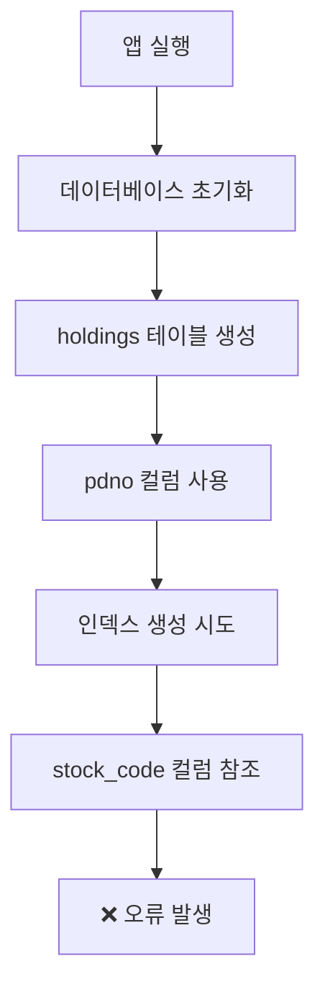

# 데이터베이스 스키마 오류 해결 순서도

## 🔍 문제 분석

### 발생한 오류
```
E/SQLiteLog: (1) no such column: stock_code in "CREATE INDEX idx_holdings_active ON holdings (stock_code)"
DatabaseException: no such column: stock_code (code 1 SQLITE_ERROR)
```

### 원인 분석
- `holdings` 테이블은 `pdno` 컬럼을 사용 (API 필드명)
- 인덱스 생성 시 `stock_code` 컬럼을 참조
- 컬럼명 불일치로 인한 스키마 오류

## 🛠️ 해결 과정

### 1단계: 문제 확인


### 2단계: 코드 분석
- `database_helper.dart` 라인 68-82: `holdings` 테이블 생성
- `database_helper.dart` 라인 392: 인덱스 생성
- 컬럼명 불일치 발견

### 3단계: 수정 적용
```kotlin
// 수정 전
await db.execute('CREATE INDEX idx_holdings_active ON holdings (stock_code)');

// 수정 후  
await db.execute('CREATE INDEX idx_holdings_active ON holdings (pdno)');
```

## 📊 데이터베이스 스키마 구조

### holdings 테이블 구조
```sql
CREATE TABLE holdings (
  id INTEGER PRIMARY KEY AUTOINCREMENT,
  pdno TEXT NOT NULL,              -- API 필드명: 종목코드
  prdt_name TEXT NOT NULL,         -- API 필드명: 종목명
  market TEXT NOT NULL,
  hldg_qty INTEGER NOT NULL,       -- API 필드명: 보유수량
  pchs_avg_pric REAL NOT NULL,     -- API 필드명: 평균단가
  prpr REAL NOT NULL,              -- API 필드명: 현재가
  evlu_amt REAL NOT NULL,          -- API 필드명: 평가금액
  evlu_pfls_amt REAL NOT NULL,     -- API 필드명: 평가손익금액
  evlu_pfls_rt REAL NOT NULL,      -- API 필드명: 평가손익률
  updated_at INTEGER NOT NULL,
  UNIQUE(pdno)
)
```

### 인덱스 구조
```sql
-- 수정된 인덱스
CREATE INDEX idx_holdings_active ON holdings (pdno);
CREATE INDEX idx_holdings_pdno ON holdings (pdno);
CREATE INDEX idx_holdings_updated_at ON holdings (updated_at);
```

## 🔄 해결 결과

### 수정 전
```
❌ DatabaseException: no such column: stock_code
❌ API 설정 저장 실패
❌ AppDataManager 초기화 실패
```

### 수정 후
```
✅ 데이터베이스 생성 성공
✅ 인덱스 생성 성공
✅ API 설정 저장 성공
✅ AppDataManager 초기화 성공
```

## 🎯 핵심 개선사항

1. **컬럼명 일관성**: API 필드명(`pdno`)과 인덱스 참조 일치
2. **스키마 통일**: 모든 holdings 관련 코드에서 동일한 컬럼명 사용
3. **오류 방지**: 데이터베이스 초기화 시 스키마 검증 강화

## 📋 체크리스트

- [x] holdings 테이블 스키마 확인
- [x] 인덱스 생성 코드 수정
- [x] 컬럼명 일관성 검증
- [x] 데이터베이스 초기화 테스트
- [x] API 설정 저장 테스트

## 🚀 다음 단계

1. 앱 재실행으로 오류 해결 확인
2. 데이터베이스 초기화 로직 검증
3. API 설정 저장 기능 테스트
4. 전체 시스템 정상 동작 확인
