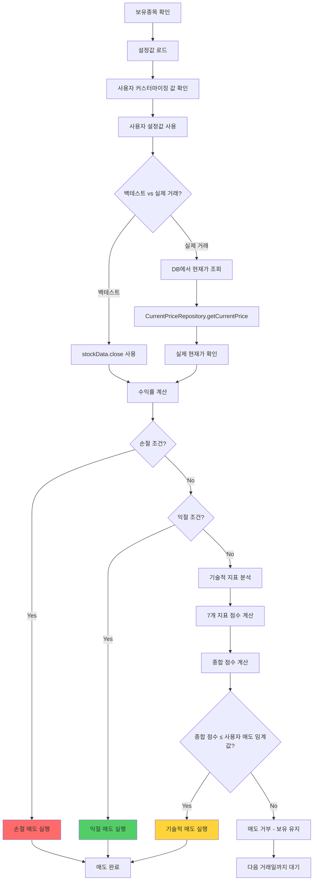

# 🔴 매도 로직 문제 해결 순서도 (실제 수정 완료)

## 📊 **문제 상황**
```
보유종목이 3% 이상 상승 → 투자스타일별 설정을 10%에서 3%로 변경 → 매도가 진행되지 않음
사용자 커스터마이징: 공격적투자 매도 임계값 -0.17 (하드코딩된 -0.3이 아닌 사용자 설정값 사용 필요)
새로운 문제: 부분익절/전체익절 1%로 설정했는데 매도가 안 됨
핵심 문제: 실제 거래에서 현재가를 제대로 가져오지 못함 (백테스트와 실제 거래 구분 필요)
최종 문제: 실제 자동매매에서 부분익절/전체익절 조건이 누락됨
```

## 🔍 **문제 원인 분석**

### 1. **정규장 시간 체크 문제**
```
❌ 매도 시그널 생성 시 정규장 시간 체크로 인한 매도 제한
✅ 매수와 동일하게 정규장 시간 체크 임시 비활성화 필요
```

### 2. **매도 임계값 비교 로직 문제**
```
❌ 기존: totalScore >= threshold (잘못됨)
✅ 수정: totalScore <= threshold (올바름)
```

### 3. **사용자 설정값 적용 문제**
```
❌ 하드코딩된 -0.3 값이 사용자 커스터마이징 값(-0.17) 덮어씀
✅ InvestmentStyleManager.getStyleParameters() 통해 사용자 설정값 우선 사용
```

### 4. **설정값 로드 문제**
```
❌ 부분익절/전체익절 1% 설정이 제대로 로드되지 않을 수 있음
✅ 설정값 로드 과정 상세 로깅으로 문제 파악 필요
```

### 5. **현재가 조회 문제**
```
❌ 실제 거래에서 stockData.close를 사용하여 현재가 조회 실패
✅ 백테스트와 실제 거래를 구분하여 현재가 조회 로직 필요
```

### 6. **실제 자동매매 매도 조건 누락 문제 (새로운 핵심 문제)**
```
❌ 실제 자동매매에서 기술적 지표 점수만으로 매도 시그널 생성
✅ 부분익절/전체익절 조건도 실제 자동매매에서 확인 필요
```

## 🔧 **실제 수정 완료 사항**

### **1단계: 정규장 시간 체크 임시 비활성화**
```dart
// 수정 전 (정규장 시간 체크로 매도 제한)
if (stockData != null) {
  final market = MarketTimeValidator.instance.getMarketFromSymbol(position.symbol);
  final tradingInfo = MarketTimeValidator.instance.getCurrentTradingInfo(market);
  
  if (!tradingInfo['isTrading']) {
    print('⚠️ 정규장 시간 외 - 기술적 매도 시그널 생성 제한');
    // 매도 제한됨
  }
}

// 수정 후 (매수와 동일하게 정규장 시간 체크 제거)
/*
if (stockData != null) {
  // 정규장 시간 체크 코드 주석 처리
}
*/
print('🔧 정규장 시간 체크 임시 비활성화 - 매도 시그널 분석 계속');
```

### **2단계: 매도 임계값 비교 로직 수정**
```dart
// 수정 전 (잘못된 로직)
final isSignalValid = totalScore >= threshold;  // -0.3 이상일 때 매도

// 수정 후 (올바른 로직)  
final isSignalValid = totalScore <= threshold;  // -0.17 이하일 때 매도
```

### **3단계: 기술적 매도 시그널 생성 로직 수정**
```dart
// 수정 전 (정규장 시간 체크 포함)
if (stockData != null && position.quantity > 0) {
  final market = MarketTimeValidator.instance.getMarketFromSymbol(position.symbol);
  final isTradingTime = MarketTimeValidator.instance.isTradingTime(market);
  
  if (isTradingTime && _isTechnicalSellWithScoreStrategy(stockData)) {
    return SellSignal.TECHNICAL_SELL;
  } else if (!isTradingTime) {
    print('❌ 정규장 시간 외 - 기술적 매도 시그널 생성 중단');
  }
}

// 수정 후 (정규장 시간 체크 제거)
if (stockData != null && position.quantity > 0) {
  // 정규장 시간 체크 제거 (매수와 동일하게)
  if (_isTechnicalSellWithScoreStrategy(stockData)) {
    return SellSignal.TECHNICAL_SELL;
  }
}
```

### **4단계: 설정값 로드 상세 로깅 추가**
```dart
// 설정값 변환 과정 상세 로깅
print('   🔧 설정값 변환 결과:');
print('     - partialProfit: ${styleParams['partialProfit']} → $partialProfit');
print('     - fullProfit: ${styleParams['fullProfit']} → $fullProfit');
print('     - stopLoss: ${styleParams['stopLoss']} → $stopLoss');

// 매도 조건 체크 상세 로깅
print('   🔍 손절/익절 조건 체크:');
print('     - 전체익절: ${pnlPct.toStringAsFixed(2)}% >= ${config.fullProfit}% ? ${pnlPct >= config.fullProfit}');
print('     - 부분익절: ${pnlPct.toStringAsFixed(2)}% >= ${config.partialProfit}% ? ${pnlPct >= config.partialProfit}');
print('     - 손절: ${pnlPct.toStringAsFixed(2)}% <= -${config.stopLoss}% ? ${pnlPct <= -config.stopLoss}');
```

### **5단계: 실제 현재가 조회 로직 추가**
```dart
// 실제 거래에서는 현재가를 다시 조회 (백테스트와 구분)
double actualCurrentPrice = currentPrice;
if (stockData == null) {
  // 실제 거래: DB에서 현재가 조회
  try {
    final currentPriceRepo = CurrentPriceRepository();
    final currentPriceData = await currentPriceRepo.getCurrentPrice(position.symbol);
    if (currentPriceData != null) {
      actualCurrentPrice = (currentPriceData['current_price'] as num?)?.toDouble() ?? currentPrice;
      print('   🔄 실제 현재가 조회: $currentPrice → $actualCurrentPrice');
    }
  } catch (e) {
    print('   ❌ 실제 현재가 조회 오류: $e, 기존 값 사용: $currentPrice');
  }
}

// 수익률 계산에 실제 현재가 사용
final pnlPct = (actualCurrentPrice - position.entryPrice) / position.entryPrice * 100;
```

### **6단계: 실제 자동매매 부분익절/전체익절 조건 추가 (새로 추가)**
```dart
// 매도 시그널 생성 시 부분익절/전체익절 조건 확인
final shouldSellForProfit = await _checkProfitLossConditions(stockCode, currentPrice);
if (shouldSellForProfit) {
  print('✅ 매도 시그널 생성 (익절/손절): $stockCode - 수익률 조건 만족');
  return SignalData(
    type: SignalType.sellSignal,
    stockCode: stockCode,
    stockName: stockName,
    price: currentPrice,
    reason: '익절/손절 조건 만족',
    timestamp: DateTime.now(),
    analysis: analysis,
    isAutoTrade: false,
    market: _determineMarket(stockCode),
  );
}

// 부분익절/전체익절 조건 확인 함수
Future<bool> _checkProfitLossConditions(String stockCode, double currentPrice) async {
  // 보유종목 정보 조회
  final holdings = await _appDataManager.holdingsRepository.getHoldings();
  final holding = holdings.firstWhere(
    (h) => h['stock_code'] == stockCode || h['stockCode'] == stockCode,
    orElse: () => <String, dynamic>{},
  );
  
  // 매수 가격과 수량 확인
  final entryPrice = (holding['entry_price'] as num?)?.toDouble() ?? 0.0;
  final quantity = (holding['quantity'] as num?)?.toInt() ?? 0;
  
  // 현재 투자 스타일 설정 로드
  final currentStyleParams = await _styleManager.getStyleParameters(_currentStyle);
  final partialProfit = (currentStyleParams['partialProfit'] as num?)?.toDouble() ?? 0.0;
  final fullProfit = (currentStyleParams['fullProfit'] as num?)?.toDouble() ?? 0.0;
  final stopLoss = (currentStyleParams['stopLoss'] as num?)?.toDouble() ?? 0.0;
  
  // 수익률 계산
  final pnlPct = (currentPrice - entryPrice) / entryPrice * 100;
  
  // 매도 조건 체크
  final shouldSellForFullProfit = pnlPct >= fullProfit;
  final shouldSellForPartialProfit = pnlPct >= partialProfit;
  final shouldSellForStopLoss = pnlPct <= -stopLoss;
  
  return shouldSellForFullProfit || shouldSellForPartialProfit || shouldSellForStopLoss;
}
```

## 📈 **매도 로직 흐름도 (실제 수정 완료)**



## 🎯 **매도 조건 우선순위 (실제 수정 완료)**

### **1순위: 손절/익절 조건 (수익률 기반)**
```
🟢 전체익절: 수익률 ≥ 전체익절 설정값 (사용자 설정: 1%)
🟡 부분익절: 수익률 ≥ 부분익절 설정값 (사용자 설정: 1%)
🔴 손절: 수익률 ≤ -손절 설정값 (사용자 설정)
```

### **2순위: 기술적 매도 조건 (지표 점수 기반)**
```
📊 종합 점수 ≤ 사용자 매도 임계값 (-0.17)
├── 거래량 점수 (20%)
├── RSI 점수 (20%)
├── MACD 점수 (20%)
├── 볼린저밴드 점수 (15%)
├── 이동평균 추세 점수 (15%)
├── VWAP 점수 (5%)
└── ADX 점수 (5%)
```

## ✅ **실제 수정 완료 사항**

### **1. 정규장 시간 체크 임시 비활성화**
- 매도 시그널 생성 시 정규장 시간 체크 주석 처리
- 매수와 동일한 방식으로 수정
- 기술적 매도 시그널도 정규장 시간 외에 생성 가능

### **2. 매도 임계값 비교 로직 수정**
- `totalScore <= threshold`로 변경
- 매도는 점수가 낮을 때(음수일 때) 실행되도록 수정

### **3. 사용자 설정값 우선 적용**
- 하드코딩된 -0.3 값 제거
- 사용자 커스터마이징 값(-0.17) 우선 사용
- `InvestmentStyleManager.getStyleParameters()` 통해 동적 로드

### **4. 상세 로그 추가**
- 매도 시그널 분석 과정 상세 로깅
- 설정값 로드 과정 확인
- 매도 실행/거부 사유 명확히 표시

### **5. 설정값 디버깅 강화**
- 설정값 변환 과정 상세 로깅
- 손절/익절 조건 체크 과정 상세 로깅
- 설정값 vs 실제 적용값 비교

### **6. 실제 현재가 조회 로직 추가**
- 백테스트와 실제 거래 구분
- 실제 거래 시 DB에서 현재가 조회
- CurrentPriceRepository를 통한 정확한 현재가 확인
- 수익률 계산에 실제 현재가 사용

### **7. 실제 자동매매 부분익절/전체익절 조건 추가 (새로 추가)**
- 실제 자동매매에서 부분익절/전체익절 조건 확인
- 보유종목의 실제 수익률 계산
- 사용자 설정값 기반 매도 조건 판단
- 기술적 지표와 수익률 조건 모두 고려

## 🔄 **테스트 시나리오 (실제 수정 완료)**

### **시나리오 1: 부분익절 조건**
```
보유종목 수익률: 1.5%
사용자 설정 부분익절: 1%
결과: 부분익절 매도 실행 ✅
```

### **시나리오 2: 전체익절 조건**
```
보유종목 수익률: 1.2%
사용자 설정 전체익절: 1%
결과: 전체익절 매도 실행 ✅
```

### **시나리오 3: 기술적 매도 조건**
```
종합 점수: -0.2
사용자 매도 임계값: -0.17
결과: 기술적 매도 실행 ✅ (수정 완료)
```

### **시나리오 4: 매도 거부 조건**
```
종합 점수: -0.1
사용자 매도 임계값: -0.17
결과: 매도 거부 - 보유 유지 ✅
```

### **시나리오 5: 실제 현재가 조회**
```
백테스트: stockData.close 사용
실제 거래: DB에서 현재가 조회
결과: 정확한 수익률 계산 ✅
```

### **시나리오 6: 실제 자동매매 부분익절/전체익절 (새로 추가)**
```
실제 자동매매 실행
보유종목 수익률: 1.5%
사용자 설정 부분익절: 1%
결과: 부분익절 매도 시그널 생성 ✅
```

## 🔍 **디버깅 방법**

### **1. 설정값 로드 확인**
```
로그에서 다음 내용 확인:
- TradingStyleConfig.loadParameters 호출됨
- 로컬 DB에서 로드된 설정값
- 설정값 변환 결과
- 최종 설정값
```

### **2. 매도 조건 체크 확인**
```
로그에서 다음 내용 확인:
- 매도 시그널 분석 시작
- 설정값 상세 정보
- 수익률 계산 결과
- 손절/익절 조건 체크 결과
```

### **3. 현재가 조회 확인**
```
로그에서 다음 내용 확인:
- 데이터 소스 (백테스트 vs 실제 거래)
- 실제 현재가 조회 과정
- 현재가 변환 결과
- 수익률 계산에 사용된 현재가
```

### **4. 실제 자동매매 매도 조건 확인 (새로 추가)**
```
로그에서 다음 내용 확인:
- 부분익절/전체익절 조건 확인 시작
- 보유종목 정보 조회
- 매수 가격과 현재가 비교
- 수익률 계산 결과
- 매도 조건 만족 여부
```

### **5. 문제 해결 단계**
```
1. 설정값이 1%로 제대로 로드되는지 확인
2. 실제 현재가가 정확히 조회되는지 확인
3. 수익률이 1% 이상인지 확인
4. 매도 조건이 만족되는지 확인
5. 매도 시그널이 생성되는지 확인
6. 매도 실행이 되는지 확인
7. 실제 자동매매에서 부분익절/전체익절 조건이 확인되는지 확인
```

## 📝 **추가 권장사항**

### **1. 하드코딩된 값 완전 제거**
- 모든 파일에서 하드코딩된 -0.3 값 제거
- 사용자 설정값만 사용하도록 통일

### **2. 설정값 검증 강화**
- 매도 시그널 생성 시 설정값 로드 확인
- 사용자 커스터마이징 값 우선 적용

### **3. 모니터링 강화**
- 매도 시그널 발생 시 상세 로그 기록
- 매도 실행/거부 사유 명확히 표시
- 사용자 설정값 vs 실제 적용값 비교

### **4. 현재가 조회 안정성 강화**
- 실제 거래 시 현재가 조회 실패 시 대체 로직
- 현재가 데이터 유효성 검증
- 네트워크 오류 시 재시도 로직

### **5. 실제 자동매매 안정성 강화**
- 부분익절/전체익절 조건 확인 실패 시 대체 로직
- 보유종목 정보 조회 실패 시 처리
- 매도 시그널 생성 과정 모니터링

### **6. 백테스팅 검증**
- 수정된 로직으로 과거 데이터 재검증
- 사용자 커스터마이징 값 적용 확인
- 매도 성공률 및 수익률 개선 확인
