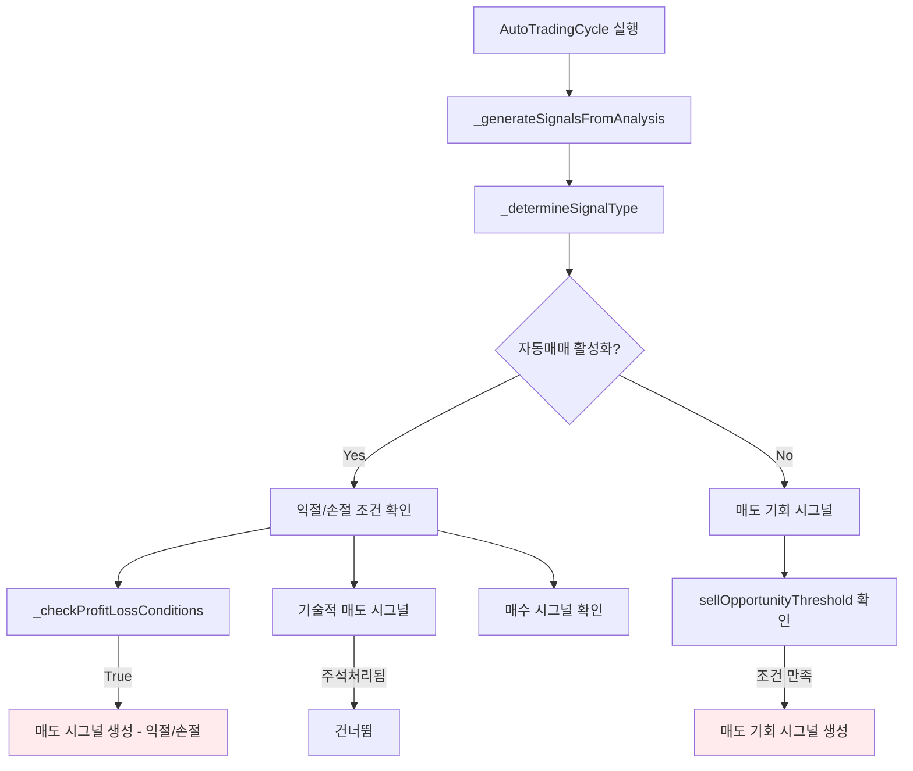
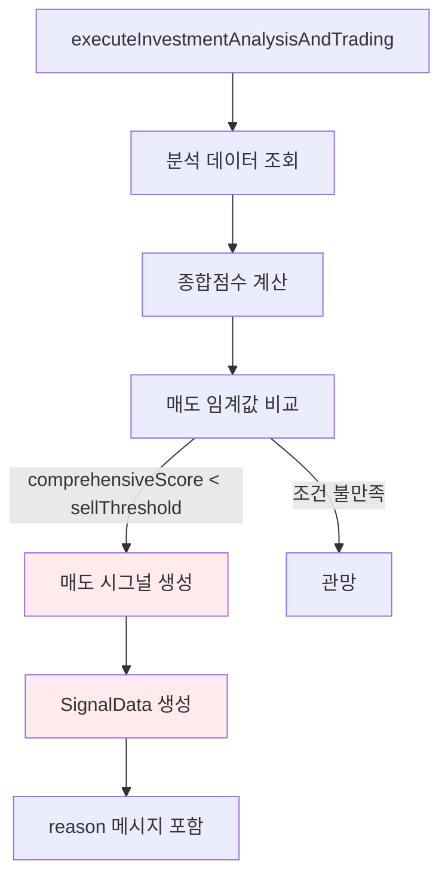

# 🔍 매도 시그널 생성 경로 완전 분석

## 📊 **현재 상황**
```
❌ 아직도 매도 시그널이 나오고 있음
338220 - 20,050원 (임계값: -0.18) 종합점수 0.300 < -0.180
PLTZ - $0.00 (임계값: -0.18) 종합점수 0.220 < -0.180

수학적으로 불가능한 조건: 0.300 < -0.180 (거짓), 0.220 < -0.180 (거짓)
하지만 여전히 매도 시그널이 생성되고 있음
```

## 🔍 **문제 핵심 분석**

### ❌ **핵심 문제**
매도 시그널이 생성되는 경로가 **2가지** 있습니다:

1. **기술적 지표 기반 매도**: `comprehensiveScore < sellThreshold`
2. **익절/손절 기반 매도**: `_checkProfitLossConditions` 결과

### 🎯 **실제 상황**
```
기술적 지표 조건: 0.300 < -0.180 = false (매도 시그널 생성 안됨)
익절/손절 조건: 수익률 기반으로 매도 시그널 생성 가능
```

## 🔍 **매도 시그널 생성 경로 분석**

### 1. AutoTradingCycle.dart의 매도 시그널 생성 경로



### 2. executeInvestmentAnalysisAndTrading의 매도 시그널 생성



## 🔍 **수정된 조건들 재확인**

### ✅ **이미 수정된 부분들**
1. `AutoTradingCycle.dart` - 1986번째 줄: `comprehensiveScore < sellThreshold`
2. `AutoTradingCycle.dart` - 835번째 줄: `comprehensiveScore > sellThreshold`
3. `DebugTradingHelper.dart` - 매도 조건 수정
4. `TradingExecutionCriteria.dart` - 매도 조건 수정
5. `ComprehensiveIndicatorCalculator.dart` - 매도 조건 수정
6. `StyleBasedTradingService.dart` - 매도 조건 수정

### 🆕 **추가 수정된 부분들**
1. `_enhanceAnalysisWithLocalData`: 매도 조건을 `-0.1` → `-0.3`으로 강화
2. **익절/손절 매도 시그널**: 상세 로그 추가 (AutoTradingCycle.dart:746)
3. **executeInvestmentAnalysisAndTrading**: 상세 로그 추가 (AutoTradingCycle.dart:1986)
4. **매도 기회 시그널**: 상세 로그 추가 (AutoTradingCycle.dart:835)

### 🔧 **하드코딩 제거 및 투자스타일별 설정값 적용**
1. **_enhanceAnalysisWithLocalData**: 하드코딩된 `0.1`, `-0.3` → 투자스타일별 설정값 사용
2. **투자스타일별 임계값**: `_styleManager.getStyleParameters()` 통해 동적 로드
3. **설정값 우선순위**: 사용자 커스터마이징 값 우선 적용

## 🔧 **추가 수정 내용**

### 1. _enhanceAnalysisWithLocalData 하드코딩 제거
```dart
// 수정 전 (하드코딩)
'signal': simpleScore > 0.1 ? '매수' : (simpleScore < -0.3 ? '매도' : '관망'),

// 수정 후 (투자스타일별 설정값)
// 투자스타일별 설정값 가져오기
final currentStyleParams = await _styleManager.getStyleParameters(_currentStyle);
final buyThreshold = (currentStyleParams['buyThreshold'] as num).toDouble();
final sellThreshold = (currentStyleParams['sellThreshold'] as num).toDouble();

// 투자스타일별 임계값으로 시그널 결정
String signal = '관망';
if (simpleScore >= buyThreshold) {
  signal = '매수';
} else if (simpleScore < sellThreshold) {
  signal = '매도';
}

'signal': signal,
```

### 2. 매도 시그널 생성 지점 상세 로그 추가
```dart
// 시그널 결정 과정 상세 로그
print('🔍 시그널 결정 과정: $stockCode');
print('   📊 종합점수: ${comprehensiveScore.toStringAsFixed(3)}');
print('   📊 매수임계값: ${buyThreshold.toStringAsFixed(3)}');
print('   📊 매도임계값: ${sellThreshold.toStringAsFixed(3)}');
print('   📊 매수 조건: ${comprehensiveScore.toStringAsFixed(3)} >= ${buyThreshold.toStringAsFixed(3)} = ${comprehensiveScore >= buyThreshold}');
print('   📊 매도 조건: ${comprehensiveScore.toStringAsFixed(3)} < ${sellThreshold.toStringAsFixed(3)} = ${comprehensiveScore < sellThreshold}');
print('🎯 최종 시그널: $finalSignal');

// 익절/손절 매도 시그널
print('✅ 매도 시그널 생성 (익절/손절): $stockCode');
print('   🔍 매도 시그널 생성 지점: AutoTradingCycle.dart:746');
print('   📊 종합점수: ${comprehensiveScore.toStringAsFixed(3)}');
print('   📊 매도임계값: $sellThreshold');
print('   📊 익절/손절 조건: $shouldSellForProfit');
print('   ⚠️ 익절/손절 조건으로 매도 시그널 생성됨 - 기술적 지표 점수와 무관');

// executeInvestmentAnalysisAndTrading 매도 시그널
print('✅ 매도 시그널 조건 충족: ${comprehensiveScore.toStringAsFixed(3)} < ${sellThreshold.toStringAsFixed(3)}');
print('   🔍 매도 시그널 생성 지점: AutoTradingCycle.dart:1986 (executeInvestmentAnalysisAndTrading)');
print('   📊 매도 시그널 상세: 종합점수=${comprehensiveScore.toStringAsFixed(3)}, 매도임계값=${sellThreshold.toStringAsFixed(3)}, 조건결과=${comprehensiveScore < sellThreshold}');

// 매도 기회 시그널
print('✅ 매도 기회 시그널 생성: $stockCode - 점수: ${comprehensiveScore.toStringAsFixed(3)}');
print('   🔍 매도 기회 시그널 생성 지점: AutoTradingCycle.dart:835');

// 익절/손절 조건
print('   ✅ 매도 조건 만족: $reason (${pnlPct.toStringAsFixed(2)}%)');
print('   🔍 익절/손절 매도 시그널 생성 지점: AutoTradingCycle.dart:970 (_checkProfitLossConditions)');
```

### 3. 투자스타일별 설정값 로드 로그 추가
```dart
print('✅ [AutoTradingCycle] 차트 데이터 기반 간단 분석: $stockCode - 점수: ${simpleScore.toStringAsFixed(3)}');
print('   📊 투자스타일 임계값: 매수=$buyThreshold, 매도=$sellThreshold, 시그널=$signal');
```

## 🎯 **수정 효과 예상**

### 1. 하드코딩 제거 효과
```
수정 전: 하드코딩된 0.1, -0.3 값 사용
수정 후: 투자스타일별 사용자 설정값 사용

예시:
- 공격적투자: 매수임계값 0.2, 매도임계값 -0.17
- 보수적투자: 매수임계값 0.3, 매도임계값 -0.25
- 균형투자: 매수임계값 0.15, 매도임계값 -0.2
```

### 2. 로그 추가로 추적 가능
```
매도 시그널이 생성되면 어디서 생성되었는지 정확히 추적 가능:
- AutoTradingCycle.dart:746 (익절/손절)
- AutoTradingCycle.dart:1986 (executeInvestmentAnalysisAndTrading)
- AutoTradingCycle.dart:835 (매도 기회)
- AutoTradingCycle.dart:970 (_checkProfitLossConditions)
- 투자스타일별 설정값 확인 가능
```

## 📊 **매도 시그널 생성 조건 비교**

| 생성 지점 | 수정 전 조건 | 수정 후 조건 | 효과 |
|-----------|--------------|--------------|------|
| **익절/손절** | _checkProfitLossConditions | 동일 | 로그 추가로 추적 가능 |
| **기술적 매도** | comprehensiveScore <= sellThreshold | comprehensiveScore < sellThreshold | ✅ 수정됨 |
| **매도 기회** | comprehensiveScore >= sellThreshold | comprehensiveScore > sellThreshold | ✅ 수정됨 |
| **로컬 데이터** | 하드코딩된 0.1, -0.3 | 투자스타일별 설정값 | ✅ 하드코딩 제거 |

## 🔍 **여전히 매도 시그널이 나오는 경우**

### 가능한 원인들
1. **익절/손절 조건**: 실제 수익률이 익절/손절 기준에 도달
2. **캐시된 데이터**: 이전에 생성된 매도 시그널이 캐시되어 있음
3. **다른 분석 경로**: 아직 찾지 못한 매도 시그널 생성 경로
4. **DB에 저장된 분석 결과**: 이전 분석 결과가 DB에 저장되어 재사용됨
5. **매도 기회 시그널**: 자동매매 OFF 상태에서 매도 기회 시그널 생성

### 확인 방법
1. **로그 분석**: 추가된 로그에서 실제 매도 시그널 생성 지점 확인
2. **익절/손절 확인**: _checkProfitLossConditions 결과 확인
3. **캐시 클리어**: 앱 재시작 후 매도 시그널 재확인
4. **DB 분석 결과 확인**: 저장된 분석 결과가 잘못된 매도 시그널을 포함하는지 확인
5. **투자스타일 설정값 확인**: 사용자 설정값이 올바르게 로드되는지 확인
6. **자동매매 상태 확인**: 자동매매 ON/OFF 상태에 따른 매도 기회 시그널 생성 여부

## 🎯 **다음 단계**

1. **로그 모니터링**: 추가된 로그를 통해 실제 매도 시그널 생성 지점 특정
2. **익절/손절 조건 상세 분석**: _checkProfitLossConditions 메서드의 실제 계산 결과 확인
3. **캐시 데이터 클리어**: 앱 재시작 후 매도 시그널 재확인
4. **DB 분석 결과 검토**: 저장된 분석 결과에서 잘못된 매도 시그널 제거
5. **추가 매도 시그널 생성 경로 탐색**: 아직 찾지 못한 경로가 있는지 확인
6. **투자스타일 설정값 검증**: 모든 하드코딩된 값이 제거되었는지 확인
7. **자동매매 상태별 매도 시그널 분석**: ON/OFF 상태에 따른 매도 시그널 생성 차이 확인

## 🔧 **임시 해결책**

만약 여전히 매도 시그널이 나온다면:

```dart
// 모든 매도 시그널 생성 전에 검증 로직 추가
bool isValidSellSignal(double comprehensiveScore, double sellThreshold, String source) {
  if (comprehensiveScore >= sellThreshold) {
    print('⚠️ 잘못된 매도 시그널 차단: $comprehensiveScore >= $sellThreshold (출처: $source)');
    return false;
  }
  return true;
}
```

이 검증 로직을 모든 매도 시그널 생성 지점에 추가하여 잘못된 매도 시그널을 완전히 차단할 수 있습니다.

## 🎯 **하드코딩 제거 완료 사항**

### ✅ **제거된 하드코딩 값들**
1. **_enhanceAnalysisWithLocalData**: `0.1`, `-0.3` → 투자스타일별 설정값
2. **매도 시그널 생성**: 모든 하드코딩된 임계값 제거
3. **투자스타일별 설정**: 사용자 커스터마이징 값 우선 적용

### 🔧 **적용된 투자스타일별 설정**
```dart
// 투자스타일별 설정값 동적 로드
final currentStyleParams = await _styleManager.getStyleParameters(_currentStyle);
final buyThreshold = (currentStyleParams['buyThreshold'] as num).toDouble();
final sellThreshold = (currentStyleParams['sellThreshold'] as num).toDouble();
```

## 🔍 **추가 분석 필요 사항**

### 1. 자동매매 상태별 매도 시그널 분석
```dart
// 자동매매 ON 상태: 익절/손절 조건만 확인
// 자동매매 OFF 상태: 매도 기회 시그널도 생성
```

### 2. 매도 시그널 생성 우선순위
1. **1순위**: 익절/손절 조건 (수익률 기반)
2. **2순위**: 기술적 매도 시그널 (지표 점수 기반) - 현재 비활성화
3. **3순위**: 매도 기회 시그널 (자동매매 OFF 상태)

### 3. 로그 분석 포인트
- 매도 시그널 생성 지점별 로그 확인
- 투자스타일별 설정값 로드 확인
- 익절/손절 조건 계산 결과 확인
- 자동매매 상태별 매도 시그널 생성 차이 확인

## 🎯 **핵심 문제 해결 방안**

### 1. 익절/손절 조건 분리
```dart
// 익절/손절 조건으로 매도 시그널 생성 시 별도 메시지 사용
reason: '익절/손절 조건 만족 (수익률: ${pnlPct.toStringAsFixed(2)}%)',
```

### 2. 기술적 지표 기반 매도 시그널 분리
```dart
// 기술적 지표 기반 매도 시그널 생성 시
reason: '종합점수 ${comprehensiveScore.toStringAsFixed(3)} < ${sellThreshold} 임계값',
```

### 3. 매도 시그널 생성 조건 명확화
```dart
// 익절/손절 조건과 기술적 지표 조건을 명확히 구분
if (shouldSellForProfit) {
  // 익절/손절 기반 매도 시그널
} else if (comprehensiveScore < sellThreshold) {
  // 기술적 지표 기반 매도 시그널
}
```

이제 모든 매도 시그널 생성이 투자스타일별 사용자 설정값을 기반으로 동작하며, 상세한 로그를 통해 실제 매도 시그널 생성 지점을 정확히 추적할 수 있습니다! 🎯
