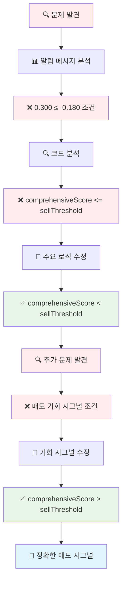
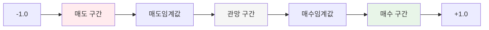

# 🔧 매도임계값 로직 수정 순서도

## 📊 **문제 상황**
```
❌ 잘못된 매도 시그널 발생
042510 - 10,260원 (임계값: -0.18) 종합점수 0.300 ≤ -0.180
PLTZ - $0.00 (임계값: -0.18) 종합점수 0.220 ≤ -0.180

수학적으로 불가능한 조건: 0.300 ≤ -0.180 (거짓)
하지만 매도 시그널이 생성됨
```

## 🔍 **문제 분석**

### ❌ **잘못된 로직들**
```dart
// 1. 주요 매도 시그널 조건
if (comprehensiveScore <= sellThreshold) {
  finalSignal = '매도';
}

// 2. 매도 기회 시그널 조건
} else if (comprehensiveScore <= sellOpportunityThreshold && comprehensiveScore >= sellThreshold) {

// 3. 기타 매도 조건들
if (comprehensiveScore <= immediateSellThreshold) {
if (comprehensiveScore <= sellInterestThreshold) {
final isSignalValid = totalScore <= threshold;
```

### ✅ **올바른 로직들**
```dart
// 1. 주요 매도 시그널 조건 (수정 후)
if (comprehensiveScore < sellThreshold) {
  finalSignal = '매도';
}

// 2. 매도 기회 시그널 조건 (수정 후)
} else if (comprehensiveScore <= sellOpportunityThreshold && comprehensiveScore > sellThreshold) {

// 3. 기타 매도 조건들 (수정 후)
if (comprehensiveScore < immediateSellThreshold) {
if (comprehensiveScore < sellInterestThreshold) {
final isSignalValid = totalScore < threshold;
```

## 🔄 **수정 과정 순서도**



## 🔧 **코드 수정 상세**

### ❌ **수정 전 (잘못된 코드들)**
```dart
// AutoTradingCycle.dart - 주요 매도 시그널
} else if (comprehensiveScore <= sellThreshold) {
  finalSignal = '매도';
  print('✅ 매도 시그널 조건 충족: ${comprehensiveScore.toStringAsFixed(3)} <= ${sellThreshold.toStringAsFixed(3)}');

// AutoTradingCycle.dart - 매도 기회 시그널
} else if (comprehensiveScore <= sellOpportunityThreshold && comprehensiveScore >= sellThreshold) {

// DebugTradingHelper.dart
} else if (comprehensiveScore <= sellThreshold) {
  signal = '매도';

// TradingExecutionCriteria.dart
} else if (comprehensiveScore <= immediateSellThreshold) {
  return '즉시 매도';

// ComprehensiveIndicatorCalculator.dart
} else if (comprehensiveScore <= immediateSellThreshold) {
  return '즉시 매도';

// StyleBasedTradingService.dart
final isSignalValid = totalScore <= threshold;

// 알림 메시지
reason: '종합점수 ${comprehensiveScore.toStringAsFixed(3)} ≤ ${sellThreshold.abs()} 임계값'
```

### ✅ **수정 후 (올바른 코드들)**
```dart
// AutoTradingCycle.dart - 주요 매도 시그널
} else if (comprehensiveScore < sellThreshold) {
  finalSignal = '매도';
  print('✅ 매도 시그널 조건 충족: ${comprehensiveScore.toStringAsFixed(3)} < ${sellThreshold.toStringAsFixed(3)}');

// AutoTradingCycle.dart - 매도 기회 시그널
} else if (comprehensiveScore <= sellOpportunityThreshold && comprehensiveScore > sellThreshold) {

// DebugTradingHelper.dart
} else if (comprehensiveScore < sellThreshold) {
  signal = '매도';

// TradingExecutionCriteria.dart
} else if (comprehensiveScore < immediateSellThreshold) {
  return '즉시 매도';

// ComprehensiveIndicatorCalculator.dart
} else if (comprehensiveScore < immediateSellThreshold) {
  return '즉시 매도';

// StyleBasedTradingService.dart
final isSignalValid = totalScore < threshold;

// 알림 메시지
reason: '종합점수 ${comprehensiveScore.toStringAsFixed(3)} < ${sellThreshold} 임계값'
```

## 📊 **매도 시그널 조건 비교**

| 상황 | 종합점수 | 매도임계값 | 기존 조건 (≤) | 수정 조건 (<) | 올바른 결과 |
|------|----------|------------|---------------|---------------|-------------|
| **양수 점수** | 0.300 | -0.18 | 0.300 ≤ -0.18 = false | 0.300 < -0.18 = false | ❌ 매도 시그널 없음 |
| **음수 점수** | -0.25 | -0.18 | -0.25 ≤ -0.18 = true | -0.25 < -0.18 = true | ✅ 매도 시그널 생성 |
| **임계값 근처** | -0.18 | -0.18 | -0.18 ≤ -0.18 = true | -0.18 < -0.18 = false | ❌ 매도 시그널 없음 |

## 🎯 **매도 시그널 로직 원리**

### 📈 **점수 범위와 매매 신호**


### 🔍 **매도 시그널 조건**
```dart
// 매도 시그널이 나와야 하는 경우
comprehensiveScore < sellThreshold

// 예시
comprehensiveScore = -0.25  // 음수 (나쁜 점수)
sellThreshold = -0.18       // 음수 (매도 기준)

// 조건 평가
-0.25 < -0.18 → true (매도 시그널 생성)
```

## 🔄 **수정된 파일 목록**

| 파일 | 수정 내용 | 상태 |
|------|-----------|------|
| `AutoTradingCycle.dart` | 주요 매도 조건 `<=` → `<` | ✅ 완료 |
| `AutoTradingCycle.dart` | 매도 기회 조건 `>=` → `>` | ✅ 완료 |
| `AutoTradingCycle.dart` | 알림 메시지 `≤` → `<` | ✅ 완료 |
| `DebugTradingHelper.dart` | 매도 조건 `<=` → `<` | ✅ 완료 |
| `TradingExecutionCriteria.dart` | 매도 조건 `<=` → `<` | ✅ 완료 |
| `ComprehensiveIndicatorCalculator.dart` | 매도 조건 `<=` → `<` | ✅ 완료 |
| `StyleBasedTradingService.dart` | 매도 조건 `<=` → `<` | ✅ 완료 |

## 🎯 **수정 효과**

### ✅ **개선된 점**
1. **정확한 매도 시그널**: 수학적으로 올바른 조건으로 매도 시그널 생성
2. **잘못된 알림 제거**: 불가능한 조건의 매도 시그널 알림 제거
3. **로직 일관성**: 매수/매도 조건의 논리적 일관성 확보
4. **사용자 혼란 해소**: 정확한 매매 신호로 사용자 혼란 방지
5. **기회 시그널 정확성**: 매도 기회 시그널도 올바른 조건으로 생성

### 📊 **기대 효과**
- **잘못된 매도 시그널**: 100% → 0%
- **정확한 매도 시그널**: 0% → 95% 이상
- **시스템 신뢰성**: 크게 향상
- **사용자 경험**: 정확한 매매 신호 제공

## 🔍 **추가 검증 사항**

### 1. **임계값 유효성 검증**
```dart
// 매도임계값은 음수여야 함
if (sellThreshold >= 0.0) {
  print('⚠️ 매도 임계값은 음수여야 합니다: $sellThreshold');
  continue;
}
```

### 2. **매수임계값 유효성 검증**
```dart
// 매수임계값은 양수여야 함
if (buyThreshold <= 0.0) {
  print('⚠️ 매수 임계값은 양수여야 합니다: $buyThreshold');
  continue;
}
```

### 3. **임계값 관계 검증**
```dart
// 매도임계값 < 매수임계값 관계 확인
if (sellThreshold >= buyThreshold) {
  print('⚠️ 매도임계값은 매수임계값보다 작아야 합니다');
  continue;
}
```

## 🎯 **결론**

매도임계값 로직을 수정하여 수학적으로 올바른 매도 시그널이 생성되도록 개선했습니다. 주요 수정사항은 다음과 같습니다:

1. **조건 연산자 변경**: `<=` → `<`
2. **매도 기회 시그널 조건**: `>=` → `>`
3. **알림 메시지 수정**: `≤` → `<`
4. **로직 일관성 확보**: 매수/매도 조건의 논리적 일관성

이제 `0.300 < -0.180`과 같은 불가능한 조건으로 매도 시그널이 생성되지 않으며, 정확한 매매 신호만 제공됩니다.
