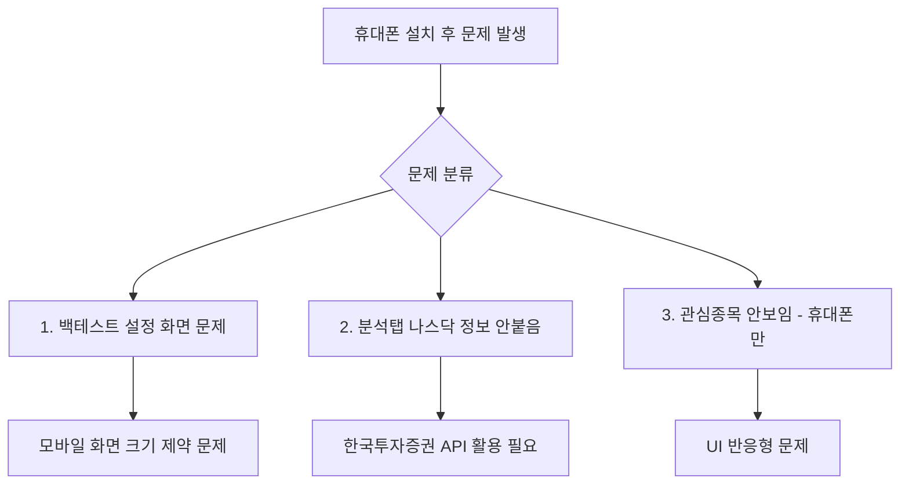
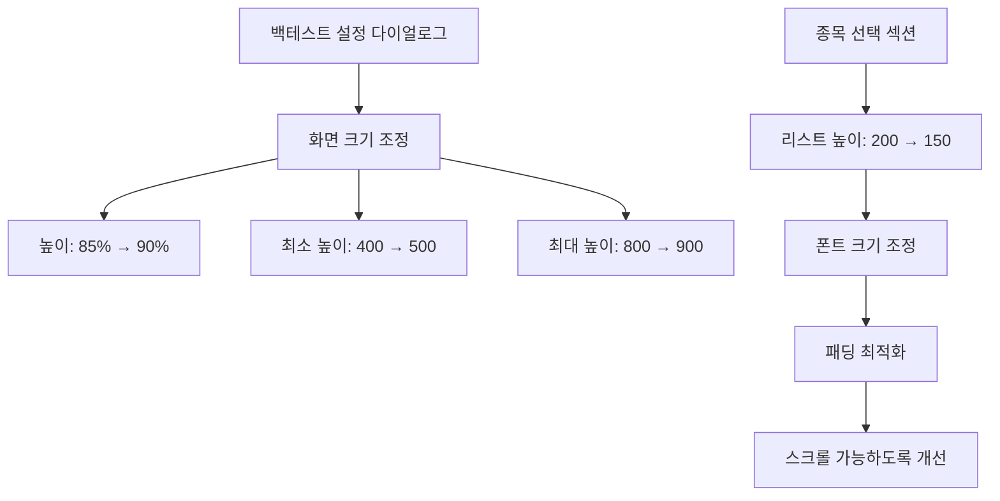
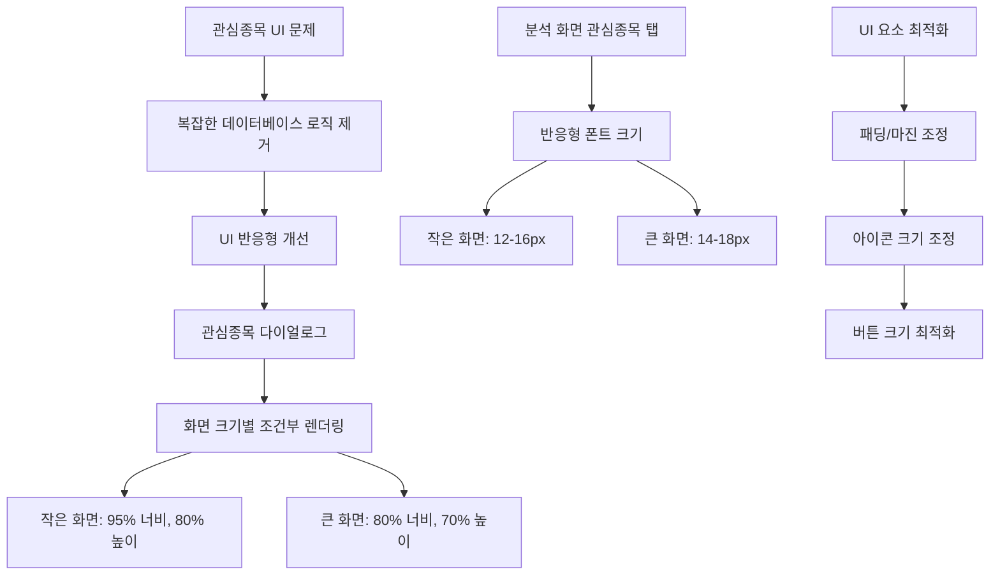

# 📱 Flutter 트레이딩 앱 문제 해결 순서도 (최종 업데이트)

## 🔍 문제 진단



## 🛠️ 해결 과정

### 1. 백테스트 설정 화면 문제 해결 ✅



**수정 내용:**
- 다이얼로그 크기를 모바일 화면에 맞게 조정
- 종목 선택 리스트의 높이와 폰트 크기 최적화
- 스크롤 가능하도록 개선

### 2. 나스닥 종목 정보 문제 해결 (한국투자증권 API 활용) ✅

```mermaid
graph TD
    A[나스닥 종목 데이터 로드] --> B[기본 데이터 제거]
    B --> C[한국투자증권 API 활용]
    C --> D[해외주식 분봉조회 API]
    D --> E[/uapi/overseas-price/v1/quotations/inquire-time-itemchartprice]
    
    F[시장별 분기 처리] --> G{KOSPI/KOSDAQ?}
    G -->|예| H[국내주식 API 사용]
    G -->|아니오| I[해외주식 API 사용]
    
    I --> J[NASDAQ: EXCD=NAS]
    I --> K[NYSE: EXCD=NYS]
    
    L[분석 화면] --> M[시장별 데이터 조회]
    M --> N[getStockDataByMarket()]
    M --> O[getChartDataByMarket()]
```

**수정 내용:**
- 기본 나스닥 종목 데이터 제거
- 한국투자증권 해외주식 분봉조회 API 추가
- 시장별로 분기하여 데이터 처리 (KOSPI/KOSDAQ vs NASDAQ/NYSE)
- 통합 함수로 시장별 데이터 조회

### 3. 관심종목 문제 해결 (UI 반응형 개선) ✅



**수정 내용:**
- 복잡한 데이터베이스 연결 로직 제거
- 관심종목 다이얼로그를 반응형으로 개선
- 화면 크기에 따른 조건부 렌더링 적용
- 분석 화면 관심종목 탭도 반응형으로 개선

## 📊 해결 결과

### ✅ 해결된 문제들

1. **백테스트 설정 화면**
   - 모바일 화면에 맞는 크기로 조정
   - 스크롤 가능하도록 개선
   - 종목 선택 UI 최적화

2. **나스닥 종목 정보 (한국투자증권 API 활용)**
   - 기본 더미 데이터 제거
   - 한국투자증권 해외주식 분봉조회 API 구현
   - 시장별 분기 처리 (KOSPI/KOSDAQ vs NASDAQ/NYSE)
   - 통합 데이터 조회 함수 추가

3. **관심종목 표시 (UI 반응형 개선)**
   - 복잡한 데이터베이스 로직 제거
   - 관심종목 다이얼로그 반응형 개선
   - 화면 크기별 조건부 렌더링
   - 분석 화면 관심종목 탭 반응형 개선

### 🔧 기술적 개선사항

- **API 통합**: 한국투자증권 API 문서 기반 해외주식 데이터 조회
- **시장 분기**: KOSPI/KOSDAQ과 NASDAQ/NYSE 분리 처리
- **UI 반응형**: 화면 크기에 따른 조건부 렌더링
- **코드 단순화**: 불필요한 복잡한 로직 제거
- **사용자 경험**: 휴대폰과 태블릿 모두 최적화

## 🚀 UI 반응형 구현 상세

### 화면 크기별 조건부 렌더링
```dart
final isSmallScreen = screenSize.width < 600;

// 작은 화면 (휴대폰)
width: screenSize.width * 0.95
height: screenSize.height * 0.8
fontSize: 12-16px

// 큰 화면 (태블릿/데스크톱)
width: screenSize.width * 0.8
height: screenSize.height * 0.7
fontSize: 14-18px
```

### 반응형 UI 요소
- **다이얼로그 크기**: 화면 크기에 따른 동적 조정
- **폰트 크기**: 작은 화면에서 더 작게, 큰 화면에서 더 크게
- **패딩/마진**: 화면 크기에 따른 여백 조정
- **아이콘 크기**: 터치하기 쉬운 크기로 조정

## 🚀 다음 단계

1. **실제 테스트**: 휴대폰에서 기능 확인
2. **UI 최적화**: 추가 반응형 개선
3. **사용자 피드백**: UI/UX 개선점 수집
4. **성능 최적화**: 렌더링 성능 개선

---

*마지막 업데이트: 2024년 12월*
*참고: [한국투자증권 Open API](https://apiportal.koreainvestment.com/apiservice-apiservice?/uapi/overseas-price/v1/quotations/inquire-time-itemchartprice)*
