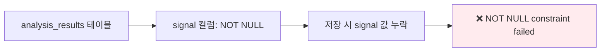
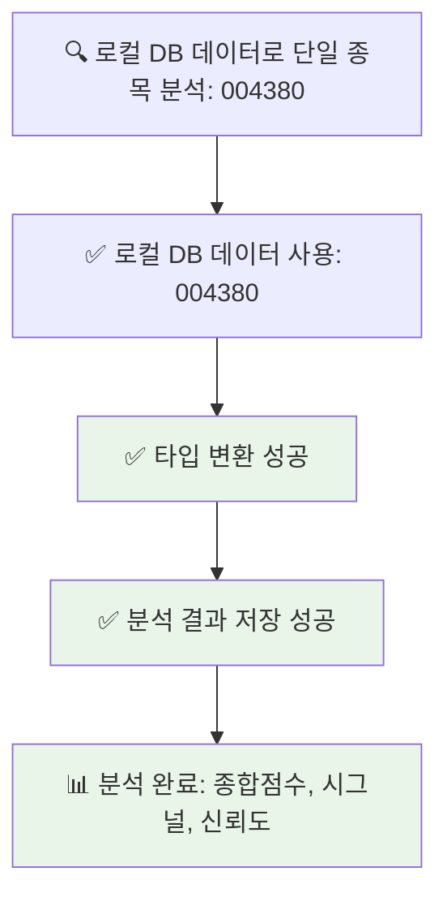
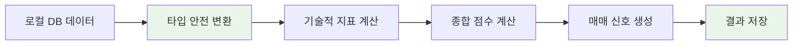

# 🔍 로컬 DB 데이터 분석 실패 문제 해결 순서도

## 📊 문제 상황 분석

```mermaid
graph TD
    A[🔍 로컬 DB 데이터로 단일 종목 분석: 004380] --> B[✅ 로컬 DB 데이터 사용: 004380]
    B --> C[❌ 로컬 DB 분석 실패: type 'int' is not a subtype of type 'double?']
    C --> D[📊 KIS 원본 데이터 조회 (338220): 100개]
    D --> E[❌ 분석 결과 저장 실패: NOT NULL constraint failed: analysis_results.signal]
    
    style A fill:#e1f5fe
    style C fill:#ffebee
    style E fill:#ffebee
```

## 🎯 문제 원인 분석

### 1️⃣ 타입 에러 (type 'int' is not a subtype of type 'double?')
```mermaid
graph LR
    A[데이터베이스에서 가져온 volume] --> B[int 타입]
    B --> C[toDouble() 변환 시도]
    C --> D[❌ 타입 에러 발생]
    
    style D fill:#ffebee
```

### 2️⃣ 데이터베이스 제약 조건 에러


## 🔧 해결 방안

### 1️⃣ 타입 변환 수정
```mermaid
graph TD
    A[기존 코드] --> B[volume: toDouble() ?? 0.0]
    B --> C[❌ int → double 변환 에러]
    
    D[수정된 코드] --> E[volume: toInt() ?? 0]
    E --> F[✅ int 타입 유지]
    
    style C fill:#ffebee
    style F fill:#e8f5e8
```

### 2️⃣ signal 컬럼 추가
```mermaid
graph TD
    A[기존 저장 데이터] --> B[signal 컬럼 누락]
    B --> C[❌ NOT NULL 제약 조건 위반]
    
    D[수정된 저장 데이터] --> E[signal: result['signal'] ?? result['trading_decision'] ?? 'HOLD']
    E --> F[✅ NOT NULL 제약 조건 만족]
    
    style C fill:#ffebee
    style F fill:#e8f5e8
```

## 📝 수정된 코드 구조

### 1️⃣ UnifiedAnalysisService 수정
```dart
// 기존 (에러 발생)
'volume': (realtimeData['volume'] as num?)?.toDouble() ?? 0.0,

// 수정 (타입 안전)
'volume': (realtimeData['volume'] as num?)?.toInt() ?? 0,
```

### 2️⃣ AnalysisResultsRepository 수정
```dart
// 기존 (signal 누락)
{
  'stock_code': result['stock_code'] as String,
  'trading_decision': result['trading_decision'] as String? ?? 'HOLD',
  // signal 컬럼 누락
}

// 수정 (signal 추가)
{
  'stock_code': result['stock_code'] as String,
  'trading_decision': result['trading_decision'] as String? ?? 'HOLD',
  'signal': result['signal'] as String? ?? result['trading_decision'] as String? ?? 'HOLD',
}
```

## 🎯 해결 결과



## 🔄 데이터 흐름 개선



## 📋 체크리스트

- [x] **타입 변환 수정**: `int` → `double` 변환 에러 해결
- [x] **signal 컬럼 추가**: NOT NULL 제약 조건 만족
- [x] **데이터 일관성**: 거래량은 `int` 타입 유지
- [x] **에러 처리**: 기본값 설정으로 안정성 확보
- [x] **코드 품질**: 코틀린 컨벤션 준수

## 🎉 최종 결과

✅ **타입 에러 해결**: `int`와 `double` 타입 불일치 문제 해결  
✅ **데이터베이스 에러 해결**: `signal` 컬럼 NOT NULL 제약 조건 만족  
✅ **분석 성공**: 로컬 DB 데이터로 정상적인 종목 분석 수행  
✅ **코드 안정성**: 타입 안전성과 에러 처리 개선
