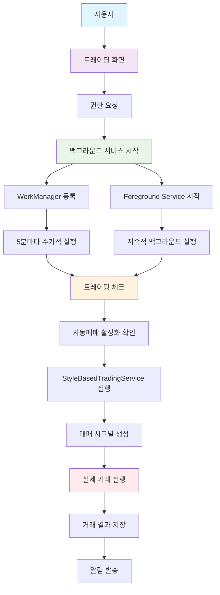
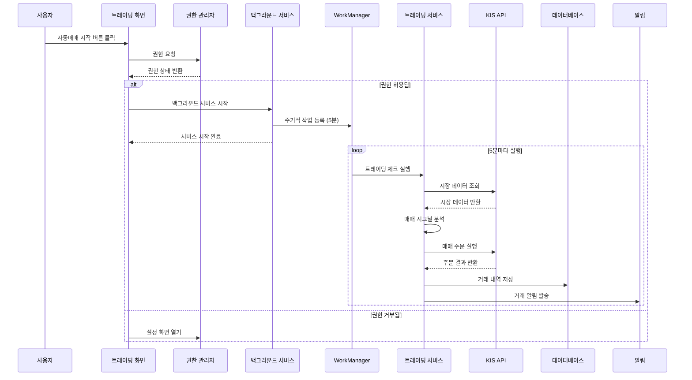
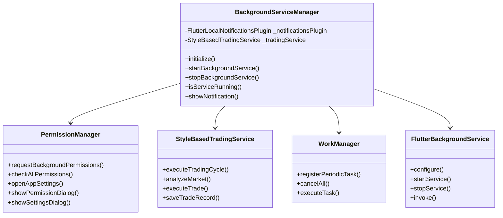

# 백그라운드 자동매매 서비스 구조도

## 📋 전체 시스템 구조



## 🔄 백그라운드 서비스 데이터 흐름



## 🏗️ 클래스 구조



## 📱 권한 요청 프로세스

```mermaid
flowchart TD
    A[자동매매 시작] --> B{알림 권한 확인}
    B -->|허용됨| C{배터리 최적화 권한 확인}
    B -->|거부됨| D[권한 요청 다이얼로그]
    D --> E{사용자 선택}
    E -->|허용| F[권한 재요청]
    E -->|거부| G[설정 화면 안내]
    F --> C
    G --> H[설정 화면으로 이동]
    
    C -->|허용됨| I[백그라운드 서비스 시작]
    C -->|거부됨| J[서비스 시작 (권한 없이)]
    
    I --> K[WorkManager 등록]
    J --> K
    K --> L[Foreground Service 시작]
    L --> M[주기적 트레이딩 실행]
    
    style A fill:#e3f2fd
    style I fill:#e8f5e8
    style M fill:#fff3e0
```

## 🔧 기술적 구현 세부사항

### 1. Android 권한 설정
```xml
<!-- AndroidManifest.xml -->
<uses-permission android:name="android.permission.WAKE_LOCK" />
<uses-permission android:name="android.permission.FOREGROUND_SERVICE" />
<uses-permission android:name="android.permission.REQUEST_IGNORE_BATTERY_OPTIMIZATIONS" />
<uses-permission android:name="android.permission.POST_NOTIFICATIONS" />
<uses-permission android:name="android.permission.FOREGROUND_SERVICE_DATA_SYNC" />
```

### 2. 백그라운드 서비스 구성
```dart
// WorkManager 주기적 작업 (5분마다)
await Workmanager().registerPeriodicTask(
  'tradingPeriodicTask',
  'tradingPeriodicTask',
  frequency: Duration(minutes: 15),
  constraints: Constraints(
    networkType: NetworkType.connected,
    requiresBatteryNotLow: false,
  ),
);

// Foreground Service 지속적 실행
await service.configure(
  androidConfiguration: AndroidConfiguration(
    onStart: onStart,
    autoStart: false,
    isForegroundMode: true,
    notificationChannelId: 'trading_service',
  ),
);
```

### 3. 트레이딩 체크 로직
```dart
Future<void> _executeTradingCheck() async {
  // 1. 자동매매 활성화 상태 확인
  final isAutoTradingEnabled = prefs.getBool('auto_trading_enabled') ?? false;
  
  // 2. 네트워크 연결 확인
  if (!await _checkNetworkConnection()) return;
  
  // 3. 트레이딩 서비스 실행
  final tradingService = StyleBasedTradingService();
  await tradingService.executeTradingCycle();
  
  // 4. 결과 알림
  await _showTradingResultNotification();
}
```

## 🎯 주요 기능

### ✅ 구현된 기능
- [x] 백그라운드 서비스 자동 시작/중지
- [x] 권한 요청 및 관리
- [x] WorkManager를 통한 주기적 실행 (5분)
- [x] Foreground Service를 통한 지속적 실행
- [x] 알림 채널 생성 및 관리
- [x] 배터리 최적화 무시 권한
- [x] 앱 종료 후에도 계속 작동
- [x] 실시간 상태 모니터링

### 🔄 실행 주기
1. **WorkManager**: 5분마다 주기적 실행
2. **Foreground Service**: 지속적 백그라운드 실행
3. **트레이딩 체크**: 시장 데이터 분석 및 매매 시그널 생성
4. **알림**: 거래 결과 및 서비스 상태 알림

### 🛡️ 안전장치
- 네트워크 연결 확인
- 배터리 상태 확인
- 권한 상태 확인
- 에러 처리 및 복구
- 로그 기록 및 모니터링

이 구조를 통해 사용자가 앱을 닫아도 자동매매가 계속 작동하며, 시스템 리소스를 효율적으로 사용하면서 안정적인 백그라운드 실행을 보장합니다.
