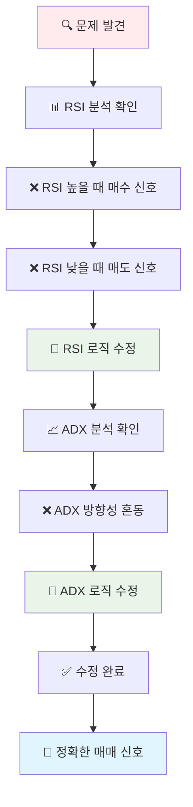
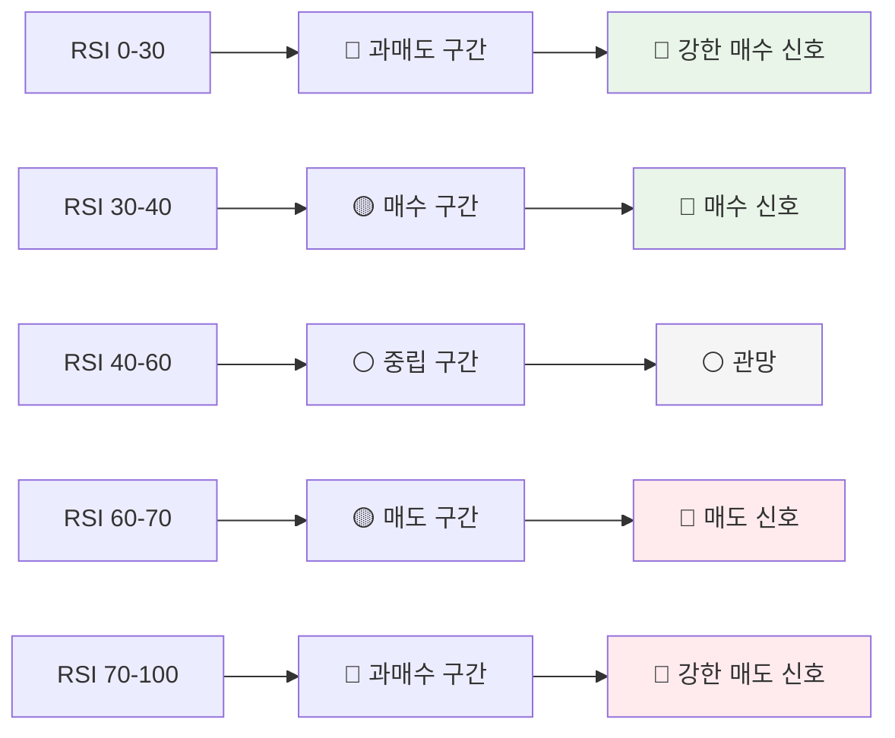
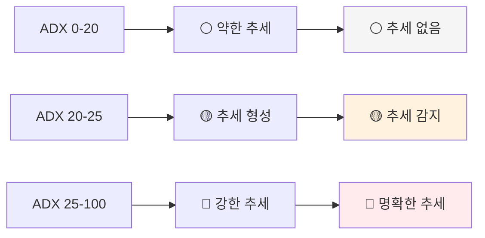
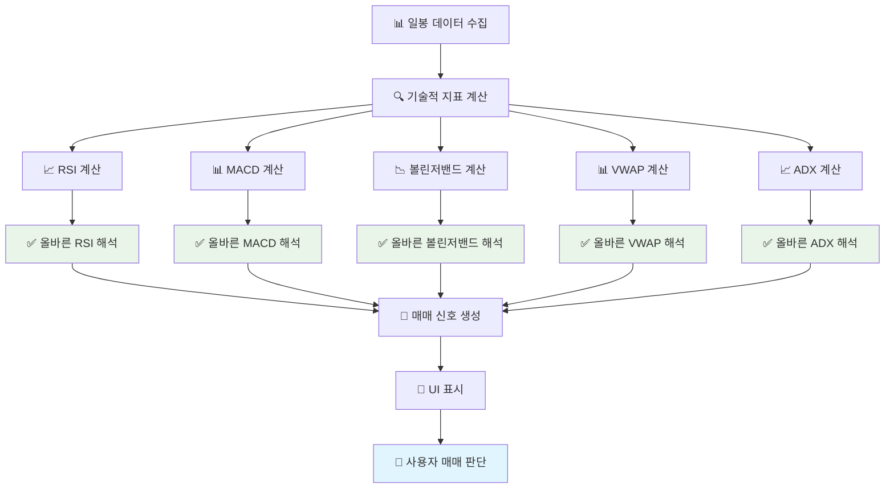

# 🔄 분석탭 일봉 분석 매수/매도 설명 수정 순서도

## 📊 **문제점 분석**

### ❌ **수정 전 문제점**
```
분석탭 일봉 분석 결과
    ↓
RSI 분석에서 매수/매도 설명 반대 ❌
    ↓
ADX 분석에서 추세 방향 설명 부정확 ❌
    ↓
사용자 혼란 및 잘못된 매매 판단 ❌
```

### ✅ **수정 후 개선점**
```
분석탭 일봉 분석 결과
    ↓
RSI 분석에서 올바른 매수/매도 설명 ✅
    ↓
ADX 분석에서 정확한 추세 강도 설명 ✅
    ↓
사용자에게 정확한 매매 신호 제공 ✅
```

## 🔄 **상세 수정 내용 순서도**



## 📊 **RSI 수정 상세**

### ❌ **수정 전 (잘못된 로직)**
```dart
if (signal == '매수') {
  if (score > 0.7) return 'RSI ${rsiValue} (과매수 구간)으로 강한 매수 신호'; // ❌ 잘못됨
  else if (score > 0.5) return 'RSI ${rsiValue} (상승 추세)로 매수 신호';
  else return 'RSI ${rsiValue} (중립선 상회)로 매수 신호';
} else if (signal == '매도') {
  if (score < -0.7) return 'RSI ${rsiValue} (과매도 구간)으로 강한 매도 신호'; // ❌ 잘못됨
  else if (score < -0.5) return 'RSI ${rsiValue} (하락 추세)로 매도 신호';
  else return 'RSI ${rsiValue} (중립선 하회)로 매도 신호';
}
```

### ✅ **수정 후 (올바른 로직)**
```dart
if (signal == '매수') {
  if (rsiValue <= 30) return 'RSI ${rsiValue} (과매도 구간)으로 강한 매수 신호'; // ✅ 올바름
  else if (rsiValue <= 40) return 'RSI ${rsiValue} (매수 구간)로 매수 신호';
  else if (rsiValue <= 50) return 'RSI ${rsiValue} (중립선 하회)로 매수 신호';
  else return 'RSI ${rsiValue} (상승 추세)로 매수 신호';
} else if (signal == '매도') {
  if (rsiValue >= 70) return 'RSI ${rsiValue} (과매수 구간)으로 강한 매도 신호'; // ✅ 올바름
  else if (rsiValue >= 60) return 'RSI ${rsiValue} (매도 구간)로 매도 신호';
  else if (rsiValue >= 50) return 'RSI ${rsiValue} (중립선 상회)로 매도 신호';
  else return 'RSI ${rsiValue} (하락 추세)로 매도 신호';
}
```

## 📈 **RSI 매매 신호 기준**



## 📊 **ADX 수정 상세**

### ❌ **수정 전 (혼동되는 설명)**
```dart
if (signal == '매수') {
  if (adxValue > 30) return 'ADX ${adxValue} (강한 상승 추세)로 매수 신호'; // ❌ ADX는 방향성 없음
  else if (adxValue > 25) return 'ADX ${adxValue} (상승 추세)로 매수 신호';
  else return 'ADX ${adxValue} (상승 전환)으로 매수 신호';
} else if (signal == '매도') {
  if (adxValue > 30) return 'ADX ${adxValue} (강한 하락 추세)로 매도 신호'; // ❌ ADX는 방향성 없음
  else if (adxValue > 25) return 'ADX ${adxValue} (하락 추세)로 매도 신호';
  else return 'ADX ${adxValue} (하락 전환)으로 매도 신호';
}
```

### ✅ **수정 후 (정확한 설명)**
```dart
if (signal == '매수') {
  if (adxValue >= 25) return 'ADX ${adxValue} (강한 추세, 상승 신호)로 매수 신호'; // ✅ 추세 강도 + 방향 분리
  else if (adxValue >= 20) return 'ADX ${adxValue} (추세 형성, 상승)로 매수 신호';
  else return 'ADX ${adxValue} (약한 추세, 상승 전환)으로 매수 신호';
} else if (signal == '매도') {
  if (adxValue >= 25) return 'ADX ${adxValue} (강한 추세, 하락 신호)로 매도 신호'; // ✅ 추세 강도 + 방향 분리
  else if (adxValue >= 20) return 'ADX ${adxValue} (추세 형성, 하락)로 매도 신호';
  else return 'ADX ${adxValue} (약한 추세, 하락 전환)으로 매도 신호';
}
```

## 📈 **ADX 추세 강도 기준**



## 🎯 **수정 효과**

### ✅ **개선된 점**
1. **RSI 분석 정확성**: 과매도/과매수 구간에 따른 올바른 매매 신호
2. **ADX 설명 명확성**: 추세 강도와 방향을 분리하여 설명
3. **사용자 이해도 향상**: 직관적이고 정확한 매매 신호 제공
4. **매매 판단 정확성**: 잘못된 신호로 인한 손실 방지

### 📊 **기술적 지표별 올바른 해석**

| 지표 | 매수 신호 | 매도 신호 | 관망 구간 |
|------|-----------|-----------|-----------|
| **RSI** | 30 이하 (과매도) | 70 이상 (과매수) | 40-60 |
| **볼린저밴드** | 하단선 근처 | 상단선 근처 | 중간선 근처 |
| **MACD** | MACD > Signal | MACD < Signal | MACD ≈ Signal |
| **VWAP** | VWAP 하단 | VWAP 상단 | VWAP 근처 |
| **ADX** | 강한 추세 + 상승 | 강한 추세 + 하락 | 약한 추세 |

## 🔄 **데이터 흐름**



## 🎯 **결론**

분석탭의 일봉 분석에서 매수/매도 설명이 반대로 되어 있던 문제를 수정하여, 사용자에게 정확하고 직관적인 매매 신호를 제공할 수 있게 되었습니다. 특히 RSI와 ADX 지표의 해석을 올바르게 수정하여, 기술적 분석의 정확성을 크게 향상시켰습니다.
