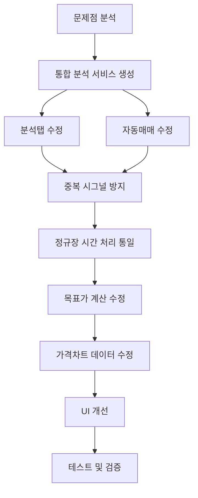
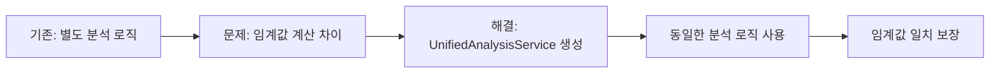
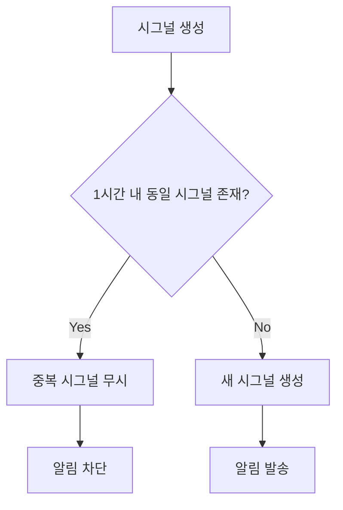
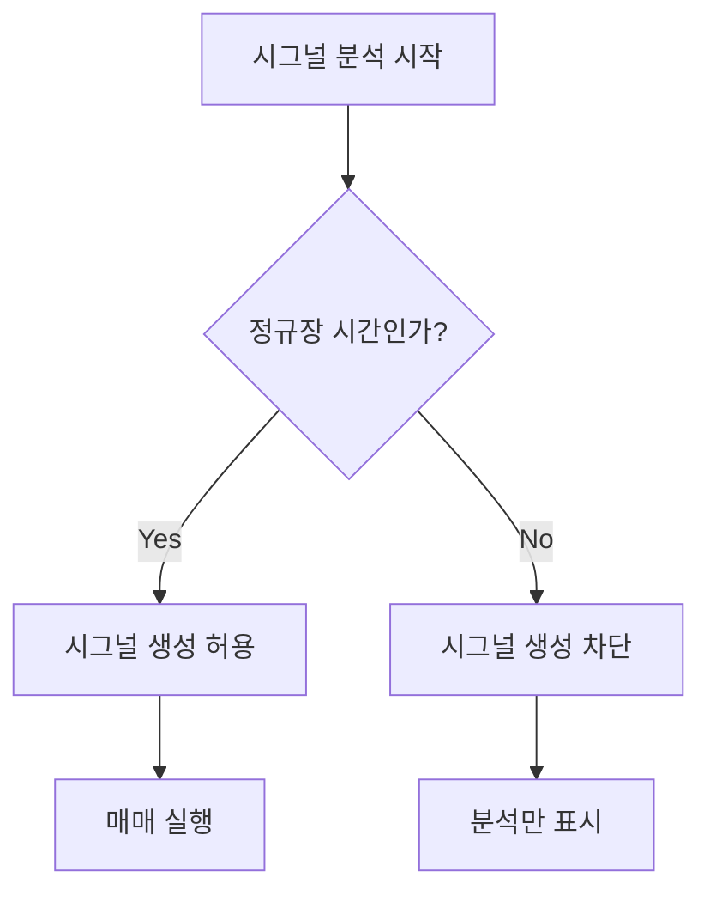

# 🔄 분석탭-자동매매 통합 수정 순서도

## 📊 전체 수정 흐름



## 🎯 주요 문제점 및 해결방안

### 1. **분석탭과 자동매매 임계값 불일치**


### 2. **중복 시그널 알림**


### 3. **정규장 시간 외 처리**


## 🔧 코드 수정 상세

### 1. **통합 분석 서비스 생성**
```dart
// lib/core/analysis/unified_analysis_service.dart
class UnifiedAnalysisService {
  // 동일한 분석 로직으로 통합
  Future<Map<String, dynamic>?> analyzeStock(String stockCode) {
    // 1. 투자 스타일 설정 로드
    // 2. 시장 데이터 가져오기
    // 3. 정규장 시간 체크
    // 4. 7가지 동적 지표 계산
    // 5. 종합 점수 계산
    // 6. 시그널 생성 (정규장 시간 내에서만)
  }
}
```

### 2. **분석탭 수정**
```dart
// lib/features/analysis/analysis_screen.dart
- AIAnalysisService → UnifiedAnalysisService 사용
- 목표가 계산 로직 수정
- 차트 데이터 추출 개선
```

### 3. **자동매매 수정**
```dart
// lib/core/trading/auto_trading_cycle.dart
- UnifiedAnalysisService 사용
- 중복 시그널 체크 추가
- 정규장 시간 체크 강화
```

## 📈 수정 결과

### ✅ **해결된 문제들**
1. **임계값 일치**: 분석탭과 자동매매가 동일한 계산 로직 사용
2. **중복 알림 제거**: 1시간 내 동일 시그널 중복 방지
3. **정규장 시간 통일**: 모든 곳에서 동일한 시간 체크 로직
4. **목표가 정확성**: 통합된 분석 서비스에서 계산된 목표가 사용
5. **가격차트 수정**: KIS API 데이터 제대로 추출

### 🎯 **개선된 기능들**
- **통합된 분석**: 하나의 서비스로 모든 분석 처리
- **일관된 시그널**: 동일한 조건에서 동일한 시그널 생성
- **정확한 시간 처리**: 시장별 정규장 시간 정확히 반영
- **신뢰도 향상**: 중복 시그널 제거로 신뢰도 증가

## 🔍 **테스트 시나리오**

### 1. **임계값 일치 테스트**
- 분석탭에서 매수 시그널 확인
- 자동매매에서 동일한 시그널 확인
- 임계값 계산 결과 비교

### 2. **중복 시그널 테스트**
- 동일 종목에 대해 연속 시그널 생성
- 1시간 내 중복 시그널 차단 확인

### 3. **정규장 시간 테스트**
- 정규장 시간 외 시그널 차단 확인
- 나스닥 토요일 새벽 거래 허용 확인

### 4. **목표가 정확성 테스트**
- 분석탭에서 목표가 표시 확인
- 실제 가격과 목표가 비교

## 🚀 **다음 단계**

1. **실제 테스트**: 수정된 코드로 실제 거래 환경 테스트
2. **성능 모니터링**: 통합된 분석 서비스 성능 측정
3. **사용자 피드백**: 개선된 기능에 대한 사용자 반응 수집
4. **추가 최적화**: 필요시 추가 개선사항 적용

---

**수정 완료! 이제 분석탭과 자동매매가 동일한 로직으로 일관된 결과를 제공합니다.** 🎉
