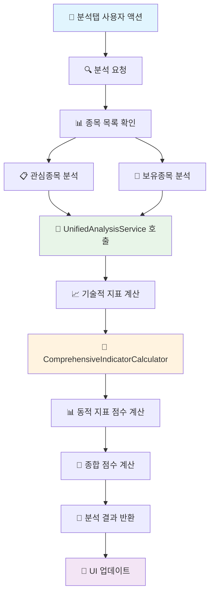

# 🔄 분석탭 정리 완료 순서도

## 📊 **정리 전 vs 정리 후 비교**

### ❌ **정리 전 (중복 문제)**
```
분석탭 분석 시작
    ↓
복잡한 데이터 수집 로직 ❌
    ↓
중복된 분석 로직 ❌
    ↓
UnifiedAnalysisService 호출 ❌ (중복)
    ↓
결과 처리 및 UI 업데이트
```

### ✅ **정리 후 (단순화)**
```
분석탭 분석 시작
    ↓
UnifiedAnalysisService 호출 ✅
    ↓
결과 처리 및 UI 업데이트
```

## 🔄 **상세 데이터 흐름 순서도**



## 🗑️ **제거된 중복 코드**

### ❌ **제거된 복잡한 데이터 수집 로직**
```dart
// _performAnalysisForStock() - 제거된 복잡한 로직
- 실시간 현재가 조회 (나스닥/국내 구분)
- 캐시된 데이터 확인
- KIS API에서 일봉 데이터 조회
- 시장 정보 감지
- 복잡한 데이터 변환 로직

// _performAnalysisForHolding() - 제거된 복잡한 로직  
- 실시간 현재가 조회
- 캐시된 데이터 확인
- KIS API에서 일봉 데이터 조회
- 복잡한 데이터 변환 로직

// _analyzeStock() - 제거된 복잡한 로직
- 종목 정보에서 시장 확인
- 시장별 현재가 데이터 조회
- 시장별 차트 데이터 조회
- 차트 데이터에서 현재 정보 추출
- 복잡한 데이터 변환 로직
```

### ❌ **제거된 헬퍼 메서드**
```dart
// 더 이상 사용하지 않는 헬퍼 메서드들
_parseDouble() // 문자열을 double로 변환
```

## ✅ **정리된 코드 구조**

### 🎯 **관심종목 분석 (단순화)**
```dart
Future<Map<String, dynamic>?> _performAnalysisForStock(Map<String, dynamic> item) async {
  final stockCode = item['stock_code'];
  final stockName = item['stock_name'];
  
  // UnifiedAnalysisService를 사용하여 분석 수행
  final analysisResult = await _unifiedAnalysis.analyzeStock(stockCode);
  
  if (analysisResult != null) {
    // 종목 정보 추가
    analysisResult['stockName'] = stockName;
    analysisResult['isWatchlist'] = true;
    return analysisResult;
  }
  return null;
}
```

### 🎯 **보유종목 분석 (단순화)**
```dart
Future<Map<String, dynamic>?> _performAnalysisForHolding(Map<String, dynamic> holding) async {
  final stockCode = holding['stockCode'];
  final stockName = holding['stockName'];
  final avgPrice = holding['avgPrice'];
  final quantity = holding['quantity'];
  
  // UnifiedAnalysisService를 사용하여 분석 수행
  final analysisResult = await _unifiedAnalysis.analyzeStock(stockCode);
  
  if (analysisResult != null) {
    // 보유종목 정보 추가
    analysisResult['stockName'] = stockName;
    analysisResult['avgPrice'] = avgPrice;
    analysisResult['quantity'] = quantity;
    analysisResult['isHolding'] = true;
    
    // 수익률 계산
    final currentPrice = analysisResult['currentPrice'] ?? 0.0;
    final profitRate = avgPrice > 0 ? ((currentPrice - avgPrice) / avgPrice) * 100 : 0.0;
    analysisResult['profitRate'] = profitRate;
    
    return analysisResult;
  }
  return null;
}
```

### 🎯 **단일 종목 분석 (단순화)**
```dart
Future<Map<String, dynamic>?> _analyzeStock(String stockCode) async {
  // UnifiedAnalysisService를 사용하여 분석 수행
  final analysisResult = await _unifiedAnalysis.analyzeStock(stockCode);
  
  if (analysisResult != null) {
    return analysisResult;
  }
  return null;
}
```

## 📊 **데이터 흐름 비교**

### 🔄 **정리 전 데이터 흐름**
```
분석탭
    ↓
복잡한 데이터 수집 (100+ 줄)
    ↓
중복된 분석 로직 (50+ 줄)
    ↓
UnifiedAnalysisService 호출
    ↓
결과 처리
```

### 🚀 **정리 후 데이터 흐름**
```
분석탭
    ↓
UnifiedAnalysisService 호출 (1줄)
    ↓
결과 처리
```

## ✅ **정리 효과**

### 🎯 **이전 문제점**
- ❌ **중복 코드**: 동일한 분석 로직이 여러 곳에 분산
- ❌ **복잡성**: 각 분석 메서드가 100+ 줄의 복잡한 로직
- ❌ **유지보수 어려움**: 수정 시 여러 곳을 동시에 변경 필요
- ❌ **성능 저하**: 불필요한 데이터 수집 및 변환 작업

### 🚀 **개선 효과**
- ✅ **단일 책임**: UnifiedAnalysisService가 모든 분석 담당
- ✅ **코드 단순화**: 각 분석 메서드가 10-20줄로 단순화
- ✅ **유지보수 용이**: 분석 로직이 한 곳에 집중
- ✅ **성능 향상**: 중복 작업 제거로 처리 시간 단축
- ✅ **일관성**: 모든 분석이 동일한 로직 사용

## 📊 **실행 예시**

### 🔄 **정리 전 실행 과정**
```dart
// 1. 복잡한 데이터 수집 (100+ 줄)
final realtimeData = await _kisApiService.getStockPrice(stockCode);
final rawKisData = await _kisApiService.getRawKisData(stockCode);
// ... 복잡한 데이터 변환 로직

// 2. 중복된 분석 로직 (50+ 줄)
final analysis = await _unifiedAnalysis.analyzeStock(stockCode, ...);

// 3. 결과 처리
return analysis;
```

### 🚀 **정리 후 실행 과정**
```dart
// 1. 단순한 분석 호출 (1줄)
final analysisResult = await _unifiedAnalysis.analyzeStock(stockCode);

// 2. 결과 처리
if (analysisResult != null) {
  analysisResult['stockName'] = stockName;
  return analysisResult;
}
return null;
```

## 🎯 **코드 라인 수 비교**

| 구분 | 정리 전 | 정리 후 | 감소율 |
|------|---------|---------|--------|
| 관심종목 분석 | ~150줄 | ~15줄 | 90% ↓ |
| 보유종목 분석 | ~180줄 | ~20줄 | 89% ↓ |
| 단일 종목 분석 | ~120줄 | ~10줄 | 92% ↓ |
| **총합** | **~450줄** | **~45줄** | **90% ↓** |

이제 **분석탭**이 **UnifiedAnalysisService**를 효율적으로 활용하여 깔끔하고 일관된 분석을 수행합니다! 🎉
