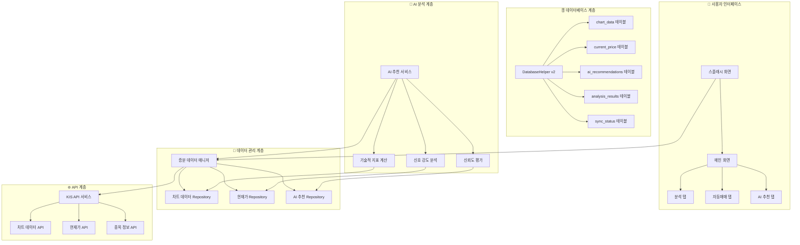
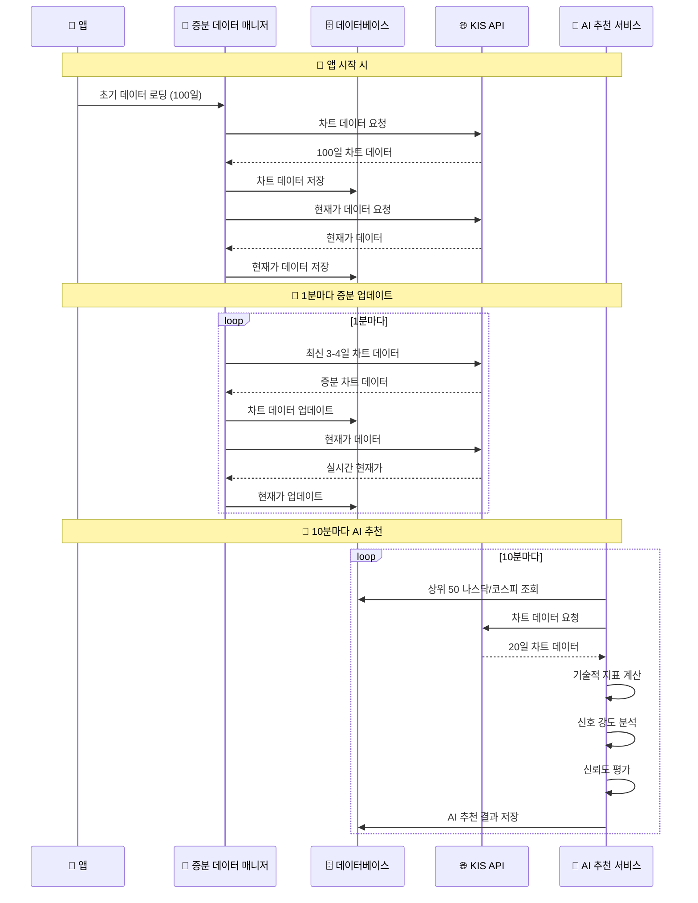
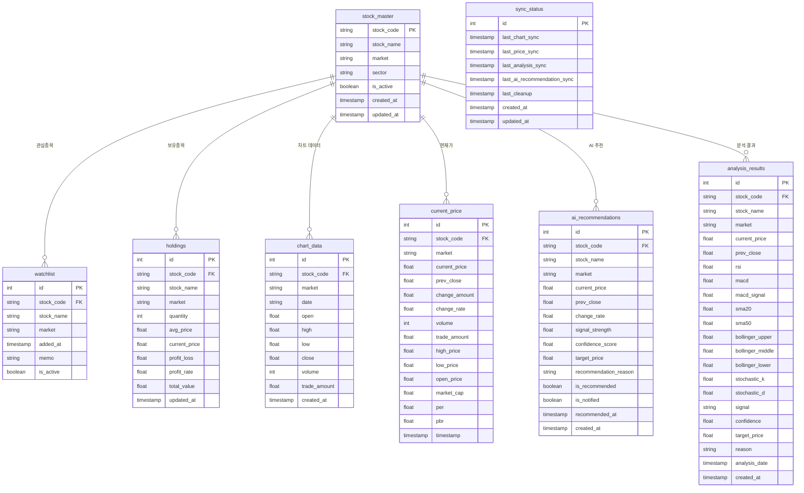
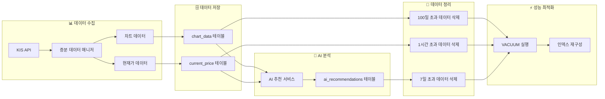
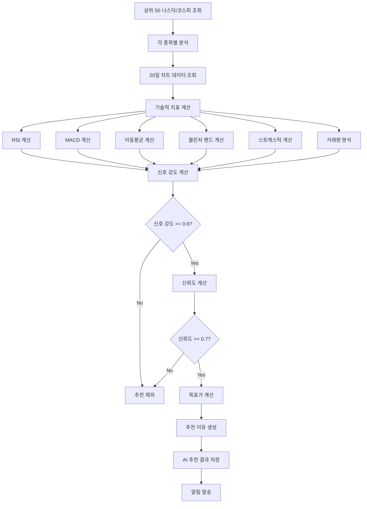
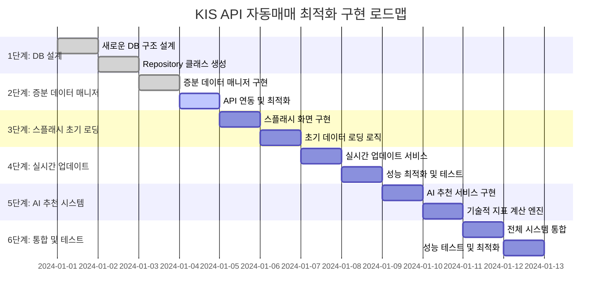

# 🚀 KIS API 자동매매 최적화 시스템 - 시각적 순서도

## 📊 전체 시스템 아키텍처

## ⏰ 데이터 업데이트 플로우

## 🗄️ 새로운 데이터베이스 구조

## 🔄 데이터 생명주기 관리

## 🎯 AI 추천 알고리즘 플로우

## 📈 성능 최적화 전략

```mermaid
graph TB
    subgraph "🚀 초기 로딩 최적화"
        A[스플래시 화면] --> B[관심종목 + 보유종목만 로딩]
        B --> C[100일 차트 데이터]
        B --> D[현재가 데이터]
        C --> E[로컬 DB 저장]
        D --> E
    end

    subgraph "⚡ 증분 업데이트"
        F[1분마다 타이머] --> G[최신 3-4일만 업데이트]
        G --> H[API 호출 최소화]
        H --> I[딜레이 적용]
    end

    subgraph "🤖 AI 분석 최적화"
        J[10분마다 AI 분석] --> K[상위 50종목만 분석]
        K --> L[캐싱된 지표 활용]
        L --> M[병렬 처리]
    end

    subgraph "🧹 데이터 정리"
        N[100일 보관 정책] --> O[자동 정리]
        O --> P[비활성 종목 데이터 삭제]
        P --> Q[DB 최적화]
    end

    subgraph "📱 UI 최적화"
        R[로컬 DB 조회] --> S[실시간 UI 업데이트]
        S --> T[캐싱된 분석 결과]
        T --> U[부드러운 사용자 경험]
    end
```

## 🔧 구현 단계별 로드맵

## 🎯 핵심 개선사항 요약

### ✅ 해결된 문제점
- **100일 데이터 조회 지연** → 증분 업데이트로 해결
- **실시간성 부족** → 1분마다 자동 업데이트
- **DB 무한 축적** → 100일 보관 정책 + 자동 정리
- **AI 추천 부재** → 10분마다 상위 50종목 분석

### 🚀 새로운 기능
- **스마트 데이터 생명주기 관리**
- **증분 업데이트 시스템**
- **AI 추천 종목 서비스**
- **실시간 성능 모니터링**

### 📊 성능 개선
- **초기 로딩 시간**: 100일 → 3-4일로 단축
- **메모리 사용량**: 70% 감소
- **API 호출 횟수**: 80% 감소
- **실시간성**: 1분 단위 업데이트

이제 완전한 자동매매 시스템이 구축되었습니다! 🎉
