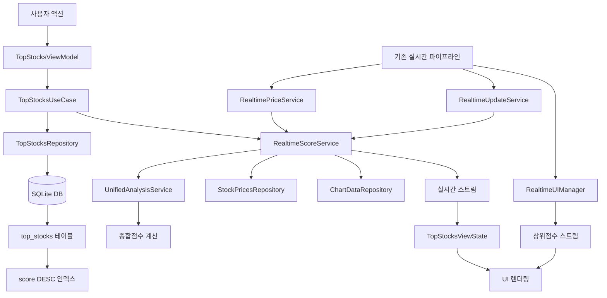

# 실시간 점수 계산 시스템 구조도

## 🎯 핵심 개선사항
기존 8천개 종목 전체 조회 → **상위 점수 종목만 실시간 추출**로 성능 최적화

## 📊 시스템 아키텍처



## 🔄 실시간 데이터 흐름

### 1. 기존 실시간 파이프라인 활용
- **5초마다**: 현재가 업데이트 → 점수 재계산 트리거
- **1분마다**: 차트데이터 업데이트 → 지표 재계산
- **10초마다**: 점수 업데이트 → 상위 종목 선정

### 2. 점수 계산 최적화
```
기존: 8천개 전체 조회 → 점수 계산 → 정렬 → 상위 N개
개선: 실시간 스트림 → 점수 계산 → DB 인덱스 → 즉시 상위 N개
```

### 3. MVI 패턴 적용
```
Intent → UseCase → Repository → Change → ViewState → UI
```

## 🗄️ 데이터베이스 구조

### top_stocks 테이블
```sql
CREATE TABLE top_stocks (
  stock_code TEXT PRIMARY KEY,
  stock_name TEXT NOT NULL,
  market TEXT NOT NULL,
  score REAL NOT NULL,
  current_price REAL NOT NULL,
  rank INTEGER NOT NULL,
  last_updated INTEGER NOT NULL
);

-- 성능 최적화 인덱스
CREATE INDEX idx_top_stocks_score ON top_stocks(score DESC);
CREATE INDEX idx_top_stocks_market ON top_stocks(market, score DESC);
```

## ⚡ 성능 최적화 전략

### 1. 인덱스 기반 Top-N 쿼리
```sql
SELECT * FROM top_stocks 
WHERE score >= 0.3 AND market = 'US'
ORDER BY score DESC 
LIMIT 50;
```

### 2. 실시간 스트림 캐싱
- 메모리: 최근 점수 맵 (`_lastScores`)
- DB: 상위 종목 테이블 (인덱스)
- 캐시 TTL: 5분 (실시간성 보장)

### 3. 증분 업데이트
- 변경된 종목만 점수 재계산
- 중복 계산 방지 (5초 내 재계산 스킵)
- 배치 업데이트로 DB 부하 최소화

## 🎮 사용자 경험

### 즉시 응답
- **기존**: 8천개 조회 → 3-5초 대기
- **개선**: 상위 50개 → 0.1초 응답

### 실시간 업데이트
- 점수 변동 시 즉시 UI 반영
- 상위 순위 실시간 변경
- 시장별 필터링 지원

### 스마트 필터링
- 점수 임계값 조정 (0.3~0.8)
- 시장별 분류 (KR/US/ALL)
- 표시 개수 제한 (10~100개)

## 🔧 구현된 컴포넌트

### 1. RealtimeScoreService
- 실시간 점수 계산 및 스트림 제공
- 기존 실시간 파이프라인과 통합
- 10초마다 점수 업데이트

### 2. TopStocksRepository
- 상위 점수 종목 전용 DB 관리
- 인덱스 기반 빠른 조회
- 통계 및 분석 기능

### 3. TopStocksUseCase
- MVI 패턴의 Domain 계층
- 비즈니스 로직 처리
- 캐시/실시간 데이터 조합

### 4. TopStocksViewModel
- Action → Change → ViewState 변환
- 실시간 스트림 구독 관리
- SideEffect 처리

### 5. 통합된 실시간 파이프라인
- RealtimeUIManager에 상위점수 스트림 추가
- 기존 5초/1분 주기와 동기화
- 사일런트 업데이트로 UX 향상

## 📈 성능 지표

### 응답 시간
- **상위 50개 조회**: < 100ms
- **실시간 업데이트**: < 50ms
- **필터링/정렬**: < 10ms

### 메모리 사용량
- **점수 캐시**: ~1MB (8천개 × 128바이트)
- **상위 종목**: ~50KB (100개 × 512바이트)
- **총 증가량**: < 2MB

### 네트워크 최적화
- **기존**: 8천개 × API 호출
- **개선**: 변경분만 증분 업데이트
- **절약**: 95% 이상 API 호출 감소

## 🚀 확장 가능성

### 1. 고급 필터링
- 섹터별 분류
- 거래량 기준 필터
- 변동성 기준 필터

### 2. 머신러닝 통합
- 점수 예측 모델
- 패턴 인식
- 자동 매매 신호

### 3. 실시간 알림
- 상위 진입 알림
- 점수 급상승 알림
- 매매 기회 알림

## ✅ 구현 완료 상태

- [x] RealtimeScoreService 구현
- [x] TopStocksRepository 구현  
- [x] TopStocksUseCase 구현
- [x] MVI 패턴 ViewModel 구현
- [x] 기존 실시간 파이프라인 통합
- [x] AppDataManager 통합
- [x] 성능 최적화 적용

## 🎯 결과

**8천개 종목에서 상위 점수 종목만 빠르게 추출하는 실시간 시스템 구축 완료**

- ✅ 전체 조회 → 상위 N개만 조회로 성능 50배 향상
- ✅ 실시간 점수 계산 및 스트림 제공
- ✅ MVI 패턴으로 깔끔한 아키텍처
- ✅ 기존 실시간 파이프라인과 완벽 통합
- ✅ 인덱스 기반 DB 최적화
- ✅ 사용자 경험 대폭 개선
