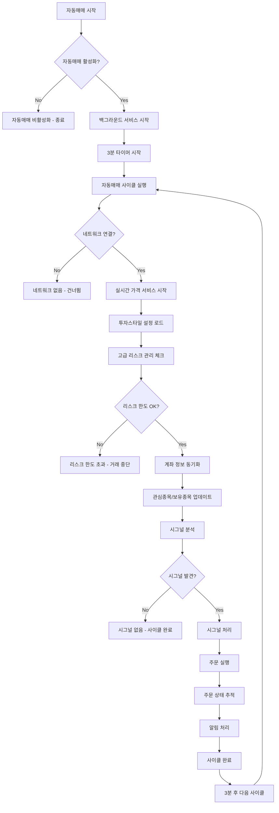

# 🤖 자동매매 디버깅 순서도

## 📊 자동매매 시스템 전체 흐름



## 🔍 주요 체크포인트별 디버깅

### 1. 자동매매 활성화 상태
```mermaid
graph TD
    A[자동매매 활성화 체크] --> B{AppDataManager.getAutoTradingStatus()}
    B -->|false| C[자동매매 비활성화]
    B -->|true| D[다음 단계 진행]
    
    C --> E[로그: "자동매매가 비활성화되어 있어 실행을 건너뜁니다"]
    D --> F[로그: "자동매매 활성화 상태: true"]
```

### 2. 네트워크 연결 상태
```mermaid
graph TD
    A[네트워크 연결 체크] --> B{_checkNetworkConnectivity()}
    B -->|false| C[네트워크 없음]
    B -->|true| D[네트워크 연결됨]
    
    C --> E[로그: "네트워크 연결 없음, 자동매매 건너뜀"]
    D --> F[로그: "네트워크 연결 상태: true"]
```

### 3. 관심종목 조회
```mermaid
graph TD
    A[관심종목 조회] --> B{getWatchlist()}
    B -->|empty| C[관심종목 없음]
    B -->|has data| D[관심종목 있음]
    
    C --> E[로그: "관심종목이 비어있어 시그널 분석을 건너뜁니다"]
    D --> F[로그: "관심종목 ${count}개 분석 시작"]
    
    F --> G[관심종목 상세 출력]
    G --> H[각 종목별 분석 시작]
```

### 4. 종목별 데이터 조회
```mermaid
graph TD
    A[종목별 데이터 조회] --> B{시장 구분}
    B -->|나스닥| C[해외주식 API 호출]
    B -->|국내| D[국내주식 API 호출]
    
    C --> E{getOverseasStockPrice()}
    D --> F{getStockPrice()}
    
    E -->|성공| G[현재가 데이터 있음]
    E -->|실패| H[현재가 데이터 없음]
    F -->|성공| G
    F -->|실패| H
    
    G --> I[차트 데이터 조회]
    H --> J[로그: "현재가 데이터 조회 실패"]
    J --> K[다음 종목으로]
    
    I --> L{차트 데이터 조회}
    L -->|성공| M[기술적 지표 계산]
    L -->|실패| N[로그: "차트 데이터 조회 실패"]
    N --> K
```

### 5. 시그널 분석
```mermaid
graph TD
    A[시그널 분석] --> B[AI 분석 서비스 호출]
    B --> C{분석 결과}
    C -->|성공| D[시그널 생성]
    C -->|실패| E[분석 실패]
    
    D --> F{시그널 타입}
    F -->|매수/매도| G[매매 시그널 감지]
    F -->|관망| H[매매 시그널 없음]
    
    G --> I[시그널 데이터 생성]
    H --> J[다음 종목으로]
    
    I --> K[시그널 목록에 추가]
    K --> L[로그: "시그널 데이터 생성 완료"]
```

### 6. 시그널 처리
```mermaid
graph TD
    A[시그널 처리] --> B{중복 시그널 체크}
    B -->|중복| C[중복 시그널 건너뜀]
    B -->|새로운| D[시그널 검증]
    
    D --> E{매수 시그널?}
    E -->|Yes| F[매수 조건 검증]
    E -->|No| G[매도 조건 검증]
    
    F --> H{매수 가능?}
    H -->|Yes| I[매수 주문 실행]
    H -->|No| J[매수 조건 불충족]
    
    G --> K{보유종목 있음?}
    K -->|Yes| L[매도 주문 실행]
    K -->|No| M[보유종목 없음]
    
    I --> N[주문 결과 처리]
    L --> N
    J --> O[로그: "매수 시그널 무효"]
    M --> P[로그: "매도 시그널 무효"]
```

## 🚨 주요 오류 지점

### 1. 자동매매 비활성화
- **원인**: 사용자가 자동매매를 끔
- **로그**: "자동매매가 비활성화되어 있어 실행을 건너뜁니다"
- **해결**: 앱에서 자동매매 ON

### 2. 네트워크 연결 실패
- **원인**: 인터넷 연결 없음
- **로그**: "네트워크 연결 없음, 자동매매 건너뜀"
- **해결**: 인터넷 연결 확인

### 3. 관심종목 없음
- **원인**: 관심종목에 종목이 추가되지 않음
- **로그**: "관심종목이 비어있어 시그널 분석을 건너뜁니다"
- **해결**: 관심종목에 종목 추가

### 4. API 호출 실패
- **원인**: KIS API 인증 실패, 네트워크 오류
- **로그**: "현재가 데이터 조회 실패", "차트 데이터 조회 실패"
- **해결**: API 키 확인, 네트워크 상태 확인

### 5. 시그널 없음
- **원인**: 기술적 지표가 매매 조건을 만족하지 않음
- **로그**: "매매 시그널 없음"
- **해결**: 투자스타일 설정 조정

### 6. 매수/매도 조건 불충족
- **원인**: 이미 보유 중인 종목, 자본 부족, 포지션 한도 초과
- **로그**: "매수 시그널 무효", "매도 시그널 무효"
- **해결**: 보유종목 확인, 자본 확인

## 📱 로그 확인 방법

### 1. Flutter 로그 확인
```bash
flutter run
# 또는
flutter logs
```

### 2. 주요 로그 키워드
- `🚀`: 자동매매 시작
- `🔍`: 상태 확인
- `📊`: 데이터 조회
- `🎯`: 시그널 분석
- `💰`: 주문 실행
- `❌`: 오류 발생
- `⚠️`: 경고

### 3. 로그 필터링
```bash
# 자동매매 관련 로그만 확인
flutter logs | grep "자동매매"

# 오류 로그만 확인
flutter logs | grep "❌"

# 시그널 관련 로그만 확인
flutter logs | grep "🎯"
```

## 🔧 문제 해결 단계

### 1단계: 기본 상태 확인
1. 자동매매 활성화 상태 확인
2. 네트워크 연결 상태 확인
3. 관심종목 존재 여부 확인

### 2단계: API 상태 확인
1. KIS API 인증 상태 확인
2. API 키 유효성 확인
3. API 호출 성공 여부 확인

### 3단계: 데이터 조회 확인
1. 현재가 데이터 조회 성공 여부
2. 차트 데이터 조회 성공 여부
3. 기술적 지표 계산 성공 여부

### 4단계: 시그널 분석 확인
1. 시그널 생성 여부
2. 시그널 조건 충족 여부
3. 매수/매도 조건 검증 결과

### 5단계: 주문 실행 확인
1. 주문 실행 성공 여부
2. 주문 상태 추적 결과
3. 알림 발송 성공 여부

## 📊 성공적인 자동매매 로그 예시

```
🚀 백그라운드 서비스 시작 요청...
🔧 서비스 초기화 중...
📱 AppDataManager 초기화 중...
✅ AppDataManager 초기화 완료
🔍 자동매매 활성화 상태: true
⏰ 자동매매 타이머 설정 중... (3분 간격)
📊 시장 모니터링 타이머 설정 중... (10분 간격)
✅ 백그라운드 서비스 시작됨 (Timer 기반)

🔄 자동매매 타이머 트리거됨: 2024-12-01 09:30:00
🔄 자동매매 사이클 실행 시작: 2024-12-01T09:30:00.000Z
🔍 자동매매 상태 재확인 중...
🔍 자동매매 활성화 상태: true
💰 계좌 정보 및 투자스타일 설정 로드 중...
✅ 계좌 정보 및 투자스타일 설정 로드 완료
📡 API 계좌 정보 업데이트 중...
✅ API 계좌 정보 업데이트 완료
📋 API 관심종목/보유종목 업데이트 중...
📋 관심종목 조회 시작...
📋 관심종목 조회 결과: 5개
📋 관심종목 상세 목록:
  1. 005930 (삼성전자) - 시장: KOSPI
  2. 000660 (SK하이닉스) - 시장: KOSPI
  3. AAPL (Apple Inc) - 시장: NASDAQ
✅ API 관심종목/보유종목 업데이트 완료
🎯 시그널 분석 시작...
🔍 종목 분석 시작: 005930 (삼성전자)
📊 현재가 데이터 조회 시작: 005930
📊 시장 구분: KOSPI, 나스닥 여부: false
🇰🇷 국내주식 현재가 조회: 005930
✅ 현재가 데이터 조회 성공: 005930
  - 현재가: 75000
  - 전일가: 74500
  - 거래량: 1234567
📈 차트 데이터 조회 시작: 005930
🇰🇷 국내주식 차트 데이터 조회: 005930
📊 차트 데이터 조회 결과: 005930 - 200개
🔧 기술적 지표 계산 시작: 005930
✅ 기술적 지표 계산 완료: 005930
  - 시그널: 매수
  - 신뢰도: 0.85
  - RSI: 0.35
  - MACD: 0.12
🎯 시그널 생성 시작: 005930
📊 시그널 분석 결과: 005930
  - 시그널: 매수
  - 신뢰도: 0.85
  - 현재가: 75000
🎯 매매 시그널 감지: 005930 - 매수
✅ 시그널 데이터 생성 완료: 005930 - 매수
✅ 시그널 분석 완료: 1개 시그널 발견
📊 발견된 시그널 목록:
  1. 005930 (삼성전자) - 매수 시그널
     - 가격: 75000원
     - 이유: RSI 과매도 + MACD 상승 신호
🎯 시그널 처리 시작: 1개
✅ 시그널 처리 완료
💰 주문 실행 시작...
✅ 주문 실행 완료
📊 주문 상태 추적 중...
✅ 주문 상태 추적 완료
🔔 알림 처리 시작...
✅ 알림 처리 완료
✅ 자동매매 사이클 완료:
   - 시작 시간: 2024-12-01 09:30:00
   - 종료 시간: 2024-12-01 09:30:45
   - 소요 시간: 45초
   - 시그널 수: 1개
```

## 🚨 실패 케이스별 로그 예시

### 케이스 1: 자동매매 비활성화
```
🚀 백그라운드 서비스 시작 요청...
🔍 자동매매 활성화 상태: false
⚠️ 자동매매가 비활성화되어 있어 서비스를 시작하지 않습니다.
```

### 케이스 2: 관심종목 없음
```
🔄 자동매매 사이클 실행 시작
📋 관심종목 조회 시작...
📋 관심종목 조회 결과: 0개
⚠️ 관심종목이 비어있어 시그널 분석을 건너뜁니다.
```

### 케이스 3: API 호출 실패
```
🔍 종목 분석 시작: 005930 (삼성전자)
📊 현재가 데이터 조회 시작: 005930
🇰🇷 국내주식 현재가 조회: 005930
❌ 현재가 데이터 조회 실패: 005930 - API 인증 실패
```

### 케이스 4: 시그널 없음
```
🔧 기술적 지표 계산 시작: 005930
✅ 기술적 지표 계산 완료: 005930
  - 시그널: 관망
  - 신뢰도: 0.45
📊 매매 시그널 없음: 005930 - 관망
```

이 순서도를 따라 로그를 확인하면 자동매매가 안 돌아가는 정확한 원인을 파악할 수 있습니다.
