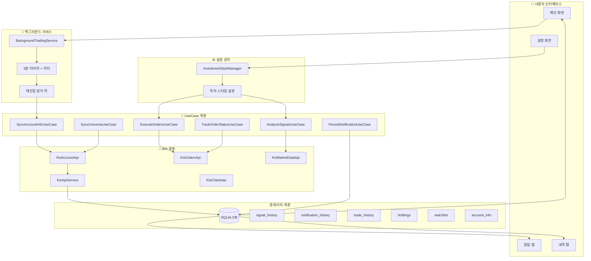
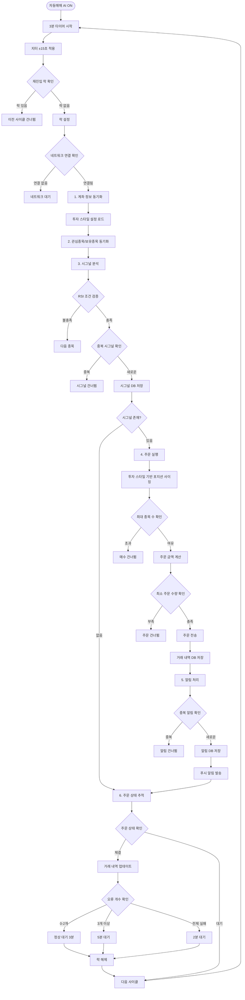
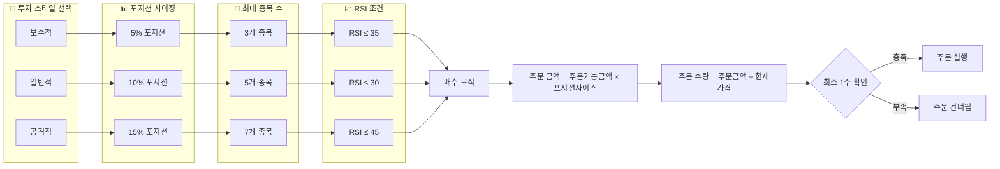
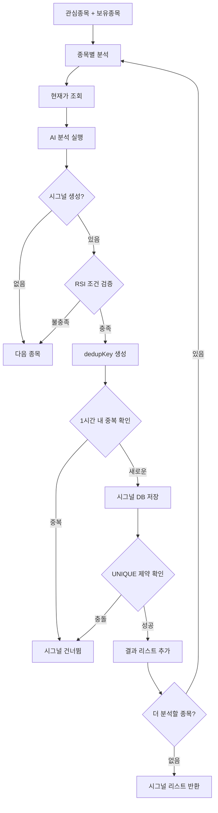
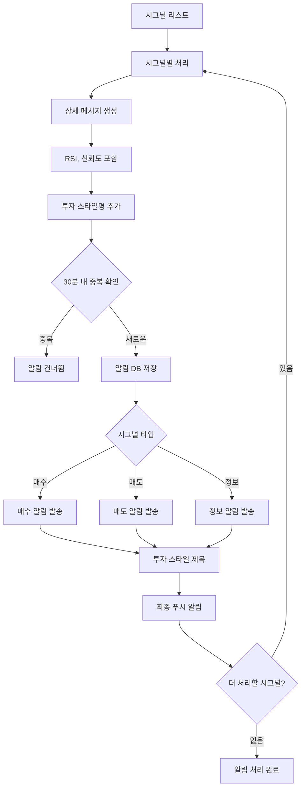
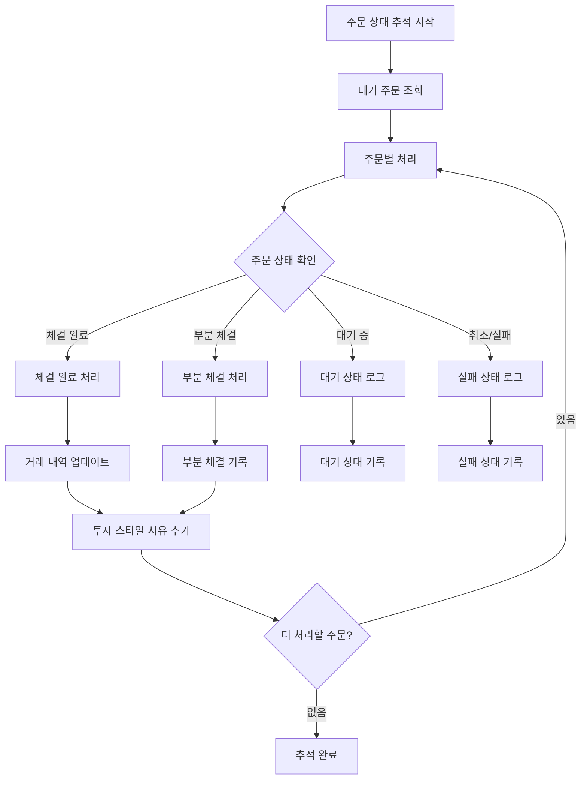
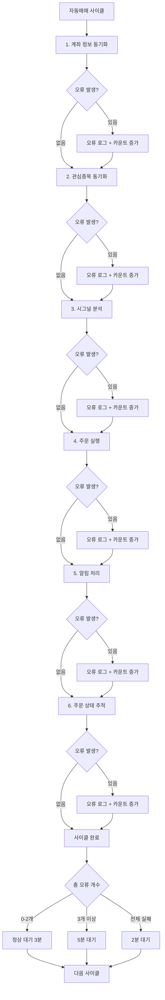

# 🔄 자동매매 시스템 개선 완료 순서도

## 📊 **전체 시스템 아키텍처**

## 🔄 **3분 주기 자동매매 사이클**

## 💰 **투자 스타일별 포지션 사이징**

## 🔍 **시그널 분석 및 중복 방지**

## 📱 **알림 시스템 개선**

## 🔄 **주문 상태 추적**

## ⚡ **에러 처리 및 복구**

---

## 🎯 **핵심 개선 사항 요약**

1. **실제 API 연동**: `getPendingOrders()` 실제 KIS API 연동 완료
2. **투자 스타일 기반**: 포지션 사이징, RSI 조건, 최대 종목 수 자동 적용
3. **중복 방지**: 시그널 1시간, 알림 30분 중복 방지
4. **안정성**: 단계별 에러 처리, 백오프 전략, 재진입 방지
5. **성능**: DB 인덱스 최적화, 배치 처리
6. **모니터링**: 상세 로깅, 상태 추적, 통계 수집

**🚀 자동매매 시스템이 완전히 개선되어 안정적이고 효율적으로 운영됩니다!**
