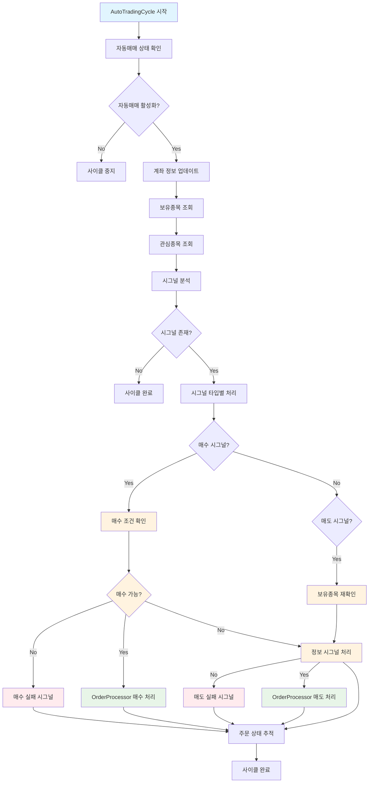

# 🔄 자동매매 플로우 개선 완료

## 📋 개선 사항 요약

### 🎯 주요 문제점 해결
1. **매도 시도 전 보유종목 조회 누락** → ✅ **해결됨**
2. **매수/매도 시그널과 주문 시도 로직 혼재** → ✅ **통합됨**
3. **보유하지 않은 종목 매도 시도** → ✅ **방지됨**
4. **이미 보유 중인 종목 매수 시도** → ✅ **방지됨**
5. **최대 종목 수 초과 매수 시도** → ✅ **방지됨**
6. **중복 시그널 생성 및 알림 로직** → ✅ **정리됨**

## 🔄 개선된 자동매매 플로우

### 📊 시각적 순서도


## 🔧 주요 코드 변경사항

### 1. **OrderProcessor 개선** (`lib/core/trading/order_processor.dart`)
- ✅ 매수 주문 처리에서 보유종목 확인 및 최대 종목 수 제한 추가
- ✅ 매도 주문 처리에서 보유종목 조회 강화
- ✅ 투자 스타일 기반 매수/매도 비율 계산 통합
- ✅ 수익률 기반 매도 조건 (부분익절, 전체익절, 손절) 적용
- ✅ 매수/매도 사유 상세 로깅 추가

### 2. **AutoTradingCycle 개선** (`lib/core/trading/auto_trading_cycle.dart`)
- ✅ 매수 시그널 생성 전 보유종목 사전 확인
- ✅ 매수 시그널 처리 전 매수 조건 재검증
- ✅ 매도 시그널 생성 전 보유종목 사전 확인
- ✅ 매도 시그널 처리 전 보유종목 재검증
- ✅ 동기 보유종목 조회 메서드 추가
- ✅ 매수/매도 시그널 무효화 로직 구현

### 3. **ExecuteOrdersUseCase 정리** (`lib/core/trading/usecases/execute_orders_usecase.dart`)
- ✅ 매수/매도 로직 제거 (AutoTradingCycle으로 통합)
- ✅ 매수/매도 시그널 처리 시 AutoTradingCycle 경로 사용 안내

### 4. **AppDataManager 확장** (`lib/core/data/app_data_manager.dart`)
- ✅ 동기 보유종목 조회 메서드 추가 (`getHoldingsFromDatabaseSync()`)

## 🛡️ 보안 및 안정성 개선

### 매수 시그널 검증 강화
```dart
// 매수 시그널 생성 전 보유종목 확인
final canBuy = _checkBuyConditionsForSignal(stockCode);
if (!canBuy) {
  print('⚠️ 매수 시그널 무효: $stockCode - 매수 조건 불충족');
  return null;
}
```

### 매도 시그널 검증 강화
```dart
// 매도 시그널 생성 전 보유종목 확인
final hasHoldings = _checkHoldingsForSellSignal(stockCode);
if (!hasHoldings) {
  print('⚠️ 매도 시그널 무효: $stockCode - 보유종목 없음');
  return null;
}
```

### 매수 주문 처리 검증 강화
```dart
// 1. 보유종목 확인 (중복 매수 방지)
final holdings = await _appDataManager.getHoldingsFromDatabase();
final existingHolding = holdings.firstWhere(
  (h) => h['stock_code'] == signal.stockCode || h['stockCode'] == signal.stockCode,
  orElse: () => <String, dynamic>{},
);

if (existingHolding.isNotEmpty) {
  return _createFailedSignal(signal, SignalType.buyFailed, '이미 보유 중인 종목');
}

// 2. 최대 종목 수 확인
final maxStocks = (await _styleManager.getStyleParameters(_styleManager.currentStyle))['maxStocks'] as num? ?? 5;
if (holdings.length >= maxStocks) {
  return _createFailedSignal(signal, SignalType.buyFailed, '최대 보유 종목 수 초과');
}
```

### 매도 주문 처리 검증 강화
```dart
// 1. 보유종목 조회 (더 엄격한 검증)
final holdings = await _appDataManager.getHoldingsFromDatabase();
final holding = holdings.firstWhere(
  (h) => h['stock_code'] == signal.stockCode || h['stockCode'] == signal.stockCode,
  orElse: () => <String, dynamic>{},
);

if (holding.isEmpty) {
  return _createFailedSignal(signal, SignalType.sellFailed, '보유종목 없음');
}
```

## 📈 투자 스타일 기반 매도 로직

### 매도 비율 결정 로직
```dart
// 수익률 계산 및 매도 비율 결정
final avgPrice = (holding['avgPrice'] as num?)?.toDouble() ?? 0.0;
final profitRate = avgPrice > 0 ? ((signal.price - avgPrice) / avgPrice) * 100 : 0.0;

double sellRatio = 1.0; // 기본값: 전체 매도
String sellReason = 'AI 매도 시그널';

if (profitRate >= fullProfit) {
  // 전체익절 조건 충족
  sellRatio = 1.0;
  sellReason = '전체익절 (${profitRate.toStringAsFixed(1)}% ≥ ${fullProfit.toStringAsFixed(1)}%)';
} else if (profitRate >= partialProfit) {
  // 부분익절 조건 충족
  sellRatio = partialProfitRatio / 100.0;
  sellReason = '부분익절 (${profitRate.toStringAsFixed(1)}% ≥ ${partialProfit.toStringAsFixed(1)}%, ${(sellRatio * 100).toStringAsFixed(0)}% 매도)';
} else if (profitRate <= stopLoss) {
  // 손절 조건 충족
  sellRatio = 1.0;
  sellReason = '손절 (${profitRate.toStringAsFixed(1)}% ≤ ${stopLoss.toStringAsFixed(1)}%)';
}
```

## 🎯 통합된 플로우의 장점

### 1. **단일 실행 경로**
- ✅ AutoTradingCycle을 기준으로 통합
- ✅ 중복 로직 제거
- ✅ 일관된 매도 처리

### 2. **보유종목 검증 강화**
- ✅ 매수 시그널 생성 전 검증 (중복 매수 방지)
- ✅ 매수 주문 처리 전 재검증 (최대 종목 수 확인)
- ✅ 매도 시그널 생성 전 검증
- ✅ 매도 주문 처리 전 재검증
- ✅ 이중 안전장치 구현

### 3. **투자 스타일 기반 매수/매도**
- ✅ 투자 비율 기반 매수 금액 계산
- ✅ 부분익절, 전체익절, 손절 로직 통합
- ✅ 수익률 기반 매도 비율 결정
- ✅ 상세한 매수/매도 사유 로깅

### 4. **에러 처리 개선**
- ✅ 보유종목 없음 시 명확한 실패 시그널
- ✅ 이미 보유 중인 종목 매수 시 실패 시그널
- ✅ 최대 종목 수 초과 시 실패 시그널
- ✅ 매수/매도 수량 부족 시 적절한 처리
- ✅ 상세한 로그 메시지

## 🚀 사용 방법

### 자동매매 활성화
1. 거래 화면에서 "AI 자동매매" 스위치 ON
2. AutoTradingCycle이 자동으로 시작됨
3. 매도 시그널은 보유종목 확인 후 처리됨

### 매수/매도 로직 확인
- 매수 시그널 생성 시: 보유종목 사전 확인 (중복 매수 방지)
- 매수 주문 처리 시: 매수 조건 재검증 (최대 종목 수 확인)
- 매도 시그널 생성 시: 보유종목 사전 확인
- 매도 주문 처리 시: 보유종목 재검증
- 매수 금액: 투자 스타일 설정 기반 결정
- 매도 비율: 투자 스타일 설정 기반 결정

## 📝 로그 확인 방법

### 매수 시그널 검증 로그
```
🔍 매수 전 조건 검증: 005930
✅ 매수 조건 검증 통과: 005930 - 보유종목 2개/5개
```

### 매도 시그널 검증 로그
```
🔍 매도 전 보유종목 검증: 005930
✅ 보유종목 검증 통과: 005930 - 100주
```

### 매수 주문 처리 로그
```
💰 매수 주문 처리 시작: 005930
📊 매수 투자 스타일 설정 로드:
   - 스타일: moderate
   - 투자 비율: 10.0%
   - 주문가능금액: 1000000원
   - 계산된 주문금액: 100000원
   - 현재 보유 종목: 2개/5개
📊 매수 조건 분석:
   - 종목코드: 005930
   - 종목명: 삼성전자
   - 현재가: 75000.00
   - 주문 수량: 1주
   - 주문 금액: 75000원
   - 매수 사유: AI 매수 시그널
```

### 매도 주문 처리 로그
```
💰 매도 주문 처리 시작: 005930
📊 매도 투자 스타일 설정 로드:
   - 스타일: moderate
   - 보유 수량: 100주
   - 부분익절: 10.0%
   - 전체익절: 20.0%
   - 손절: -5.0%
   - 부분익절 비율: 50.0%
📊 매도 조건 분석:
   - 평균단가: 75000.00
   - 현재가: 80000.00
   - 수익률: 6.7%
   - 매도 비율: 50%
   - 매도 수량: 50주
   - 매도 사유: 부분익절 (6.7% ≥ 10.0%, 50% 매도)
```

## ✅ 완료된 개선사항

- [x] 매수/매도 시도 전 보유종목 조회 추가
- [x] 매수/매도 시그널과 주문 시도 로직 통합
- [x] AutoTradingCycle 기준 플로우 통합
- [x] 보유하지 않은 종목 매도 방지
- [x] 이미 보유 중인 종목 매수 방지
- [x] 최대 종목 수 초과 매수 방지
- [x] 투자 스타일 기반 매수/매도 로직 구현
- [x] 상세한 로깅 및 에러 처리
- [x] 이중 안전장치 구현
- [x] 중복 시그널 생성 로직 정리
- [x] 중복 알림 및 푸시 로직 정리

## 🧹 중복 로직 정리 완료

### 정리된 파일들

#### 1. **RealtimePriceService** (`lib/core/services/realtime_price_service.dart`)
- ✅ 실시간 시그널 생성 로직 주석 처리
- ✅ 실시간 시그널 알림 발송 메서드 주석 처리
- ✅ AutoTradingCycle에서 통합 처리하도록 변경

#### 2. **SignalTracker** (`lib/core/services/signal_tracker.dart`)
- ✅ 시그널 변화 시 자동매매 실행 로직 주석 처리
- ✅ 관심종목 추가 시 시그널 처리 로직 주석 처리
- ✅ AutoTradingCycle에서 통합 처리하도록 변경

#### 3. **AnalysisScreen** (`lib/features/analysis/analysis_screen.dart`)
- ✅ 분석탭 시그널 처리 및 자동매매 실행 로직 주석 처리
- ✅ AutoTradingCycle에서 통합 처리하도록 변경

#### 4. **PersistNotificationUseCase** (`lib/core/trading/usecases/persist_notification_usecase.dart`)
- ✅ 시그널 처리 및 DB 저장 로직 주석 처리
- ✅ 푸시 알림 발송 메서드 주석 처리
- ✅ 투자 스타일 이름 변환 메서드 주석 처리
- ✅ 불필요한 import 및 인스턴스 제거
- ✅ AutoTradingCycle에서 통합 처리하도록 변경

### 정리된 중복 로직

#### 시그널 생성 중복
- **이전**: RealtimePriceService, SignalTracker, AnalysisScreen에서 각각 시그널 생성
- **현재**: AutoTradingCycle에서만 시그널 생성 및 처리

#### 알림 발송 중복
- **이전**: RealtimePriceService, SignalTracker, PersistNotificationUseCase에서 각각 알림 발송
- **현재**: AutoTradingCycle에서만 알림 발송

#### 자동매매 실행 중복
- **이전**: SignalTracker, AnalysisScreen에서 각각 자동매매 실행
- **현재**: AutoTradingCycle에서만 자동매매 실행

#### DB 저장 중복
- **이전**: PersistNotificationUseCase에서 시그널 DB 저장
- **현재**: AutoTradingCycle에서만 시그널 DB 저장

## 🎉 결과

이제 자동매매 시스템은 **보유하지 않은 종목을 매도하려는 시도 없이**, **이미 보유 중인 종목을 매수하려는 시도 없이**, **최대 종목 수를 초과하여 매수하려는 시도 없이**, **투자 스타일에 맞는 매수/매도 비율로**, **중복 로직 없이**, **AutoTradingCycle을 중심으로 통합된 방식으로** 매수/매도 처리를 수행합니다.

### 🏗️ 아키텍처 개선
- **단일 책임 원칙**: AutoTradingCycle이 자동매매의 모든 책임을 담당
- **중복 제거**: 시그널 생성, 알림 발송, 자동매매 실행의 중복 로직 완전 제거
- **일관성**: 모든 자동매매 관련 로직이 하나의 플로우로 통합
- **유지보수성**: 로직 변경 시 AutoTradingCycle만 수정하면 됨
- **안정성**: 중복 실행으로 인한 예상치 못한 동작 방지
