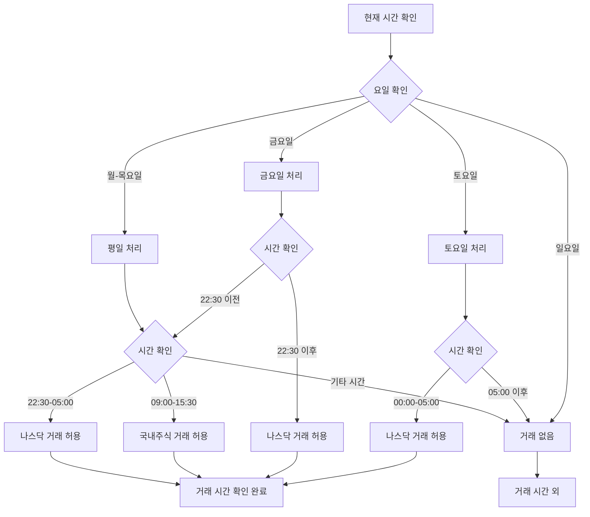

# 📊 정규장 시간 처리 로직 순서도

## 🔄 전체 처리 흐름



## ⏰ 시장별 거래 시간

### 🇰🇷 국내주식 (KOSPI/KOSDAQ)
```
월요일 ~ 금요일: 09:00 - 15:30
토요일, 일요일: 거래 없음
```

### 🇺🇸 나스닥 (NASDAQ)
```
월요일 ~ 목요일: 22:30 - 05:00 (다음날)
금요일: 22:30 - 05:00 (토요일)
토요일: 00:00 - 05:00
일요일: 거래 없음
```

## 🔧 코드 로직

### 1. 실시간 가격 서비스 (`realtime_price_service.dart`)
```dart
// 정규장 시간 체크 (나스닥 토요일 새벽 거래 허용)
bool isTradingTime = false;

// 나스닥 거래시간: 금요일 22:30 ~ 토요일 05:00 (한국시간)
if (weekday == 6) { // 토요일
  if (hour >= 0 && hour < 5) {
    isTradingTime = true; // 토요일 새벽 00:00-05:00 (나스닥)
  }
} else if (weekday == 5) { // 금요일
  if (hour >= 22 && now.minute >= 30) {
    isTradingTime = true; // 금요일 밤 22:30 이후 (나스닥)
  }
} else if (weekday >= 1 && weekday <= 5) { // 월-금
  // 국내주식 정규장 시간: 09:00-15:30
  if (hour >= 9 && hour <= 15) {
    if (hour == 15 && now.minute > 30) {
      // 15:30 이후는 거래시간 아님
    } else {
      isTradingTime = true;
    }
  }
  
  // 나스닥 거래시간: 22:30-05:00 (다음날)
  if (hour >= 22 && now.minute >= 30) {
    isTradingTime = true;
  }
  if (hour >= 0 && hour < 5) {
    isTradingTime = true;
  }
}
```

### 2. AI 분석 서비스 (`ai_analysis_service.dart`)
```dart
if (isNasdaq) {
  // 나스닥 거래시간: 금요일 22:30 ~ 토요일 05:00 (한국시간)
  if (weekday == 6) { // 토요일
    return hour >= 0 && hour < 5; // 토요일 새벽 00:00-05:00
  } else if (weekday == 5) { // 금요일
    return hour >= 22 && minute >= 30; // 금요일 밤 22:30 이후
  } else if (weekday >= 1 && weekday <= 5) { // 월-금
    // 나스닥: 22:30-05:00 (다음날)
    if (hour >= 22 && minute >= 30) return true;
    if (hour >= 0 && hour < 5) return true;
  }
  return false;
} else {
  // 국내주식: 평일 09:00-15:30
  if (weekday == 6 || weekday == 7) {
    return false; // 주말은 거래 없음
  }
  
  if (hour < 9) return false;
  if (hour == 9 && minute < 0) return false;
  if (hour > 15) return false;
  if (hour == 15 && minute > 30) return false;
  return true;
}
```

## 📋 수정된 파일 목록

1. **`lib/core/services/realtime_price_service.dart`**
   - 실시간 가격 업데이트 시간 제한 로직 수정

2. **`lib/core/analysis/ai_analysis_service.dart`**
   - AI 분석 시 정규장 시간 체크 로직 수정

3. **`lib/features/analysis/analysis_screen.dart`**
   - 분석 화면의 정규장 시간 오버레이 로직 수정

4. **`lib/core/trading/volume_threshold_manager.dart`**
   - 거래량 임계값 관리 시 정규장 시간 체크 로직 수정

5. **`lib/core/trading/market_time_validator.dart`**
   - 시장 시간 검증 로직 수정

## 🎯 주요 변경사항

### ✅ **추가된 기능**
- **나스닥 토요일 새벽 거래 허용**: 00:00-05:00
- **나스닥 금요일 밤 거래 허용**: 22:30 이후
- **시장별 차별화된 시간 처리**: 국내주식과 나스닥 구분

### ✅ **개선된 로직**
- **요일별 세분화**: 토요일, 금요일, 평일 구분 처리
- **시간대별 정확한 처리**: 22:30, 00:00, 05:00 등 정확한 시간 체크
- **시장별 최적화**: 각 시장의 특성에 맞는 거래 시간 적용

### ✅ **사용자 경험 개선**
- **24시간 거래 지원**: 나스닥의 연속 거래 시간 지원
- **실시간 데이터**: 토요일 새벽에도 실시간 가격 업데이트
- **자동매매 연속성**: 주말에도 나스닥 자동매매 가능

## 🔍 테스트 시나리오

### 1. 토요일 새벽 테스트
- **시간**: 토요일 02:00
- **예상 결과**: 나스닥 거래 허용, 국내주식 거래 제한

### 2. 금요일 밤 테스트
- **시간**: 금요일 23:00
- **예상 결과**: 나스닥 거래 허용, 국내주식 거래 제한

### 3. 평일 정규장 테스트
- **시간**: 화요일 14:00
- **예상 결과**: 국내주식 거래 허용

### 4. 주말 테스트
- **시간**: 일요일 10:00
- **예상 결과**: 모든 거래 제한

이제 나스닥의 토요일 새벽 거래가 정상적으로 처리됩니다! 🚀
