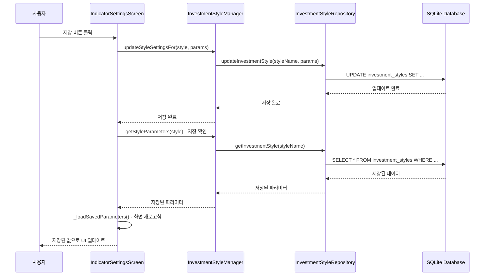
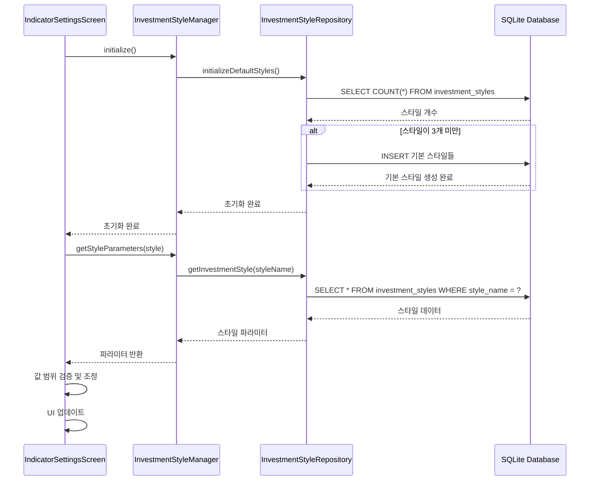

# 투자스타일별 지표 설정 데이터 흐름 순서도

## 📊 전체 데이터 흐름

```mermaid
graph TD
    A[사용자 앱 실행] --> B[IndicatorSettingsScreen 초기화]
    B --> C[InvestmentStyleManager.initialize()]
    C --> D[DatabaseHelper 초기화]
    D --> E[InvestmentStyleRepository.initializeDefaultStyles()]
    E --> F{기본 스타일 존재?}
    F -->|No| G[기본 스타일 생성]
    F -->|Yes| H[기존 스타일 로드]
    G --> H
    H --> I[_loadSavedParameters()]
    I --> J[각 스타일별 파라미터 로드]
    J --> K[UI 렌더링]
    
    L[사용자 슬라이더 조정] --> M[_updateParameter()]
    M --> N[로컬 상태 업데이트]
    
    O[저장 버튼 클릭] --> P[_saveParameters()]
    P --> Q[SQLite DB 저장]
    Q --> R[저장 확인]
    R --> S[화면 새로고침]
    S --> T[저장된 값 표시]
    
    U[초기화 버튼 클릭] --> V[_resetToDefaults()]
    V --> W[기본값으로 DB 업데이트]
    W --> X[화면 새로고침]
    X --> Y[기본값 표시]
```

## 🔄 저장 프로세스 상세



## 📥 로드 프로세스 상세



## 🗄️ 데이터베이스 스키마

```sql
CREATE TABLE investment_styles (
    id INTEGER PRIMARY KEY AUTOINCREMENT,
    style_name TEXT NOT NULL UNIQUE,
    partial_profit REAL DEFAULT 8.0,
    full_profit REAL DEFAULT 15.0,
    stop_loss REAL DEFAULT 3.0,
    position_size REAL DEFAULT 0.05,
    max_stocks INTEGER DEFAULT 2,
    daily_loss_limit REAL DEFAULT 2.0,
    buy_threshold REAL DEFAULT 0.2,
    sell_threshold REAL DEFAULT -0.2,
    is_active INTEGER DEFAULT 1,
    created_at INTEGER,
    updated_at INTEGER
);
```

## 🎯 투자 스타일별 기본값

| 스타일 | 매수 임계값 | 매도 임계값    | 부분익절 | 전체익절  | 손절    | 투자비율 | 최대종목 | 일일손실한도 |
|--------|--------|-----------|------|-------|-------|------|------|--------|
| 안정적 | 0.4    | -0.1      | 3.0% | 7.0%  | -3.0% | 5%   | 3개   | -4.0%  |
| 일반적 | 0.35   | -0.15     | 5.0% | 10.0% | -5.0% | 10%  | 4개   | -6.0%  |
| 공격적 | 0.3    | -0.2      | 7.0% | 15.0% | -7.0% | 20%  | 5개   | -7.0%  |

## 🔧 주요 개선사항

### 1. 데이터베이스 초기화 강화
- 앱 실행 시 기본 스타일 자동 생성
- 중복 초기화 방지
- 초기화 상태 확인 및 로깅

### 2. 저장/로드 로직 개선
- 저장된 값 우선 사용
- 값 범위 검증 및 조정
- 저장 후 화면 새로고침

### 3. 오류 처리 강화
- 데이터베이스 오류 시 기본값 사용
- 상세한 로깅으로 디버깅 지원
- 사용자 친화적 오류 메시지

### 4. UI/UX 개선
- 저장 후 화면 나가지 않고 새로고침
- 실시간 값 검증
- 저장 상태 표시

## 🚀 사용 방법

1. **앱 실행**: 자동으로 기본 투자 스타일이 데이터베이스에 생성됩니다.
2. **스타일 선택**: 안정적/일반적/공격적 투자 스타일 중 선택합니다.
3. **파라미터 조정**: 슬라이더를 조정하여 원하는 값으로 설정합니다.
4. **저장**: 저장 버튼을 눌러 현재 설정을 데이터베이스에 저장합니다.
5. **확인**: 저장된 값이 즉시 화면에 반영됩니다.
6. **초기화**: 초기화 버튼을 눌러 기본값으로 되돌립니다.

## 🔍 디버깅

콘솔에서 다음 로그를 확인할 수 있습니다:
- `📊 파라미터 로드`: 각 스타일별 로드된 값
- `💾 파라미터 저장`: 저장 시도 중인 값들
- `✅ 저장 확인`: 저장 후 검증된 값들
- `🔄 스타일 초기화`: 초기화 과정
- `❌ 오류`: 발생한 오류들
